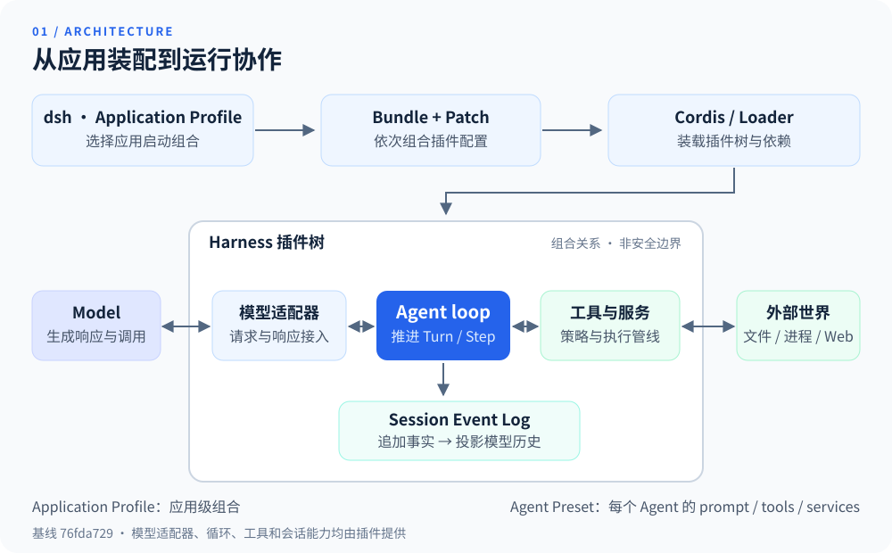
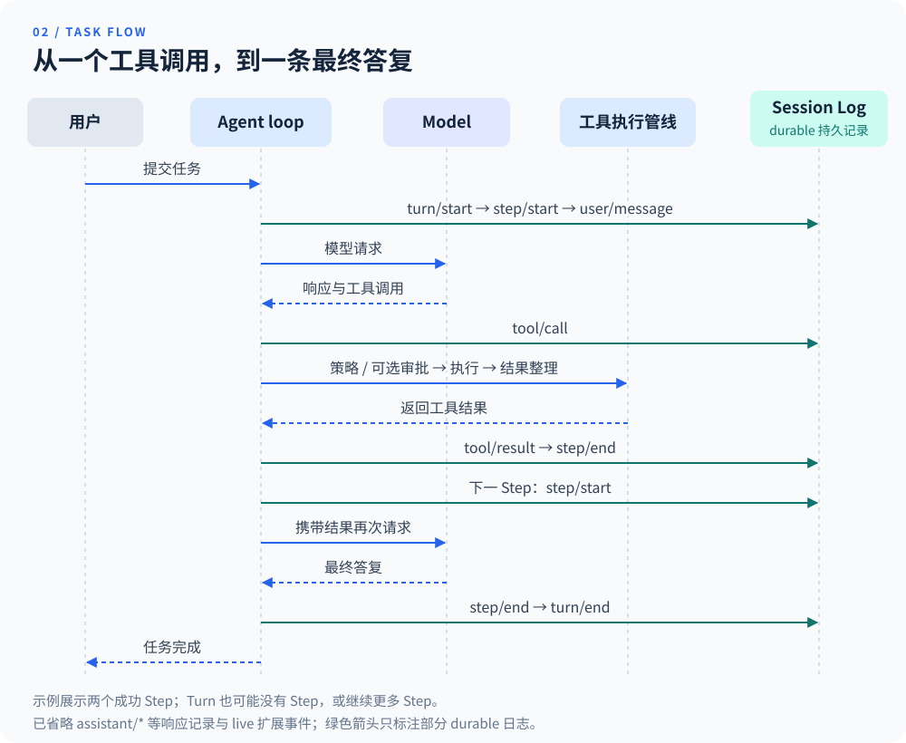
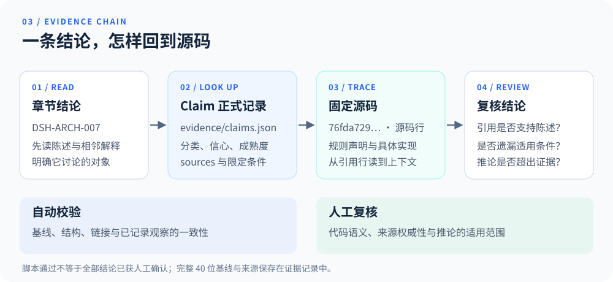

# DeepSeek Harness Analysis

[English summary](README.en.md) · [项目概览](docs/01-overview.md) · [源码索引](docs/source-map.md) · [参与贡献](CONTRIBUTING.md)

## 项目简介

**从源码理解 Agent Harness：怎样组合能力、执行任务，以及留下可复核的记录。**

DeepSeek Harness Analysis 是面向 Agent 系统开发者、技术决策者与开源贡献者的中文证据链手册。围绕 DeepSeek Harness，它提供五个核心章节、六篇专题深挖和框架／编码 Agent 产品比较，帮助读者把架构解释与具体实现对应起来。

本仓库保存分析文档、证据记录和校验脚本；运行 DeepSeek Harness 应用请使用[上游仓库](https://github.com/deepseek-ai/deepseek-harness)。本手册是由 `yang0228` 维护的独立项目，不隶属于 DeepSeek，也不是其官方文档、支持渠道或安全响应方。

**固定分析基线：** DeepSeek Harness commit `0d1f50007f9bca3f52b06e1c3074fa14d5fb0720`。上游事实、作者推论和限定条件均围绕这一源码快照组织；它不代表上游当前版本。核验日期：2026-09-16；源码版本：`0.1.6-alpha.1`。完整元数据见 [`evidence/baseline.json`](evidence/baseline.json)，变更见[本次升级记录](docs/updates/2026-09-16.md)。

## 整体架构

先看应用怎样装配，再看运行时怎样协作。模型适配器、Agent loop、工具服务与 Session Event Log 都由插件提供；CLI Application Profile 组合应用，Agent Preset 组合每个 Agent 的能力。Desktop 则由 Electron 启动独立 Node Host，通过管道与 `dsh-app://` 通信，应用传输不启动本地 Web 端口。



图中的分组表示组合与协作关系，不表示进程或安全隔离；可替换能力也不意味着运行中的组件可以任意热替换。继续阅读[组合与生命周期架构](docs/02-architecture.md)、[能力与组合归属](docs/03-capabilities.md)和[应用与 Session 的组合层](docs/deep-dives/profiles-bundles-presets.md)。

## 一次任务如何运行

以“读取一个文件并解释内容”为例：用户提交任务，模型选择工具，Harness 执行调用并记录结果，模型再根据结果继续回答。下图展开一次工具调用成功、随后模型给出最终答复的简化路径。



- **Turn 是一次任务推进的外层单位，Step 包含一次模型请求及其工具处理。** 一个 Turn 可以有多个 Step，也可以在首次 pre-step 被拒绝时以零个 Step 结束。
- **工具调用经过策略、可选审批和执行管线。** 拒绝、取消和异常有各自的分支；图中展示的是成功路径。
- **持久日志与实时事件作用不同。** `tool/call`、`tool/result` 等 durable 事件用于保留历史；`tools/*` 等 live 事件用于在途协调，不自动成为持久记录。`agent/assistant-stream` 提供实时响应流，结算后把 compact stream 写入 `assistant/message` 或仅供日志使用的 `assistant/attempt`；结算前崩溃不保证该次流可恢复。

详细机制见 [Turn 与 Step](docs/02-architecture.md#claim-dsh-arch-006)、[工具执行与 PTC](docs/deep-dives/tools-and-ptc.md)和 [Session Event Log](docs/deep-dives/session-event-log.md)。

## 快速上手

### 阅读并验证这份手册

需要 Git，以及 Node.js `^22.19.0 || >=24.0.0`。以下是本分析仓库的命令；现有校验脚本没有第三方依赖，不需要配置模型 API key。

**1. 获取手册并运行测试。** 在未包含同名目录的位置执行：

```sh
git clone https://github.com/yang0228/deepseek-harness-analysis.git &&
  cd deepseek-harness-analysis &&
  npm test
```

成功时测试摘要中的 `fail` 为 `0`。测试检查证据 schema、导航、校验器及仓库约定，不会启动 DeepSeek Harness 或调用模型。

**2. 获取固定上游源码并核验引用。** 完成上一步后，在同一手册目录执行；源码保存在相邻的新目录 `deepseek-harness-source`：

```sh
handbook_root="$PWD" &&
  git clone https://github.com/deepseek-ai/deepseek-harness.git "$handbook_root/../deepseek-harness-source" &&
  git -C "$handbook_root/../deepseek-harness-source" checkout --detach 0d1f50007f9bca3f52b06e1c3074fa14d5fb0720 &&
  npm run verify -- --source "$handbook_root/../deepseek-harness-source"
```

上游目录须处于该固定提交且工作树干净；只为核验证据时，无需在上游安装依赖或构建。验证成功后，npm 脚本信息下方会输出：

```json
{
  "ok": true,
  "inspectedUpstream": true,
  "claimCount": 71
}
```

若已有符合条件的上游 checkout，可直接运行 `npm run verify -- --source /上游目录的绝对路径`，跳过第二次 clone。校验器检查基线、引用和已记录观察；结论的语义、来源权威性和限定语仍需阅读源码核对。

### 运行 DeepSeek Harness

运行应用的命令属于上游项目。[可复现的入门路径](docs/05-getting-started.md)提供完整步骤、前置条件、独立实验目录和 Harness Home 设置：

| 想做什么 | 选择哪条路径 | 需要留意什么 |
|---|---|---|
| 体验 Web UI | 入门路径 1：打包 Web UI | 浮动 npm 包跟随 registry，未必等于本手册的固定源码。 |
| 复现本手册的分析对象 | 入门路径 2：固定源码构建 | checkout 到固定 commit，再安装依赖、构建并启动。 |
| 执行一次命令行任务 | 入门路径 3：Headless | 接续已经构建的固定源码环境。 |
| 在应用中调用 Agent | 入门路径 4／5：TypeScript／Python SDK | 使用对应 SDK 的依赖与运行时；示例分别说明启动和回收。 |

**运行前请读安全说明：** 固定基线处于开发者预览阶段，允许破坏性变更，未经过安全审计，也不应视为生产就绪。请阅读固定提交的[上游 `SAFETY.md`](https://github.com/deepseek-ai/deepseek-harness/blob/0d1f50007f9bca3f52b06e1c3074fa14d5fb0720/SAFETY.md#L5-L23)，使用最小权限，并按所选 Provider 配置凭据。上游运行示例按源码审查，不能视为本手册已经完成的实机体验记录。

## 证据链示例

这本手册不止给出结论，也给出检查结论的入口。以 [`DSH-ARCH-007`](docs/02-architecture.md#claim-dsh-arch-007) 为例：

> 所有进入模型请求的输入都可由追加式 Session Event Log 重建。



1. **读结论与解释：** 打开[架构章节中的该项结论](docs/02-architecture.md#claim-dsh-arch-007)，理解“进入模型请求”的范围。
2. **查正式记录：** 在 [`evidence/claims.json`](evidence/claims.json) 中搜索 `DSH-ARCH-007`，核对 `kind`、`confidence`、`maturity` 和 `sources`。该项记录为 `upstream-fact`／`verified`／`released`；`released` 不等于生产就绪。
3. **对照固定来源：** 阅读上游架构文档的 [model-visible logging 规则，第 119–125 行](https://github.com/deepseek-ai/deepseek-harness/blob/0d1f50007f9bca3f52b06e1c3074fa14d5fb0720/docs/architecture.md#L119-L125)，再沿记录中的 Session 源码链接检查事件类型与投影。
4. **同时核验适用范围：** 不是每次 UI／CLI 交互都已进入模型请求，live 事件也不等于 durable 日志。自动校验通过后，仍要判断引用是否足以支撑陈述。

更多规则见[证据方法](docs/00-methodology.md)；从上游文件反查分析结论，使用[证据反向索引](docs/source-map.md)。

## 核心机制

以下五项机制都有对应 Claim。正式分类、证据信心、成熟度和限定语由[差异化机制评估](docs/04-differentiators.md)与 [`evidence/claims.json`](evidence/claims.json)共同给出。

| 机制 | 帮助理解的问题 | 同时阅读的限制 |
|---|---|---|
| [全插件组合](docs/04-differentiators.md#claim-dsh-diff-001) | 除工具之外，哪些产品能力可以通过组合替换？ | 不表示运行中的组件能任意热替换。 |
| [生命周期拥有的 Effect](docs/04-differentiators.md#claim-dsh-diff-002) | 卸载与重载时，谁负责清理注册和资源？ | 自动清理关系只覆盖通过生命周期 API 登记的副作用。 |
| [类型化事件与模型输入日志](docs/04-differentiators.md#claim-dsh-diff-003) | 怎样观察运行过程并重建模型历史？ | 持久重建依赖 durable Session Event Log，live 总线本身不持久。 |
| [每 Session 的 Agent Preset](docs/04-differentiators.md#claim-dsh-diff-004) | 同一 Host 怎样承载不同能力组合？ | Session 开始 Turn 后组合固定，不能任意换装工具。 |
| [Programmatic Tool Calling](docs/04-differentiators.md#claim-dsh-diff-005) | 怎样用模型生成的程序组合多次工具调用？ | 子调用仍走受保护管线；本手册没有量化速度、成本或质量收益。 |

<details>
<summary>展开：普通工具调用与 PTC 的交互差异</summary>

假设读取两个文件后汇总内容，以下只比较两种可能的调用组织方式，不代表所有普通调用都必须逐次往返：

| 组织方式 | 示例过程 |
|---|---|
| 模型逐次决定下一项调用 | 模型请求读 A → 工具结果返回模型 → 模型请求读 B → 工具结果返回模型 → 汇总。 |
| PTC 程序组合调用 | 模型提交一段 `run_code` 程序 → 程序调用读 A、读 B 并处理结果 → 向模型返回所需内容。 |

当前 PTC 使用受会话文件策略约束的新 Node 进程，不再是旧 Worker 执行模型。普通工具调用也可以在一次模型响应中包含多次调用。PTC 的特点是把部分中间控制流交给程序表达；每次子调用仍受策略、取消、并发和资源约束。完整机制见[注册工具与 Programmatic Tool Calling](docs/deep-dives/tools-and-ptc.md)。

</details>

## 阅读路线与贡献

### 本次基线值得关注的变化

- [Desktop 与会话架构](docs/02-architecture.md)：独立桌面 Host、实时流与持久化结算分离。
- [能力矩阵](docs/03-capabilities.md)：Minimal 改为单 Shell；PTC 的 Workflow engine、通用工具和 Ralph 默认禁用；新增 Browser / Computer Use、MCP 与 Schedule 的组合归属。
- [编排机制](docs/deep-dives/subagents-goals-workflows.md)：Agent Teams 已发布但仍属 opt-in 实验能力，不能等同于默认启用。

### 按目标选择阅读路线

| 你的目标 | 建议顺序 | 读完能回答什么 |
|---|---|---|
| 快速建立全貌 | [项目概览](docs/01-overview.md) → [能力与组合归属](docs/03-capabilities.md) → [入门路径](docs/05-getting-started.md) | 它是什么，能力在哪启用，从哪里运行？ |
| 理解系统机制 | [架构](docs/02-architecture.md) → [差异化机制](docs/04-differentiators.md) → 下方专题 | 插件、事件日志、工具和 Agent 怎样协作？ |
| 审核证据链 | [证据方法](docs/00-methodology.md) → [源码索引](docs/source-map.md) → [术语表](docs/glossary.md) | 每个结论来自哪里，有什么限定？ |
| 比较框架与产品 | [比较方法](docs/comparisons/methodology.md) → [Agent 框架](docs/comparisons/agent-frameworks.md)／[编码 Agent 产品](docs/comparisons/coding-agent-products.md) | 同类对象的机制与产品表面有哪些差异？ |

### 专题深挖

| 专题 | 重点问题 |
|---|---|
| [Cordis 插件生命周期](docs/deep-dives/cordis-lifecycle.md) | 加载、依赖、Effect 与卸载清理。 |
| [应用与 Session 的组合层](docs/deep-dives/profiles-bundles-presets.md) | Application Profile、Bundle、Agent Preset 与 Scope 的不同职责。 |
| [Session Event Log](docs/deep-dives/session-event-log.md) | 追加记录、投影、恢复与 Fork。 |
| [工具与 PTC](docs/deep-dives/tools-and-ptc.md) | 注册、执行管线、程序化调用与约束。 |
| [本地 Sandbox](docs/deep-dives/sandbox-execution.md) | 不同执行环境的隔离范围与限制。 |
| [Subagent、Goal、Plan mode 与 Workflow](docs/deep-dives/subagents-goals-workflows.md) | 委托、目标、计划状态和脚本编排分别由谁负责？ |

### 支持、贡献与引用

- 事实错误、上游漂移或分析建议，可以通过 [Issue Forms](https://github.com/yang0228/deepseek-harness-analysis/issues/new/choose) 反馈；请附相关 Claim 和源码位置。
- 修改前阅读[参与贡献](CONTRIBUTING.md)，保留 Claim 分类、不可变来源和限定语，并运行本仓库测试与证据校验。
- 一般问题见[支持范围](SUPPORT.md)；DeepSeek Harness 安装、配置和产品使用问题转向[上游仓库](https://github.com/deepseek-ai/deepseek-harness)的当前支持渠道。
- 本仓库的安全问题按 [SECURITY.md](SECURITY.md) 私密报告；上游安全问题按其当前公开渠道处理。
- 引用使用 [`CITATION.cff`](CITATION.cff) 中的首选信息，并注明分析基线 `0d1f5000`；其中的版本字段为 `snapshot-0d1f5000`。

维护者：[`@yang0228`](https://github.com/yang0228)。
