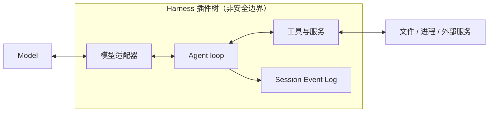

# 项目概览

基线：DeepSeek Harness commit `0d1f50007f9bca3f52b06e1c3074fa14d5fb0720`。

## 一句话结论

 **Claim `DSH-OVR-001`:** DeepSeek Harness 是一个开源、基于 Cordis 且采用全插件架构的 Agent Harness。

它把模型接入工具、执行环境和可持久化的会话。Agent = Model + Harness 是本手册的解释框架，不是上游原文；模型生成响应和行动选择，Harness 管理实际执行及其生命周期。

## 机制

### 一切皆插件

模型适配器、工具注册表、Session Event Log 与 Agent loop 都通过插件装载。插件贡献服务、类型化事件和可逆 Effect；扩展通常是在现有插件旁装载新插件，而不是修改不可替换的产品核心。[架构定义](https://github.com/deepseek-ai/deepseek-harness/blob/0d1f50007f9bca3f52b06e1c3074fa14d5fb0720/docs/architecture.md#L9-L13)

分组表示组合关系，不表示安全隔离。插件可替换也不意味着运行中的任意插件都能安全地并发换装。

### 可替换能力与装配基座

 **Claim `DSH-OVR-002`:** 产品能力通过 Cordis 插件组合替换；CLI Profile 与 Desktop Host 是需要分别理解的应用装配入口。

这是一项 `analysis-inference`。限定为：可替换描述配置和能力接口，不承诺活动组件可以任意热替换；Desktop 不是第六个 CLI Profile 模板。

CLI 保留 `web`、`headless`、`sdk`、`sdk-minimal`、`acp` 五种模板。Electron Desktop 则启动独立的私有 Host，用捆绑的 Node、后端和客户端资源构成桌面应用，通过字节管道与 `dsh-app://` 通信，应用传输不启动 Web server 或 loopback port。上游架构的通用 CLI 启动规则需与其单列的 Desktop 章节合读。[CLI 与 Desktop](https://github.com/deepseek-ai/deepseek-harness/blob/0d1f50007f9bca3f52b06e1c3074fa14d5fb0720/docs/architecture.md#L41-L53)

## 证据

| Claim | 种类 / 证据信心 | 固定来源 |
|---|---|---|
| `DSH-OVR-001` | `upstream-fact / verified` | [README](https://github.com/deepseek-ai/deepseek-harness/blob/0d1f50007f9bca3f52b06e1c3074fa14d5fb0720/README.md#L1-L7)；[插件定义](https://github.com/deepseek-ai/deepseek-harness/blob/0d1f50007f9bca3f52b06e1c3074fa14d5fb0720/docs/architecture.md#L9-L13) |
| `DSH-OVR-002` | `analysis-inference / qualified` | [应用装配](https://github.com/deepseek-ai/deepseek-harness/blob/0d1f50007f9bca3f52b06e1c3074fa14d5fb0720/docs/architecture.md#L15-L53) |
| `DSH-OVR-003` | `upstream-fact / qualified` | [开发者预览](https://github.com/deepseek-ai/deepseek-harness/blob/0d1f50007f9bca3f52b06e1c3074fa14d5fb0720/README.md#L11-L15) |

正式记录与成熟度见 [Claim ledger](../evidence/claims.json)，核对方式见[证据方法](00-methodology.md)。

## 限制与适用范围

 **Claim `DSH-OVR-003`:** 固定基线中的 DeepSeek Harness 处于开发者预览阶段，明确允许破坏性变更，并要求运行前阅读安全说明。

限定为：该成熟度结论只描述固定提交，不预测后续版本状态。`released` 表示位于发布代码路径，不等于生产就绪，也不证明源码中的版本已在某个 registry 发布。

## 继续阅读

- [组合与生命周期架构](02-architecture.md)
- [能力与组合归属](03-capabilities.md)
- [Cordis 插件生命周期](deep-dives/cordis-lifecycle.md)
- [术语表](glossary.md)与[证据反向索引](source-map.md)
