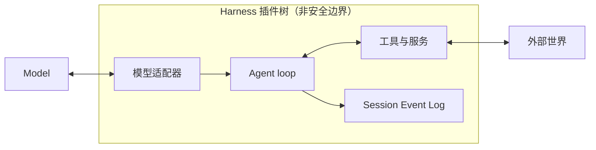

# 项目概览

基线：DeepSeek Harness commit `76fda729799fe9b3848dbe2c211d4b231032b81e`。

## 一句话结论

 **Claim `DSH-OVR-001`:** DeepSeek Harness 是一个开源、基于 Cordis 且采用全插件架构的 Agent Harness。

这里的上游事实术语是 Agent Harness、Cordis 与全插件架构。Agent = Model + Harness 是本手册的解释框架，不是上游原文。

## 机制

本节先给出用于阅读后续章节的概念图，再说明全插件架构中的替换范围和应用装配基座。

### Agent = Model + Harness

在本手册的解释框架中，Model 负责生成推理与行动选择，Harness 负责把模型连接到工具、服务、会话记录与外部世界。这个划分帮助读者区分模型能力与运行系统能力，不把分析用的等式误读为项目自称或上游定义。

图中的方框表示交互关系，不表示进程、信任或安全边界。具体隔离能力必须按其提供者和运行配置另行判断。

### 一切皆插件

固定基线把模型适配器、工具注册表、会话日志和 Agent loop 都描述为插件。插件共同装载在 Cordis context 中，并贡献服务、类型化事件和可逆 Effect；这里的“无特权核心”说明扩展通常通过并列装载插件完成，而不是要求修改一块不可替换的产品核心。

### 可替换能力与装配基座

 **Claim `DSH-OVR-002`:** 模型适配器、工具、会话与循环等产品能力可通过组合替换，但 Cordis、Loader 与受支持的 `dsh` Profile 启动链仍是应用装配基座。

这项结论是作者依据固定基线作出的 `analysis-inference`，不是上游原文。这里的“可替换”描述组合层面的实现选择，不表示运行中的组件可以任意并发替换。受支持的 Node 应用仍由 Cordis 与 Loader 读取插件树，并通过命名的 `dsh` Application Profile 启动；Profile 与 Agent Preset 的层级差异见[术语表](glossary.md)。

## 证据

三项结论的正式分类、限定和不可变来源由 `evidence/claims.json` 保管；[证据方法](00-methodology.md)解释字段和更新规则，[证据反向索引](source-map.md)提供按上游路径查找的入口。

| Claim | 种类 | 证据信心 | DeepSeek Harness 成熟度 | 固定来源 |
|---|---|---|---|---|
| `DSH-OVR-001` | `upstream-fact` | `verified` | `released` | [`README.md` 第 1–7 行](https://github.com/deepseek-ai/deepseek-harness/blob/76fda729799fe9b3848dbe2c211d4b231032b81e/README.md#L1-L7)；[`package.json` 第 1–10 行](https://github.com/deepseek-ai/deepseek-harness/blob/76fda729799fe9b3848dbe2c211d4b231032b81e/package.json#L1-L10) |
| `DSH-OVR-002` | `analysis-inference` | `qualified` | `released` | [`docs/architecture.md` 第 9–29 行](https://github.com/deepseek-ai/deepseek-harness/blob/76fda729799fe9b3848dbe2c211d4b231032b81e/docs/architecture.md#L9-L29)；[第 41–47 行](https://github.com/deepseek-ai/deepseek-harness/blob/76fda729799fe9b3848dbe2c211d4b231032b81e/docs/architecture.md#L41-L47) |
| `DSH-OVR-003` | `upstream-fact` | `qualified` | `released` | [`README.md` 第 11–15 行](https://github.com/deepseek-ai/deepseek-harness/blob/76fda729799fe9b3848dbe2c211d4b231032b81e/README.md#L11-L15) |

## 限制与适用范围

### 成熟度与边界

 **Claim `DSH-OVR-003`:** 固定基线中的 DeepSeek Harness 处于开发者预览阶段，明确允许破坏性变更，并要求运行前阅读安全说明。

固定基线处于开发者预览阶段。该成熟度结论只描述固定提交，不预测后续版本状态。

这里的 `released` 表示这些对象位于固定基线的已发布代码路径，不等于生产就绪。读者不应从全插件架构推导通用隔离保证，也不应跳过上游安全说明；本章只建立项目级阅读模型，不展开各能力的启用状态和失败模式。

## 继续阅读

- [专题深挖：Cordis 插件生命周期](deep-dives/cordis-lifecycle.md)
- [下一章：组合与生命周期架构](02-architecture.md)
- [证据方法](00-methodology.md)
- [术语表](glossary.md)
- [证据反向索引](source-map.md)
