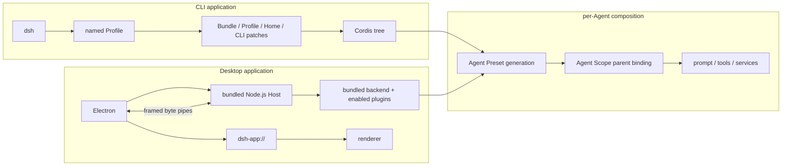
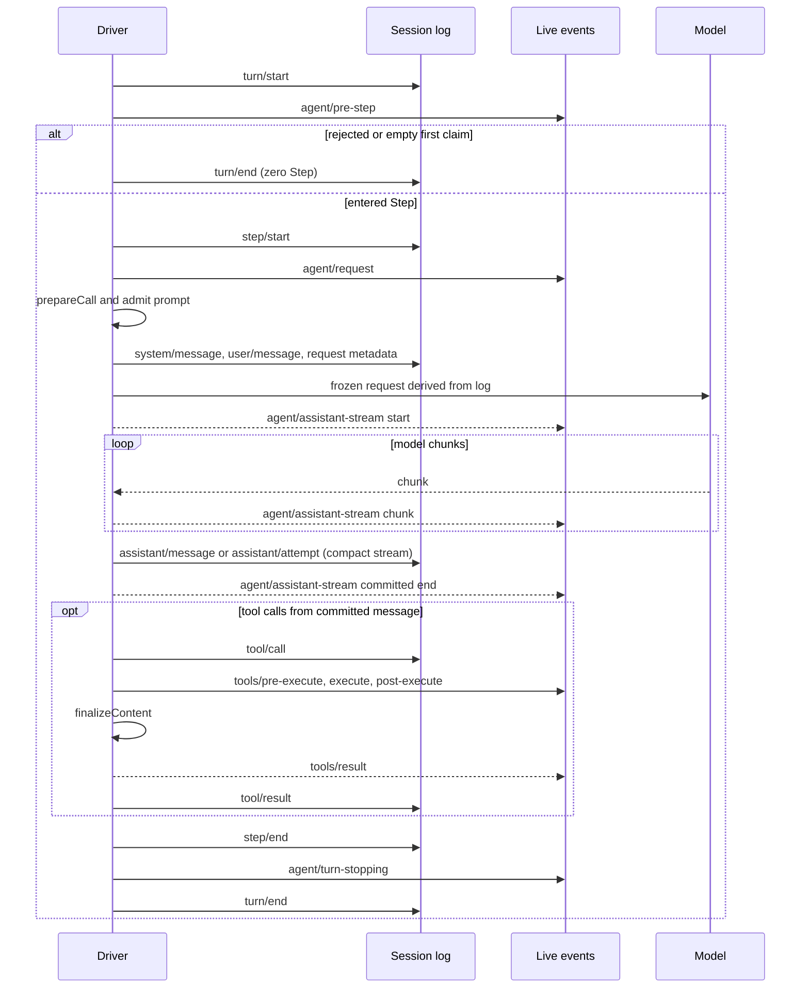

# 组合与生命周期架构

基线：DeepSeek Harness commit `0d1f50007f9bca3f52b06e1c3074fa14d5fb0720`。

## 一句话结论

DeepSeek Harness 用 Cordis 管理插件生命周期，用 Profile 组合 CLI 应用、用 Preset 组合 Agent；Desktop 另有 Electron 管理的独立 Host 启动路径。Session 日志记录可恢复事实，实时流式帧负责在途显示。

## 机制

### Cordis 与副作用所有权

模型适配器、工具注册表、Session 日志和 Agent loop 都作为插件挂载。Service 提供直接调用接口，类型化事件提供观察与策略扩展点；`inject` 声明的依赖控制插件激活和依赖变化后的重载。

 **Claim `DSH-ARCH-001`:** 通过 Cordis 生命周期 API 注册的副作用由所属插件的 Fiber 管理，并在卸载时启动清理。

`ctx.effect()` 和 `ctx.on()` 把注册交给所属 Fiber。卸载会启动拥有的 Effect wrapper，并等待其结算；同一 Effect 在无错误路径上逆序串接 disposer，不同 Effect 可以并行推进。

卸载结算不保证每个 disposer 都被调用或资源均已释放；未登记的外部副作用也不在自动清理范围内。

 **Claim `DSH-ARCH-003`:** 一个完整能力接缝由 Service Definition、Service Provider 与 Consumer 三种角色组成。

Service Definition 声明接口和 context key，Provider 实现能力，Consumer 调用接口。一个包可以兼任多种角色；单独一个 Provider 不构成完整能力接缝。

### 应用组合与 Desktop

 **Claim `DSH-ARCH-004`:** Application Profile 按顺序组合 Bundle 与 Patch；已发布 Profile 中只有 `web` 在运行时重载 Patch。

CLI Profile 从空配置行开始，依次应用有序 Bundle、Profile Patch、Harness Home Patch 和 CLI `--patch`。按 id 定位的 Patch 替换整个 config，不做字段深度合并。

自定义 Profile 默认可实时重载，而 `headless`、`sdk`、`sdk-minimal` 与 `acp` 只在启动时应用组合。

 **Claim `DSH-ARCH-008`:** Desktop 由 Electron 启动独立 Node.js Host，通过字节管道与 `dsh-app://` 服务渲染器；应用传输不启动 Web server 或 loopback 端口。

Desktop 使用随签名应用交付的 Node.js 和私有 Host 包，装载匹配版本的 backend、client graph 与已启用插件。`$DSH_HOME/profiles/desktop` 由 Electron 拥有，CLI 不能启动或修改它；这不是第六个 CLI Profile 模板。字节管道承载 RPC、Remote streams 和资源，Node IPC 仅承担生命周期控制。工作区开发可另开 [loopback inspector](https://github.com/deepseek-ai/deepseek-harness/blob/0d1f50007f9bca3f52b06e1c3074fa14d5fb0720/apps/desktop/src/host-process.ts#L88-L110)，不属于应用传输。

### Agent Preset 与 Scope

 **Claim `DSH-ARCH-005`:** Agent Preset 为每个 Agent 组合能力，Scope 通过父子关系隔离并继承注册。

Registry 先把完整 Preset 挂载到 standing Scope，再把 Agent Scope 绑定为其子级。注册沿父链可见，Agent 专属注册仍归自己的 Scope。相同 Preset 的 Agent 可以共享一个组合代；文件变化为后续加入者建立新代，已有 Session 保留旧代。子 Agent 要继承同一组合代，需要显式的 `composeFrom()` 绑定。

Profile Patch 重组应用树，Preset 选择改变 Agent 的能力组合，两者生命周期不同。详细限制见[组合专题](deep-dives/profiles-bundles-presets.md)。

### 事件域与 Turn

 **Claim `DSH-ARCH-002`:** durable session、live agent 与 capability 三类事件域服务于不同生命周期。

| 事件域 | 例子 | 用途 |
|---|---|---|
| durable session | `turn/*`、`step/*`、`system/message`、`user/message`、`assistant/message`、`assistant/attempt`、`tool/*` | 追加到日志并经 `session/event` 广播，供恢复和投影使用。 |
| live agent | `agent/pre-step`、`agent/request`、`agent/assistant-stream` | 携带运行中的 Agent，控制或观察在途工作。 |
| capability | `llm/stream`、`tools/*`、`fs/*` | 在相应能力上连接策略与适配器。 |

 **Claim `DSH-ARCH-006`:** 一个 Turn 包含零个或多个模型与工具 Step，并由类型化 waterfall 扩展点控制。

Driver 先记录 `turn/start`，再认领输入。`agent/pre-step` 可以拒绝输入或把首个提议改为空，使 Turn 直接结束而不进入 Step。进入 Step 后，`agent/request` 与 `prepareCall()` 先确定实际模型路由，再提交 system、user 和 request 记录；这两个异步阶段内取消，不会提交该次 system 或 user 输入。

图只展开一次 Step；工具或新输入可以使同一 Turn 继续。Waterfall listener 调用 `next()` 才委托后续处理；`agent/turn-stopping` 是 serial 事件，没有 `next()`。工具流水线在 `finalizeContent` 后发布 live `tools/result`，随后 Driver 才写 durable `tool/result`。[工具流水线](https://github.com/deepseek-ai/deepseek-harness/blob/0d1f50007f9bca3f52b06e1c3074fa14d5fb0720/docs/tool-execution-pipeline.md#L1-L62)提供细节。

### 日志、流式输出与模型历史

 **Claim `DSH-ARCH-007`:** 所有进入模型请求的输入都可由追加式 Session Event Log 重建。

日志用连续 `seq` 排序事实，`deriveMessages()` 从当前 surface 派生模型历史。System prompt 作为 `system/message` 进入历史；`request/header` 保存调用配置、adapter defaults 和工具 schema。请求路由先确定，已接受输入再落日志，模型请求随后从日志构造。

`agent/assistant-stream` 的 start、chunk、end 是实时帧。请求结算时，完整 timed compact stream 写入一个 `assistant/message` 或 log-only `assistant/attempt`；后者保存失败、重试或取消尝试的证据，不增加模型消息。结算前的进程硬终止不会留下该 attempt 的 durable stream。当前日志不把 `assistant/chunk` 作为逐块持久事件。

当前逻辑格式是 v3。JSONL Provider 读取受支持的历史格式时执行静态迁移链；只读打开不写 successor，写打开先验证再发布新一代文件，原文件保持不变。持久化、Fork 与恢复细节见[Session 专题](deep-dives/session-event-log.md)。

## 证据

本页八项 Claim 均为 `upstream-fact`、成熟度 `released`；标准陈述、限定与来源由 [claim ledger](../evidence/claims.json) 保管。

| Claim | 证据信心 | 固定来源 |
|---|---|---|
| `DSH-ARCH-001` | `qualified` | [`fiber.ts` 418–441](https://github.com/deepseek-ai/deepseek-harness/blob/0d1f50007f9bca3f52b06e1c3074fa14d5fb0720/vendor/cordis/src/fiber.ts#L418-L441)；[`fiber.ts` 675–695](https://github.com/deepseek-ai/deepseek-harness/blob/0d1f50007f9bca3f52b06e1c3074fa14d5fb0720/vendor/cordis/src/fiber.ts#L675-L695) |
| `DSH-ARCH-002` | `verified` | [`architecture.md` 70–78](https://github.com/deepseek-ai/deepseek-harness/blob/0d1f50007f9bca3f52b06e1c3074fa14d5fb0720/docs/architecture.md#L70-L78)；[`runtime-types.ts` 354–363](https://github.com/deepseek-ai/deepseek-harness/blob/0d1f50007f9bca3f52b06e1c3074fa14d5fb0720/packages/core/agent/src/runtime-types.ts#L354-L363) |
| `DSH-ARCH-003` | `verified` | [`architecture.md` 127–131](https://github.com/deepseek-ai/deepseek-harness/blob/0d1f50007f9bca3f52b06e1c3074fa14d5fb0720/docs/architecture.md#L127-L131) |
| `DSH-ARCH-004` | `qualified` | [`architecture.md` 25–29](https://github.com/deepseek-ai/deepseek-harness/blob/0d1f50007f9bca3f52b06e1c3074fa14d5fb0720/docs/architecture.md#L25-L29)；[`profile.ts` 138–171](https://github.com/deepseek-ai/deepseek-harness/blob/0d1f50007f9bca3f52b06e1c3074fa14d5fb0720/packages/boot/app-boot/src/profile.ts#L138-L171) |
| `DSH-ARCH-005` | `verified` | [`index.ts` 430–455](https://github.com/deepseek-ai/deepseek-harness/blob/0d1f50007f9bca3f52b06e1c3074fa14d5fb0720/packages/preset/agent-presets/src/index.ts#L430-L455)；[`index.ts` 32–50](https://github.com/deepseek-ai/deepseek-harness/blob/0d1f50007f9bca3f52b06e1c3074fa14d5fb0720/packages/core/scope/src/index.ts#L32-L50) |
| `DSH-ARCH-006` | `verified` | [`architecture.md` 82–111](https://github.com/deepseek-ai/deepseek-harness/blob/0d1f50007f9bca3f52b06e1c3074fa14d5fb0720/docs/architecture.md#L82-L111) |
| `DSH-ARCH-007` | `verified` | [`architecture.md` 117–125](https://github.com/deepseek-ai/deepseek-harness/blob/0d1f50007f9bca3f52b06e1c3074fa14d5fb0720/docs/architecture.md#L117-L125)；[`types.ts` 226–238](https://github.com/deepseek-ai/deepseek-harness/blob/0d1f50007f9bca3f52b06e1c3074fa14d5fb0720/packages/core/session/src/types.ts#L226-L238)；[`types.ts` 299–310](https://github.com/deepseek-ai/deepseek-harness/blob/0d1f50007f9bca3f52b06e1c3074fa14d5fb0720/packages/core/session/src/types.ts#L299-L310) |
| `DSH-ARCH-008` | `verified` | [`architecture.md` 49–53](https://github.com/deepseek-ai/deepseek-harness/blob/0d1f50007f9bca3f52b06e1c3074fa14d5fb0720/docs/architecture.md#L49-L53)；[`README.md` 5](https://github.com/deepseek-ai/deepseek-harness/blob/0d1f50007f9bca3f52b06e1c3074fa14d5fb0720/apps/desktop/README.md#L5)；[`README.md` 22–26](https://github.com/deepseek-ai/deepseek-harness/blob/0d1f50007f9bca3f52b06e1c3074fa14d5fb0720/apps/desktop/README.md#L22-L26) |

## 限制与适用范围

`live` 仅说明 Patch 重载策略，不承诺任意模块或活动请求状态无缝替换。无效 Patch 不改变运行配置；有效 Patch 中的插件失败可能保留成功的其他条目，不能把整个更新理解为事务回滚。

Preset 的旧代保留至整棵应用树 teardown，文件编辑不会自动替换已运行 Session 的能力。实时 UI 帧与 durable 结算记录不能互换：日志投影可重建已提交历史，不保存尚未结算的内存状态。

确定性 replay fixture 用于固定场景回归；这些原语不构成通用 debugger，也不提供性能、成本或质量结论。

## 继续阅读

- [Cordis 插件生命周期](deep-dives/cordis-lifecycle.md)
- [应用与 Session 的组合层](deep-dives/profiles-bundles-presets.md)
- [Session Event Log](deep-dives/session-event-log.md)
- [上一章：项目概览](01-overview.md)
- [下一章：能力与组合归属](03-capabilities.md)
- [证据方法](00-methodology.md) · [术语表](glossary.md) · [证据反向索引](source-map.md)
