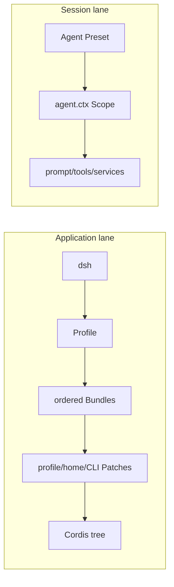
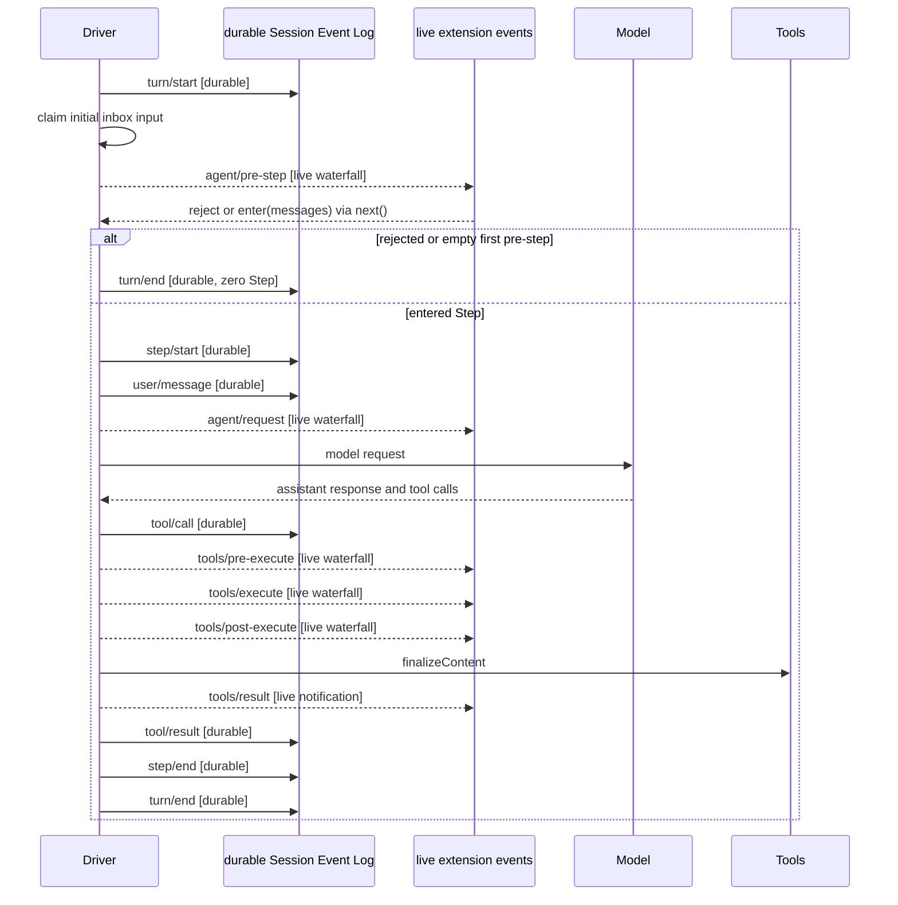

# 组合与生命周期架构

基线：DeepSeek Harness commit `76fda729799fe9b3848dbe2c211d4b231032b81e`。

## 一句话结论

DeepSeek Harness 以 Cordis 插件树管理应用级生命周期，再用 Application Profile 与 Agent Preset 分别完成应用级和 Agent 级组合。

## 机制

本节先说明 Cordis 如何拥有插件副作用、服务与事件，再区分应用启动组合和每个 Agent 的能力组合。

### Cordis 与微内核

Cordis 是插件树、共享 context 与生命周期的装配基座。模型适配器、工具注册表、Session Event Log 和 Agent loop 都作为插件并列装载；“无特权核心”表示产品能力不集中在一块必须修改的业务核心中，不表示应用脱离 Cordis、Loader 或 `dsh` Profile 启动链运行。

插件通过稳定的 `ctx.<key>` 查找 Service，并用 `inject` 声明依赖。提供者出现后依赖插件才会激活，因此服务需求而不是手写启动顺序表达依赖关系。

### 可逆副作用

 **Claim `DSH-ARCH-001`:** 通过 Cordis 生命周期 API 注册的副作用由所属插件的 Fiber 管理，并在卸载时启动清理。

通过 `ctx.effect()` 或 `ctx.on()` 注册的副作用归所属 Fiber 管理。卸载时，Fiber 启动它拥有的 Effect wrapper，并以 `Promise.all` 等待 wrapper 结算；同一 Effect 内的 disposer 在无错误路径上按逆序串接，不同 Effect 则可并行推进。

卸载结算不保证每个 disposer 都被调用或资源均已释放；未登记的外部副作用也不在自动清理范围内。

### 服务与类型化事件

 **Claim `DSH-ARCH-002`:** durable session、live agent 与 capability 三类事件域服务于不同生命周期。

Service 适合直接调用能力，类型化 Event 适合观察、拦截和策略扩展。事件名和 payload 通过 TypeScript declaration merging 声明，并按 `emit`、`waterfall`、`parallel`、`serial` 或 `bail` 等模式派发。

durable session 事件记录需要跨重载保留的事实；live agent 事件携带运行中的 Agent，用于观察或拦截在途工作；capability 事件把策略和适配器接到文件系统、工具、遥测等能力上，而不要求能力直接导入 Agent loop。本章只界定三个事件域，Turn、Step 和事件时序留待后续架构段落说明。

### 能力接缝

 **Claim `DSH-ARCH-003`:** 一个完整能力接缝由 Service Definition、Service Provider 与 Consumer 三种角色组成。

Service Definition、Service Provider 与 Consumer 三者共同构成完整能力接缝。Definition 声明稳定接口和 context key，Provider 实现能力，Consumer 通过该接口使用能力；单独一个 Provider 不是完整接缝。以 filesystem 为例，Definition 声明文件操作接口，Provider 把操作接入本地或远端执行环境，Consumer 通过同一接口提供文件相关能力。

### 两层组合

应用层和 Agent 层使用不同的组合入口，二者不能互称。下图只表示组合顺序与作用域，不表示这些节点可以在运行中任意并发替换。

#### Application Profile

 **Claim `DSH-ARCH-004`:** Application Profile 按顺序组合 Bundle 与 Patch；已发布 Profile 中只有 `web` 在运行时重载 Patch。

Profile 从空 entry 列表开始，依次应用 manifest 中列出的 Bundle，再应用 profile、Harness home 和 CLI `--patch` 层，最终形成 Cordis tree。web 在运行时重载 Patch；headless、sdk、sdk-minimal 与 acp 只在启动时应用组合；自定义 Profile 默认实时重载。

#### Agent Preset 与 Scope

 **Claim `DSH-ARCH-005`:** Agent Preset 为每个 Agent 组合能力，Scope 通过父子关系隔离并继承注册。

Agent Preset 在每个 Agent 的子 Scope 中组合能力。实现先把一个 Preset 载入 standing Scope，再把 `agent.ctx` 对应的 Scope 绑定为它的子级；子 Scope 因而继承 Preset 的 prompt、tools 和 services，同时避免把 Agent 专属注册发布到进程根。这里的继承描述 Scope 注册视图沿父子链向下可见，不表示子 Agent 自动继承父 Agent 的作用域。

### 事件域

Turn、Step、`user/message`、`assistant/*`、`tool/call` 与 `tool/result` 等 durable session 事件作为事实追加到 Session Event Log，并通过 `session/event` 广播。`agent/*` 携带运行中的 Agent，`tools/*` 把策略和适配器接入工具执行；这两类事件用于在途协调或拦截。

live 扩展事件不等于 durable Session Event Log。

### Turn 与 Step

 **Claim `DSH-ARCH-006`:** 一个 Turn 包含零个或多个模型与工具 Step，并由类型化 waterfall 扩展点控制。

Driver 先写入 `turn/start`，再认领初始 inbox 输入；一个 Step 包含一次模型请求及其工具调用。`agent/pre-step` 可以改写或拒绝已认领的消息：如果第一个提议被拒绝或改写为空，Driver 直接写入 `turn/end`，这个 Turn 没有 `step/start`、模型请求或工具调用。成功进入的提议从 `step/start` 开始，并在模型请求和该轮工具处理完成后以 `step/end` 结束；只要工具仍要求下一次请求或 inbox 提供了后续输入，同一 Turn 就可继续下一个 Step。

图中写入 Log 的消息是 durable session events，发往 Hooks 的消息是 live 扩展事件；模型响应还会以 `assistant/chunk` 和 `assistant/message` 等 durable 事件进入日志。图只展开一个成功 Step；同一 Turn 可以重复认领和执行更多 Step。

### 工具执行瀑布

Waterfall listener 必须调用 next() 才会委托后续处理。

模型产生工具调用后，Driver 先记录 durable `tool/call`，再依次进入 live `tools/pre-execute`、单调 guard、live `tools/execute` 和 live `tools/post-execute`。`tools/post-execute` 返回后，`ToolDefinition.finalizeContent` 先完成最终内容处理，live `tools/result` 再观察冻结的结果，随后 Driver 才记录单一的 durable `tool/result`；因此 `tools/*` 扩展事件不能替代 `tool/call` 或 `tool/result` 作为可恢复历史。

### 追加式日志与投影

Session Event Log 以单调 `seq` 追加类型化 `SessionEventMap` 事件。`deriveMessages()` 从日志投影模型历史，原始 `assistant/chunk` 保留 replay 与界面所需的流式细节；持久化、resume、已完成 Turn 的 fork、transcript 和 telemetry 都从同一事件流派生。

#### model-visible means logged

 **Claim `DSH-ARCH-007`:** 所有进入模型请求的输入都可由追加式 Session Event Log 重建。

新的 model-visible 输入必须先成为 session event，再由日志投影进入模型请求。这个要求覆盖实际到达模型请求的输入，不把每一次 CLI、UI 或尚未进入 Step 的交互都假定为 durable 用户消息。

## 证据

七项结论的正式分类、限定与不可变来源由 [`evidence/claims.json`](../evidence/claims.json) 保管；[证据方法](00-methodology.md)解释字段和更新规则，[证据反向索引](source-map.md)提供按上游路径查找的入口。

| Claim | 种类 | 证据信心 | DeepSeek Harness 成熟度 | 固定来源 |
|---|---|---|---|---|
| `DSH-ARCH-001` | `upstream-fact` | `qualified` | `released` | [`docs/architecture.md` 第 9–13 行](https://github.com/deepseek-ai/deepseek-harness/blob/76fda729799fe9b3848dbe2c211d4b231032b81e/docs/architecture.md#L9-L13)；[`docs/cordis-primer.md` 第 9–13 行](https://github.com/deepseek-ai/deepseek-harness/blob/76fda729799fe9b3848dbe2c211d4b231032b81e/docs/cordis-primer.md#L9-L13)；[`fiber.ts` disposer 类型第 64–93 行](https://github.com/deepseek-ai/deepseek-harness/blob/76fda729799fe9b3848dbe2c211d4b231032b81e/vendor/cordis/src/fiber.ts#L64-L93)、[`runDisposable` 第 114–117 行](https://github.com/deepseek-ai/deepseek-harness/blob/76fda729799fe9b3848dbe2c211d4b231032b81e/vendor/cordis/src/fiber.ts#L114-L117)、[Effect 清理链第 427–441 行](https://github.com/deepseek-ai/deepseek-harness/blob/76fda729799fe9b3848dbe2c211d4b231032b81e/vendor/cordis/src/fiber.ts#L427-L441)、[Fiber 卸载第 675–695 行](https://github.com/deepseek-ai/deepseek-harness/blob/76fda729799fe9b3848dbe2c211d4b231032b81e/vendor/cordis/src/fiber.ts#L675-L695)；[`utils.ts` 第 27–31 行](https://github.com/deepseek-ai/deepseek-harness/blob/76fda729799fe9b3848dbe2c211d4b231032b81e/vendor/cordis/src/utils.ts#L27-L31) |
| `DSH-ARCH-002` | `upstream-fact` | `verified` | `released` | [`docs/architecture.md` 第 64–72 行](https://github.com/deepseek-ai/deepseek-harness/blob/76fda729799fe9b3848dbe2c211d4b231032b81e/docs/architecture.md#L64-L72)；[`docs/cordis-primer.md` 第 9–27 行](https://github.com/deepseek-ai/deepseek-harness/blob/76fda729799fe9b3848dbe2c211d4b231032b81e/docs/cordis-primer.md#L9-L27) |
| `DSH-ARCH-003` | `upstream-fact` | `verified` | `released` | [`docs/architecture.md` 第 111–117 行](https://github.com/deepseek-ai/deepseek-harness/blob/76fda729799fe9b3848dbe2c211d4b231032b81e/docs/architecture.md#L111-L117) |
| `DSH-ARCH-004` | `upstream-fact` | `qualified` | `released` | [`docs/architecture.md` 第 15–29 行](https://github.com/deepseek-ai/deepseek-harness/blob/76fda729799fe9b3848dbe2c211d4b231032b81e/docs/architecture.md#L15-L29)；[`profile.ts` 第 1–23 行](https://github.com/deepseek-ai/deepseek-harness/blob/76fda729799fe9b3848dbe2c211d4b231032b81e/packages/boot/app-boot/src/profile.ts#L1-L23)、[第 49–72 行](https://github.com/deepseek-ai/deepseek-harness/blob/76fda729799fe9b3848dbe2c211d4b231032b81e/packages/boot/app-boot/src/profile.ts#L49-L72)、[第 136–169 行](https://github.com/deepseek-ai/deepseek-harness/blob/76fda729799fe9b3848dbe2c211d4b231032b81e/packages/boot/app-boot/src/profile.ts#L136-L169) |
| `DSH-ARCH-005` | `upstream-fact` | `verified` | `released` | [`docs/architecture.md` 第 49–61 行](https://github.com/deepseek-ai/deepseek-harness/blob/76fda729799fe9b3848dbe2c211d4b231032b81e/docs/architecture.md#L49-L61)；[`preset.ts` 第 1–70 行](https://github.com/deepseek-ai/deepseek-harness/blob/76fda729799fe9b3848dbe2c211d4b231032b81e/packages/preset/agent-presets/src/preset.ts#L1-L70)；[`index.ts` 第 380–426 行](https://github.com/deepseek-ai/deepseek-harness/blob/76fda729799fe9b3848dbe2c211d4b231032b81e/packages/preset/agent-presets/src/index.ts#L380-L426)、[第 745–794 行](https://github.com/deepseek-ai/deepseek-harness/blob/76fda729799fe9b3848dbe2c211d4b231032b81e/packages/preset/agent-presets/src/index.ts#L745-L794)；[`mount.ts` 第 368–415 行](https://github.com/deepseek-ai/deepseek-harness/blob/76fda729799fe9b3848dbe2c211d4b231032b81e/packages/preset/agent-presets/src/mount.ts#L368-L415)；[`scope/index.ts` 第 32–82 行](https://github.com/deepseek-ai/deepseek-harness/blob/76fda729799fe9b3848dbe2c211d4b231032b81e/packages/core/scope/src/index.ts#L32-L82)、[第 129–147 行](https://github.com/deepseek-ai/deepseek-harness/blob/76fda729799fe9b3848dbe2c211d4b231032b81e/packages/core/scope/src/index.ts#L129-L147) |
| `DSH-ARCH-006` | `upstream-fact` | `verified` | `released` | [`docs/architecture.md` 第 76–101 行](https://github.com/deepseek-ai/deepseek-harness/blob/76fda729799fe9b3848dbe2c211d4b231032b81e/docs/architecture.md#L76-L101)；[`docs/agent-lifecycle.md` 第 4–80 行](https://github.com/deepseek-ai/deepseek-harness/blob/76fda729799fe9b3848dbe2c211d4b231032b81e/docs/agent-lifecycle.md#L4-L80)；[`docs/tool-execution-pipeline.md` 第 1–62 行](https://github.com/deepseek-ai/deepseek-harness/blob/76fda729799fe9b3848dbe2c211d4b231032b81e/docs/tool-execution-pipeline.md#L1-L62) |
| `DSH-ARCH-007` | `upstream-fact` | `verified` | `released` | [`docs/architecture.md` 第 103–109 行](https://github.com/deepseek-ai/deepseek-harness/blob/76fda729799fe9b3848dbe2c211d4b231032b81e/docs/architecture.md#L103-L109)；[`types.ts` 第 20–120 行](https://github.com/deepseek-ai/deepseek-harness/blob/76fda729799fe9b3848dbe2c211d4b231032b81e/packages/core/session/src/types.ts#L20-L120)、[第 436–470 行](https://github.com/deepseek-ai/deepseek-harness/blob/76fda729799fe9b3848dbe2c211d4b231032b81e/packages/core/session/src/types.ts#L436-L470) |

## 限制与适用范围

`live` 只说明 Profile Patch 文件在应用存活时会重载，不表示任意插件实现可以并发换装。已发布 Profile 中，只有 `web` 使用 `live`；`headless`、`sdk`、`sdk-minimal` 与 `acp` 使用 `startup`，而自定义 Profile 的默认值是 `live`。`DSH-ARCH-004` 的正式限定语是：自定义 Profile 默认可实时重载，而 `headless`、`sdk`、`sdk-minimal` 与 `acp` 只在启动时应用组合。

Effect 清理不会提供跨所有 Effect 的全局异步完成顺序。同一 Effect 只提供无错误路径上的逆序串接：同步抛错会退出循环，Promise rejection 会绕过后续成功回调；Fiber 记录 wrapper 失败后继续卸载。需要确保每项清理均被尝试的资源所有者必须用适合资源关系的 `try`/`finally` 或显式错误处理组织 disposer，但这种控制流仍不能保证资源一定释放成功。

Preset 组合按 Agent 的 Scope 生效。Preset 文件变更为后续加入的 Session 建立新 generation，已加入的 Session 保留原 generation；这不是活动 Session 的任意工具换装机制。

日志投影是依据已提交事件计算的派生视图，不是原始数据源；读取者需要原始事实或流式细节时应使用 Session Event Log，而不能把投影反向当作完整原始记录。

确定性 replay fixture 用于固定场景的回归验证，不是完整的终端用户 debugger，也不是性能 benchmark；它不能单独证明任意会话都可逐步调试或量化速度、成本与质量。

## 继续阅读

- [专题深挖：Cordis 插件生命周期](deep-dives/cordis-lifecycle.md)
- [专题深挖：应用与 Session 的组合层](deep-dives/profiles-bundles-presets.md)
- [专题深挖：Session Event Log](deep-dives/session-event-log.md)
- [上一章：项目概览](01-overview.md)
- [下一章：能力与组合归属](03-capabilities.md)
- [证据方法](00-methodology.md)
- [术语表](glossary.md)
- [证据反向索引](source-map.md)
