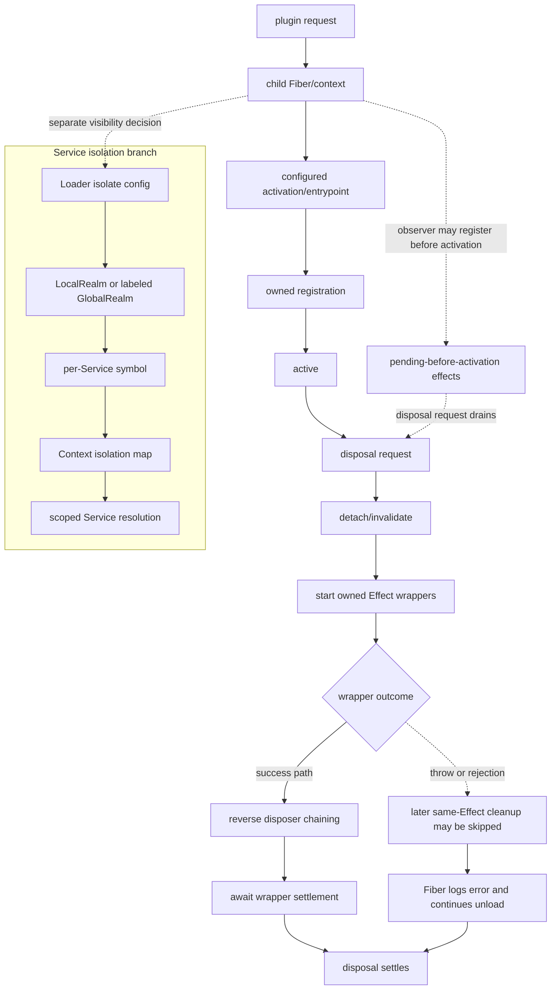

# Cordis 插件生命周期

## 基线

基线：DeepSeek Harness commit `76fda729799fe9b3848dbe2c211d4b231032b81e`。

## 一句话结论

Cordis 为每次插件请求创建子 Fiber 与 Context，由 Fiber 接管通过生命周期 API 注册的 Service、Event Listener 与其他 Effect，并在卸载或依赖变化时启动有归属的清理；Loader 的 Realm 只改变指定 Service 的解析标识，不是全局命名空间或操作系统隔离。

 **Claim `DSH-DD-CORDIS-001`:** 子 Context 与隔离 Realm 共同决定插件可见性和 Service 解析范围。

 **Claim `DSH-DD-CORDIS-002`:** 同一 Effect 内的 disposer 默认逆序串接，单个 disposer 失败可能跳过其后续清理，而 Fiber 会记录错误并继续卸载。

跨 Effect 没有全局串行完成顺序；需要确保各项清理均被尝试的资源所有者必须显式处理清理异常。

 **Claim `DSH-DD-CORDIS-003`:** Event Listener 由 Fiber 拥有，Waterfall Listener 通过显式调用 `next()` 委托后续处理。

## 机制

### Context 树与可见性

根 Context 安装内建 Service；`extend()` 创建从父 Context 原型继承的子 Context，而不会修改父 Context。插件读取普通 `ctx.<service>` 属性时，解析器沿 Fiber 父链查找可用实现，并在 isolation symbol 变化处停止继续向上解析。`inject` 不是访问权限开关：当前插件声明的依赖会进入它自己的实现快照与 epoch，以控制激活和 reload；未声明的访问仍可能取得父 Fiber 的实现，但当前插件不会通过自己的依赖快照获得该 Service 的可用性门控与 reload 跟踪。

`Realm` 是 Loader 中实际存在的抽象。配置把某个 Service 设为 `isolate: true` 时，`LocalRealm` 为该 Entry 生成 Service symbol；配置使用字符串标签时，同标签 Entry 通过 `GlobalRealm` 取得共享 symbol。Loader 把这些 symbol 写入 Context 的 isolation map，Cordis 的 Service store 再以 symbol 取实现；Realm 不是 Cordis core 类型，也不是 OS sandbox。

### Plugin/Fiber 生命周期

`ctx.plugin()` 解析插件入口并创建 Fiber；Fiber 构造期间先创建子 Context、把自身登记为父 Fiber 拥有的 Effect，再发布插件通知和检查 `inject`。依赖满足后，Fiber 解析配置、调用函数、构造器或对象 `apply` 入口，并把入口产生的 Effect disposer 收入自身；入口完成后 Fiber 才进入 active 状态。

卸载请求先使 Fiber 对后续注册不可用，并把它从 runtime 中脱离；随后 Fiber 进入 unload。若 Fiber 仍处于 pending 且监听器已经在激活前为它登记 Effect，显式 disposal 也会启动 unload，并等待这些 Effect wrapper 结算。

### Effect 与 disposer

`ctx.effect(execute)` 同步开始执行 `execute`，并先把 Effect wrapper 登记到所属 Fiber，因此重入式卸载也能观察到尚在 setup 的 Effect。公开 disposer 是单次操作；在无错误路径上，Effect 内部收集的多个 disposer 逆序串接，异步 disposer 完成后才继续下一个。

Fiber 卸载时从 `DisposableList` 取得逆序的 Effect wrapper，在独立的异步任务中启动各 wrapper，并以 `Promise.all` 等待任务结算。`runDisposable()` 直接调用 disposer；同步抛错会退出当前 Effect 的反向循环，Promise rejection 会绕过以 `.then()` 注册的后续 disposer。Fiber 捕获并记录 wrapper 的失败后继续卸载，因此卸载结算不证明每个 disposer 均已调用或每项资源均已释放。

### 事件注册与 waterfall

`ctx.on()` 先确认当前 Fiber 可注册，再把已绑定的 Listener 通过 `ctx.effect()` 加入事件表；返回的 disposer 与 Fiber 卸载都能移除同一 Listener。注册动作本身是同步的，而 disposer 可以触发异步清理；等待 Fiber 或 disposer 的 Promise 只能确认 teardown 任务已结算，不能单独证明资源释放成功。

Waterfall 把最终行为作为最内层 `next`，每个 Listener 包裹余下链路。Listener 只有显式调用 `next()` 才会把控制权交给后续 Listener 或最终行为；不调用 `next()` 会有意短路余下链路，适合拥有决定权的策略 Listener，但只做观察或注解的 Listener 必须委托。

### 卸载与 reload

当前插件通过 `inject` 声明的 Service 会组成它自己的实现快照与 epoch，因此它只在这些依赖都可用时激活；已跟踪 Provider 的变化会重算 epoch，使 active Fiber 先 unload 自己拥有的 Effect，再在新依赖快照下调用入口。未声明的访问可能沿父 Fiber 找到实现，但不会单独把该 Service 纳入当前插件的激活或 reload 条件；父 Fiber 自身的生命周期仍可能产生其他间接变化。Loader 的 context patch 也会更新 isolation map，并通知受影响的 Fiber。

这里的 reload 范围由 Loader Entry、依赖变化和生命周期注册决定，不是任意副作用的热替换。直接创建且没有放入 `ctx.effect()`、`ctx.on()`、`ctx.provide()` 或其他生命周期 helper 的计时器、句柄和外部资源不会自动变成可逆注册，插件仍须显式返回 disposer。

## 源码导读

下表按一次插件请求的阅读顺序连接固定源码；链接均固定到手册基线的完整 commit。

| 主题 | 固定来源 | 可核对行为 |
|---|---|---|
| Context 创建 | [`context.ts` proxy 第 38–40 行](https://github.com/deepseek-ai/deepseek-harness/blob/76fda729799fe9b3848dbe2c211d4b231032b81e/vendor/cordis/src/context.ts#L38-L40)、[根 Context 与 `extend()` 第 70–107 行](https://github.com/deepseek-ai/deepseek-harness/blob/76fda729799fe9b3848dbe2c211d4b231032b81e/vendor/cordis/src/context.ts#L70-L107)、[`isolate()` 第 109–125 行](https://github.com/deepseek-ai/deepseek-harness/blob/76fda729799fe9b3848dbe2c211d4b231032b81e/vendor/cordis/src/context.ts#L109-L125) | 根 Context 安装内建 Service；子 Context 继承父级，并可替换单个 Service 的 isolation symbol。 |
| 插件入口与依赖 | [`registry.ts` Plugin 类型第 91–123 行](https://github.com/deepseek-ai/deepseek-harness/blob/76fda729799fe9b3848dbe2c211d4b231032b81e/vendor/cordis/src/registry.ts#L91-L123)、[Context 方法第 164–185 行](https://github.com/deepseek-ai/deepseek-harness/blob/76fda729799fe9b3848dbe2c211d4b231032b81e/vendor/cordis/src/registry.ts#L164-L185)、[registry 实现第 293–336 行](https://github.com/deepseek-ai/deepseek-harness/blob/76fda729799fe9b3848dbe2c211d4b231032b81e/vendor/cordis/src/registry.ts#L293-L336) | Plugin 声明 `inject`，`ctx.plugin()` 创建 Fiber，并等待加载结算。 |
| Service 解析 | [`reflect.ts` store 第 134–170 行](https://github.com/deepseek-ai/deepseek-harness/blob/76fda729799fe9b3848dbe2c211d4b231032b81e/vendor/cordis/src/reflect.ts#L134-L170)、[proxy handler 第 225–242 行](https://github.com/deepseek-ai/deepseek-harness/blob/76fda729799fe9b3848dbe2c211d4b231032b81e/vendor/cordis/src/reflect.ts#L225-L242)、[Service 声明第 267–304 行](https://github.com/deepseek-ai/deepseek-harness/blob/76fda729799fe9b3848dbe2c211d4b231032b81e/vendor/cordis/src/reflect.ts#L267-L304)、[`fiber.ts` 第 597–639 行](https://github.com/deepseek-ai/deepseek-harness/blob/76fda729799fe9b3848dbe2c211d4b231032b81e/vendor/cordis/src/fiber.ts#L597-L639) | Context proxy 沿父 Fiber 与 isolation symbol 解析 Service；`inject` 建立当前插件的 active 实现快照和 reload epoch，而不是统一阻止未声明访问；`provide()` 由 Effect 拥有。 |
| Loader Realm | [`isolate.ts` 第 25–101 行](https://github.com/deepseek-ai/deepseek-harness/blob/76fda729799fe9b3848dbe2c211d4b231032b81e/vendor/loader/src/config/isolate.ts#L25-L101) | `LocalRealm` 与 `GlobalRealm` 生成并写入按 Service 区分的 symbol。 |
| Fiber 建立与销毁 | [`fiber.ts` 状态与容器第 180–203 行](https://github.com/deepseek-ai/deepseek-harness/blob/76fda729799fe9b3848dbe2c211d4b231032b81e/vendor/cordis/src/fiber.ts#L180-L203)、[构造与 disposal 第 222–295 行](https://github.com/deepseek-ai/deepseek-harness/blob/76fda729799fe9b3848dbe2c211d4b231032b81e/vendor/cordis/src/fiber.ts#L222-L295) | Fiber 创建子 Context；disposal 先 detach/invalidate，再驱动 unload，并排空激活前 Effect。 |
| Effect 与 unload | [`fiber.ts` disposer 类型第 70–93 行](https://github.com/deepseek-ai/deepseek-harness/blob/76fda729799fe9b3848dbe2c211d4b231032b81e/vendor/cordis/src/fiber.ts#L70-L93)、[`runDisposable` 第 114–117 行](https://github.com/deepseek-ai/deepseek-harness/blob/76fda729799fe9b3848dbe2c211d4b231032b81e/vendor/cordis/src/fiber.ts#L114-L117)、[Effect 清理链第 427–441 行](https://github.com/deepseek-ai/deepseek-harness/blob/76fda729799fe9b3848dbe2c211d4b231032b81e/vendor/cordis/src/fiber.ts#L427-L441)、[Fiber 卸载第 675–695 行](https://github.com/deepseek-ai/deepseek-harness/blob/76fda729799fe9b3848dbe2c211d4b231032b81e/vendor/cordis/src/fiber.ts#L675-L695)、[`utils.ts` 第 27–31 行](https://github.com/deepseek-ai/deepseek-harness/blob/76fda729799fe9b3848dbe2c211d4b231032b81e/vendor/cordis/src/utils.ts#L27-L31) | Effect wrapper 接管 disposer；同一 Effect 在成功路径上逆序串接清理，失败可跳过后续 disposer；Fiber 记录 wrapper 错误并继续卸载。 |
| Event 与 waterfall | [`events.ts` 类型第 24–32 行](https://github.com/deepseek-ai/deepseek-harness/blob/76fda729799fe9b3848dbe2c211d4b231032b81e/vendor/cordis/src/events.ts#L24-L32)、[注册与派发第 37–108 行](https://github.com/deepseek-ai/deepseek-harness/blob/76fda729799fe9b3848dbe2c211d4b231032b81e/vendor/cordis/src/events.ts#L37-L108)、[waterfall 第 177–243 行](https://github.com/deepseek-ai/deepseek-harness/blob/76fda729799fe9b3848dbe2c211d4b231032b81e/vendor/cordis/src/events.ts#L177-L243)、[公开事件方法第 254–301 行](https://github.com/deepseek-ai/deepseek-harness/blob/76fda729799fe9b3848dbe2c211d4b231032b81e/vendor/cordis/src/events.ts#L254-L301)、[`cordis-primer.md` 第 9–45 行](https://github.com/deepseek-ai/deepseek-harness/blob/76fda729799fe9b3848dbe2c211d4b231032b81e/docs/cordis-primer.md#L9-L45) | Listener 以 Effect 登记；waterfall 只在 Listener 调用 `next()` 时继续。 |

## 限制与失败

### 失败模式

| 主题 | 失败或成本 | 责任与恢复 |
|---|---|---|
| 生命周期耦合 | 注册归属于执行注册时的 Fiber；在错误的 Context 上注册会把资源绑定到错误的卸载时点。 | 在拥有资源的插件 Context 上调用生命周期 API，并让 helper 返回的 disposer 保持单次、可等待。 |
| reload 范围 | 依赖或 Loader Entry 变化会使关联 Fiber unload 后重新执行入口，插件内存状态不会自动迁移；这也不覆盖任意外部副作用。 | 把可重建状态放在入口与 Effect 中，把需保留的事实交给其持久化所有者。 |
| disposer 顺序与失败 | 跨 Effect 的异步完成没有全局串行顺序；同一 Effect 的 disposer 只在无错误路径上逆序串接，单个同步抛错或 Promise rejection 可跳过后续清理。 | 需要确保每项清理均被尝试的资源所有者使用适合资源关系的 `try`/`finally` 或显式错误处理；这些措施组织清理尝试，但不承诺释放一定成功。 |
| inactive Fiber | Fiber 已 dispose 或处于 unloading 时继续创建 Effect 会抛出 `INACTIVE_EFFECT`。 | 停止向失效 Context 注册，并在新的激活入口中重建注册。 |
| Waterfall 委托 | 只观察或修改参数的 Listener 忘记调用 `next()` 会截断后续 Listener 与最终行为。 | 观察型 Listener 始终返回 `next()`；只有拥有最终决定权的策略才短路。 |
| Service 可见性 | Provider 没有可用实现或父子 Context 的 isolation symbol 不一致时，普通属性读取可能无法解析 Service；未通过当前插件的 `inject` 声明建立依赖时，访问仍可能取得父 Fiber 实现，但不会获得当前插件自己的激活门控与 reload 跟踪。 | 需要生命周期依赖时显式声明 `inject`；解析失败时检查 Provider 可用性与 Loader Entry 的 isolate 标签。 |

这些机制只覆盖通过 Cordis 生命周期 API 拥有的注册。Cordis 不会自动撤销插件自行发起但未登记的网络请求、子进程、文件修改或其他外部副作用，卸载结算也不证明每项已登记资源均释放成功。

## 继续阅读

- [所属核心章节：组合与生命周期架构](../02-architecture.md)
- [证据方法](../00-methodology.md)
- [证据反向索引](../source-map.md)
- [`evidence/claims.json`](../../evidence/claims.json)
