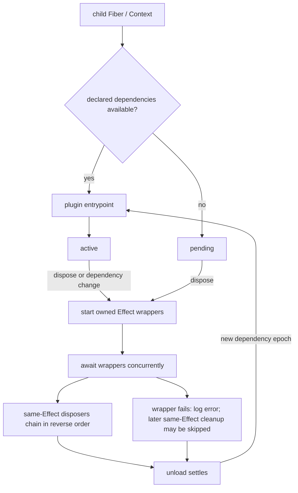

# Cordis 插件生命周期

## 基线

DeepSeek Harness commit `0d1f50007f9bca3f52b06e1c3074fa14d5fb0720`。本页描述 Cordis 自身的 Context、Service 解析和 Effect 清理；应用是否因某条插件失败而停止，由上层启动策略决定。

## 一句话结论

Cordis 为插件建立子 Fiber 与 Context，清理通过生命周期 API 登记的副作用；Loader Realm 只改变指定 Service 的解析标识，不提供操作系统隔离。

 **Claim `DSH-DD-CORDIS-001`:** 子 Context 与隔离 Realm 共同决定插件可见性和 Service 解析范围。

 **Claim `DSH-DD-CORDIS-002`:** 同一 Effect 内的 disposer 默认逆序串接，单个 disposer 失败可能跳过其后续清理，而 Fiber 会记录错误并继续卸载。

跨 Effect 没有全局串行完成顺序；需要确保各项清理均被尝试的资源所有者必须显式处理清理异常。

 **Claim `DSH-DD-CORDIS-003`:** Event Listener 由 Fiber 拥有，Waterfall Listener 通过显式调用 `next()` 委托后续处理。

## 机制

### Context、Service 与 Realm

`extend()` 创建继承父 Context 的子 Context，不修改父级。普通 `ctx.<service>` 读取沿 Fiber 父链寻找实现，遇到 isolation symbol 改变时停止。当前插件通过 `inject` 声明的 Service 构成自己的实现快照和 reload epoch；未声明访问可能得到父 Fiber 的实现，但不会因此获得当前插件的依赖门控与重载跟踪。

Loader 对 `isolate: true` 使用 Entry 专属 `LocalRealm`；字符串标签让同标签 Entry 经 `GlobalRealm` 共享 symbol。Symbol 按 Service 写入 Context isolation map，Service store 再据此选择实现。Realm 属于 Loader，既不是全局命名空间，也不是 OS sandbox。

### Plugin/Fiber 与 Effect

`ctx.plugin()` 建立子 Fiber；Fiber 先创建子 Context，把自身的清理登记到父 Fiber，再等待依赖并调用插件入口。依赖满足后入口可以返回 disposer 或产生其他 Effect，入口完成后才进入 active。

`ctx.effect(execute)` 立即运行 setup，并在 setup 前登记 wrapper，因此重入卸载能看到正在建立的 Effect。公开 disposer 是单次操作；同一 Effect 的 disposer 在无错误路径上逆序串接，遇到异步 disposer 时等待它再继续。

Fiber 卸载从 `DisposableList` 取得逆序 wrapper，以独立任务启动并用 `Promise.all` 等待。`runDisposable()` 直接调用 disposer：同步抛错退出当前循环，Promise rejection 跳过后续 `.then()` 清理。Fiber 捕获并记录 wrapper 失败，继续完成其余卸载；这不能证明每个资源都已释放。处于 pending 的 Fiber 也可能已被监听器登记 Effect，显式 disposal 会排空这些激活前注册。

### 事件与重载

`ctx.on()` 把 Listener 作为 Effect 登记，手动 disposer 或 Fiber 卸载都可移除它。Waterfall 将余下 Listener 和最终行为交给 `next()`；不调用它会短路，因此观察或注解型 Listener 仍须委托。

Provider 变化会重算已声明依赖的 epoch：active Fiber 先 unload，再按新依赖重新执行入口。Loader 更新 Entry isolation map 时也通知相关 Fiber。这个过程不会迁移插件内存状态，也不会撤销插件未登记的外部副作用。

## 源码导读

| 主题 | 固定来源 | 核对重点 |
|---|---|---|
| Context 与 Service 解析 | [Context 继承与 isolate](https://github.com/deepseek-ai/deepseek-harness/blob/0d1f50007f9bca3f52b06e1c3074fa14d5fb0720/vendor/cordis/src/context.ts#L99-L125)；[Service 父链解析](https://github.com/deepseek-ai/deepseek-harness/blob/0d1f50007f9bca3f52b06e1c3074fa14d5fb0720/vendor/cordis/src/reflect.ts#L144-L166) | 子 Context 与 isolation symbol 决定可见实现。 |
| Loader Realm | [Realm 定义与配置映射](https://github.com/deepseek-ai/deepseek-harness/blob/0d1f50007f9bca3f52b06e1c3074fa14d5fb0720/vendor/loader/src/config/isolate.ts#L25-L101) | Entry 专属或按标签共享的 Service symbol。 |
| Fiber 创建与 disposal | [子 Context、父 Effect 与 pending cleanup](https://github.com/deepseek-ai/deepseek-harness/blob/0d1f50007f9bca3f52b06e1c3074fa14d5fb0720/vendor/cordis/src/fiber.ts#L222-L295) | 注册所有权、入口和激活前 Effect 的卸载。 |
| 依赖重载 | [实现快照与 epoch](https://github.com/deepseek-ai/deepseek-harness/blob/0d1f50007f9bca3f52b06e1c3074fa14d5fb0720/vendor/cordis/src/fiber.ts#L597-L639) | 只有声明依赖进入当前 Fiber 的门控和重载计算。 |
| Effect 清理 | [Effect 与逆序链](https://github.com/deepseek-ai/deepseek-harness/blob/0d1f50007f9bca3f52b06e1c3074fa14d5fb0720/vendor/cordis/src/fiber.ts#L405-L441)；[disposer 调用](https://github.com/deepseek-ai/deepseek-harness/blob/0d1f50007f9bca3f52b06e1c3074fa14d5fb0720/vendor/cordis/src/fiber.ts#L114-L117)；[unload](https://github.com/deepseek-ai/deepseek-harness/blob/0d1f50007f9bca3f52b06e1c3074fa14d5fb0720/vendor/cordis/src/fiber.ts#L675-L695)；[wrapper 逆序读取](https://github.com/deepseek-ai/deepseek-harness/blob/0d1f50007f9bca3f52b06e1c3074fa14d5fb0720/vendor/cordis/src/utils.ts#L27-L31) | 单个 Effect 的串接和不同 wrapper 的并行结算。 |
| Listener 与 waterfall | [waterfall 与 Effect 注册](https://github.com/deepseek-ai/deepseek-harness/blob/0d1f50007f9bca3f52b06e1c3074fa14d5fb0720/vendor/cordis/src/events.ts#L234-L259)；[Listener 所有权](https://github.com/deepseek-ai/deepseek-harness/blob/0d1f50007f9bca3f52b06e1c3074fa14d5fb0720/vendor/cordis/src/events.ts#L277-L301) | 显式委托与自动移除。 |

## 限制与失败

| 主题 | 后果与责任 |
|---|---|
| Context 选错 | 注册归调用时的 Fiber；资源所有者须在自己的 Context 登记，避免错误卸载时点。 |
| 清理失败 | 同一 Effect 的后续 disposer 可能被跳过。需要逐项尝试时，资源所有者用 `try/finally` 或显式错误处理组织清理。 |
| inactive Fiber | disposed 或 unloading 时继续创建 Effect 会抛出 `INACTIVE_EFFECT`；应在新的激活入口重建注册。 |
| Service 不可用 | 普通读取可能因 Provider 不可用或 symbol 不同而失败；需要依赖跟踪时显式声明 `inject`。 |
| reload | 插件内存状态不自动迁移；未登记的计时器、网络请求、子进程和文件修改不自动撤销。 |
| 应用失败策略 | Cordis 卸载语义不决定整个应用是否退出；CLI 的 required-entry 启动审计与运行中局部失败规则见[组合专题](profiles-bundles-presets.md)。 |

## 继续阅读

- [所属核心章节：组合与生命周期架构](../02-architecture.md)
- [证据方法](../00-methodology.md) · [证据反向索引](../source-map.md)
- [Claim ledger](../../evidence/claims.json)
