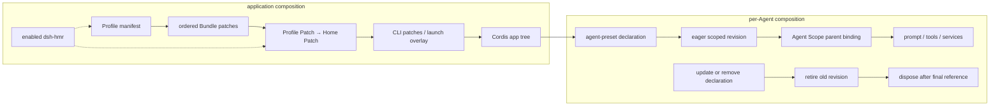

# 应用与 Session 的组合层

## 基线

DeepSeek Harness commit `46a7f68b0922371ce7144b668b90e377d8e799f4`。

## 一句话结论

Profile、Bundle、Patch 组合应用；普通 Preset 声明与 Scope 组合 Agent。配置热重载由 YAML 中的 `dsh-hmr` 控制，Desktop 的保留 Profile 由 Electron 单独管理。

 **Claim `DSH-ARCH-004`:** Application Profile 按顺序组合 Bundle 与 Patch；随附 YAML 默认仅为 `web` 启用 Patch 热重载。

`headless`、`sdk` 与 `acp` 禁用 `dsh-hmr`，`sdk-minimal` 不挂载它；Profile Patch 可覆盖这些默认值。

 **Claim `DSH-ARCH-005`:** Agent Preset 为每个 Agent 组合能力，Scope 通过父子关系隔离并继承注册。

 **Claim `DSH-CAP-001`:** 固定基线发布 `web`、`headless`、`sdk`、`sdk-minimal` 与 `acp` 五个 Application Profile，并记录各自的 Bundle。

 **Claim `DSH-CAP-002`:** 固定基线发布 `standard`、`minimal`、`ptc` 与 `cordis` 四个 Agent Preset，并为它们配置不同的工具呈现。

 **Claim `DSH-DD-COMP-001`:** Profile 从空配置行开始，依次应用 Bundle、Profile Patch、Home Patch 与 CLI Patch。

 **Claim `DSH-DD-COMP-002`:** `dsh-hmr` 的 YAML 配置决定是否在运行时重载 Profile 组合。

热重载只在该插件启用时运行，不表示任意插件可在活动请求中无缝替换。

 **Claim `DSH-DD-COMP-003`:** Agent Preset 由普通插件声明完整的每 Agent 组合；Registry 按引用计数回收退役修订。

运行中 Agent 可保留旧修订，进程重启后按 Preset id 使用当前定义；用户覆盖不会自动合并内置列表的后续更新。

## 机制

### 组合归属

| 概念 | 作用域与位置 | 应用方式 |
|---|---|---|
| Profile | CLI 应用；`$DSH_HOME/profiles/<name>/package.json` | 指定有序 Bundle；重载由组合中的 YAML 决定。 |
| Bundle | npm manifest 的 `dsh.bundle.patch` | 指向单个或有序多个 Patch 文件，依次提供配置行。 |
| Patch | Bundle → Profile → Home → CLI | 按 id 替换完整 config，或插入配置行。 |
| Preset | `dsh-agent-preset` 普通插件行的 `config.plugins` | 声明完整子插件列表；Loader 行 id 用于编辑，`config.id` 用于 Session 身份。 |
| Scope | 内存中的 key 与父子关系 | Agent 绑定到 Preset 修订，继承 prompt、tools、services。 |

Desktop 独占 `profiles/desktop` 及其包管理状态，以 Electron Node 模式运行私有 Host 和共享 Web 应用。CLI 不能启动或修改该 Profile，因此它不计入五个 CLI 模板。[Desktop 所有权与传输](https://github.com/deepseek-ai/deepseek-harness/blob/46a7f68b0922371ce7144b668b90e377d8e799f4/docs/architecture.md#L51-L55)说明共享数据与独立可执行依赖的区别。

### 两条组合链

启动器重写空根 `cordis.yml`，按 Bundle、Profile、Home、CLI 顺序叠加；启动 overlay 可再加入 telemetry 选择。启用的 `dsh-hmr` 监听 Profile manifest 与两个用户 Patch 文件，重读有序 Bundle 层，并与 Plugin Manager 的配置写入串行协调；包操作在该队列之外。启动器提供 Profile 数据和就绪状态，不自动安装 watcher。

Registry 不扫描 Preset 目录，也不接受路径或写回 YAML。新 Preset 与内置覆盖均由 Bundle Patch 声明：插入 `agent-preset` 行，或按行 id 修改配置。Web 的四个定义位于 `web-app/presets/*.patch.yml`。

每个声明立即建立 Registry 所有的 Scope 和内存 Loader 树。声明更新或移除后，已绑定 Agent、子 Agent 和临时历史读取继续持有旧修订；最后一个引用释放时才清理退役树。子 Agent 的 `composeFrom()` 继承父 Agent 的同一修订。进程重启按日志中的 Preset id 查找当前定义，缺失定义拒绝恢复。

Registry entry 的 volatile 字段 `selectedDefault` 与 `modeSelectionEnabled` 保存用户默认值和选择器可见性；隐藏选择器时使用部署 `default`。高层 `select()` 串行检查 Session：只运行独立命令而未开启 Turn 仍可切换，一旦有 open Turn 或 `lastTurn > 0` 就拒绝；底层 `recompose()` 由调用者保证空会话前提。

### 固定名录

`sdk-minimal` 是唯一不叠加 `dsh-base` 的 CLI 模板。下表为随附 YAML 的默认行为，Profile Patch 可以覆盖。

| Profile | 有序 Bundle（省略 `@deepseek-ai/dsh-`） | 默认配置热重载 |
|---|---|---|
| `acp` | `base` → `acp-app` | 禁用 HMR |
| `headless` | `base` → `headless` | 禁用 HMR |
| `sdk` | `base` → `sdk-app` | 禁用 HMR |
| `sdk-minimal` | `sdk-minimal` | 不挂载 HMR |
| `web` | `base` → `web-app` | 启用配置热重载 |

四个 Web Preset id 与产品模式如下；工具差异由[能力章节](../03-capabilities.md)集中说明。`cordis` 是 Creator mode 的权威 id，显示名称不产生另一个 Preset。

| Preset id | 声明 | 产品模式 |
|---|---|---|
| `cordis` | [cordis.patch.yml](https://github.com/deepseek-ai/deepseek-harness/blob/46a7f68b0922371ce7144b668b90e377d8e799f4/packages/bundle/web-app/presets/cordis.patch.yml#L1-L10) | Creator mode |
| `minimal` | [minimal.patch.yml](https://github.com/deepseek-ai/deepseek-harness/blob/46a7f68b0922371ce7144b668b90e377d8e799f4/packages/bundle/web-app/presets/minimal.patch.yml#L1-L10) | Minimal mode；持久 shell 单工具 |
| `ptc` | [ptc.patch.yml](https://github.com/deepseek-ai/deepseek-harness/blob/46a7f68b0922371ce7144b668b90e377d8e799f4/packages/bundle/web-app/presets/ptc.patch.yml#L1-L10) | PTC mode |
| `standard` | [standard.patch.yml](https://github.com/deepseek-ai/deepseek-harness/blob/46a7f68b0922371ce7144b668b90e377d8e799f4/packages/bundle/web-app/presets/standard.patch.yml#L1-L10) | Standard mode |

## 源码导读

| 主题 | 固定来源 | 核对重点 |
|---|---|---|
| Profile 名录与层次 | [模板](https://github.com/deepseek-ai/deepseek-harness/blob/46a7f68b0922371ce7144b668b90e377d8e799f4/packages/boot/app-boot/src/profile.ts#L157-L174)；[组合顺序与 YAML HMR](https://github.com/deepseek-ai/deepseek-harness/blob/46a7f68b0922371ce7144b668b90e377d8e799f4/docs/architecture.md#L23-L31) | 模板只有有序 Bundle，重载取决于插件配置。 |
| Patch 与重载 | [Bundle、兼容性与 watcher](https://github.com/deepseek-ai/deepseek-harness/blob/46a7f68b0922371ce7144b668b90e377d8e799f4/packages/boot/app-boot/README.md#L50-L63)；[失败策略](https://github.com/deepseek-ai/deepseek-harness/blob/46a7f68b0922371ce7144b668b90e377d8e799f4/packages/boot/app-boot/README.md#L90-L109) | 完整 config 替换、被跳过的 Bundle 与局部失败。 |
| Preset 声明 | [id 与子列表](https://github.com/deepseek-ai/deepseek-harness/blob/46a7f68b0922371ce7144b668b90e377d8e799f4/packages/preset/agent-preset/README.md#L40-L58)；[定义来源与限制](https://github.com/deepseek-ai/deepseek-harness/blob/46a7f68b0922371ce7144b668b90e377d8e799f4/packages/preset/agent-preset-registry/README.md#L46-L58) | 不扫描目录、没有复制 API。 |
| 修订与回收 | [注册、退役与回收](https://github.com/deepseek-ai/deepseek-harness/blob/46a7f68b0922371ce7144b668b90e377d8e799f4/packages/preset/agent-preset-registry/src/index.ts#L86-L154)；[Agent 引用与子级继承](https://github.com/deepseek-ai/deepseek-harness/blob/46a7f68b0922371ce7144b668b90e377d8e799f4/packages/preset/agent-preset-registry/src/index.ts#L248-L290) | 退役且零引用后 disposal。 |
| 选择与恢复 | [select 门禁](https://github.com/deepseek-ai/deepseek-harness/blob/46a7f68b0922371ce7144b668b90e377d8e799f4/packages/preset/agent-preset-registry/src/index.ts#L320-L340)；[进程重启限制](https://github.com/deepseek-ai/deepseek-harness/blob/46a7f68b0922371ce7144b668b90e377d8e799f4/packages/preset/agent-preset-registry/README.md#L93-L95) | 运行中修订保留不等于跨重启保留。 |

## 限制与失败

| 情况 | 结果与责任 |
|---|---|
| id Patch 只写一个 config 字段 | 整个 config 被替换；修改者必须重述要保留的字段。 |
| Bundle 无法读取或与运行时不兼容 | 报诊断并跳过，保留选择记录和其余 Bundle 顺序；剩余组合仍可能缺少必需服务。 |
| 精确版本兼容性豁免 | 写在 Profile 的 `compatibility.json`；插件或 DSH 升级不会继承豁免，格式损坏时只读。 |
| Patch 语法或配置行结构无效 | 热更新被拒绝，运行配置保留；Profile 与用户 Patch 错误使启动失败。 |
| 有效更新中的插件导入或激活失败 | 报错并保留成功的其他条目；已有条目的 config schema 拒绝可保留原实例，没有整个更新的事务回滚。 |
| CLI 启动的必需条目无法激活 | dispose 应用并非零退出；后续 HMR 不重复必需项启动审计。 |
| Preset 导入、激活或全局 Service 泄漏失败 | 拒绝挂载，失败定义保留在名录中；等待 Host Service 的树在后续读和绑定时重审，不因启动先后立刻判死。 |
| 覆盖内置子列表 | 不自动合并后续内置更新；作者维护完整列表，不能依赖旧目录副本流程。 |
| 已开启 Turn 后切换 Preset | 高层 `select()` 返回 `agent-preset/locked`，避免历史工具调用与当前能力失配。 |

名录仅描述固定提交发布的组合材料，不证明任意部署已经选用或成功激活它们。

## 继续阅读

- [所属核心章节：组合与生命周期架构](../02-architecture.md)
- [证据方法](../00-methodology.md) · [证据反向索引](../source-map.md)
- [Claim ledger](../../evidence/claims.json)
