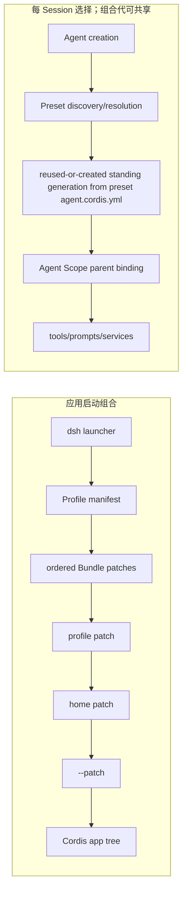

# 应用与 Session 的组合层

## 基线

基线：DeepSeek Harness commit `76fda729799fe9b3848dbe2c211d4b231032b81e`。

## 一句话结论

Profile/Bundle/Patch 属于应用启动组合。

Agent Preset/Scope 属于每 Session 组合。

前一条组合链从空的 Cordis 配置行集合叠加应用层，后一条组合链为 Agent 选择完整能力集合并把 Agent Scope 绑定到相应的共享组合代；两条链的生命周期和修改方式不同。

 **Claim `DSH-ARCH-004`:** Application Profile 按顺序组合 Bundle 与 Patch；已发布 Profile 中只有 `web` 在运行时重载 Patch。

自定义 Profile 默认可实时重载，而 `headless`、`sdk`、`sdk-minimal` 与 `acp` 只在启动时应用组合。

 **Claim `DSH-ARCH-005`:** Agent Preset 为每个 Agent 组合能力，Scope 通过父子关系隔离并继承注册。

 **Claim `DSH-CAP-001`:** 固定基线发布 `web`、`headless`、`sdk`、`sdk-minimal` 与 `acp` 五个 Application Profile，并记录各自的 Bundle 与重载模式。

 **Claim `DSH-CAP-002`:** 固定基线发布 `standard`、`minimal`、`ptc` 与 `cordis` 四个 Agent Preset，并为它们配置不同的工具呈现。

 **Claim `DSH-DD-COMP-001`:** Profile 从空配置行开始，依次应用 Bundle、Profile Patch、Home Patch 与 CLI Patch。

 **Claim `DSH-DD-COMP-002`:** Application Profile 的 `live` 或 `startup` 模式决定 Patch 变更何时进入应用组合。

`live` 只覆盖 Patch 重载，不表示任意插件可以在活动请求中并发替换。

 **Claim `DSH-DD-COMP-003`:** Agent Preset 挂载完整的每 Agent 组合，复制出的用户 Preset 是独立快照。

部署升级不会更新已复制 Preset，因此副本会与其来源逐渐漂移。

用户 Preset 副本不会随部署升级自动更新。

## 机制

### 五个概念的归属

| 概念 | 生命周期 | 存放位置 | 当前值 | 谁应用它 | 可变更方式 |
|---|---|---|---|---|---|
| Profile | 一次应用启动；`live` 可让用户 Patch 在进程存活期重组 | `$DSH_HOME/profiles/<name>/package.json` | `web`、`headless`、`sdk`、`sdk-minimal`、`acp` | `dsh` launcher 的 profile boot | 改 Profile manifest 的有序 Bundle 与 `patchReload` |
| Bundle | 随 Profile 的应用组合挂载 | npm 包 manifest 指向的 `cordis.patch.yml` | `base`、`web-app`、`headless`、`sdk-app`、`acp-app`、独立的 `sdk-minimal` | profile loader 按 manifest 顺序展开 | 在 Profile 的 Bundle 列表中增删或排序 |
| Patch | 启动时应用；只有 `live` Profile 监听 Profile 与 Home 两个用户 Patch | Bundle、Profile、Harness Home 或 `--patch` 文件 | Bundle → Profile → Home → CLI | profile boot 与 Cordis Loader | 修改相应 Patch；按 id 覆盖时重述要保留的完整 config |
| Agent Preset | 每个 Session 创建 Agent 时选择；相同文件版本可共享 standing generation | shipped root 或用户 preset root 下的 `<id>/agent.cordis.yml` | `standard`、`minimal`、`ptc`、`cordis` | Agent Preset registry 解析并挂载组合代 | 复制整个 Preset 后编辑自己的文件；文件变化供后续 Session 建新代 |
| Scope | 随 Agent 存续；其父级可指向共享 Preset 组合代 | 进程内的 opaque scope key 与父子关系 | Agent Scope → Preset generation Scope | `dsh-scope` 与 Preset registry | 创建 Scope，并由持有 binding 的 registry 绑定或受限重绑父级 |

Preset 不是 Profile Patch。Profile 决定承载整个应用的 Cordis 树，Preset 的 `agent.cordis.yml` 则是一份可独立挂载的完整 Agent 组合；Preset 层没有“在某个 Profile 上只覆盖一项”的 Patch 语义。

### 两条组合链

Boot lane 只表达有名称的主要 Patch 层顺序；启动器还可在 CLI Patch 之上生成条件性 telemetry overlay，因此这张图不是所有条件层的穷举图。每次启动都会先重写空的根 `cordis.yml`，再依次把 Bundle、Profile、Home 与 CLI Patch 合成为应用树。

id 定位的 Patch 会替换目标条目的整个 `config`，而不是深度合并字段；修改者必须重述希望保留的 Bundle 配置字段。`startup` 只在启动中读取用户层；`live` 监听 Profile 与 Home Patch，合法编辑触发重组，失败编辑保留最后一个可用组合。

Session lane 在解析 Preset 时重新扫描 roots；相同 Preset 的首次并发使用共享一次 standing mount。组合文件的 stamp 变化只让当前及后续 Session 创建新 generation，已经加入旧 generation 的 Session 保持原组合；旧 generation 只在整棵应用树 teardown 时回收，而不是随单个 Session 结束立即卸载。

### 固定名录

只读 inspector 对固定提交输出的 Profile 数组与下表五行逐项相等；`sdk-minimal` 是唯一不叠加 `@deepseek-ai/dsh-base` 的独立 Bundle 例外。

| Profile | 有序 Bundle | Patch 模式 |
|---|---|---|
| `acp` | `@deepseek-ai/dsh-base` → `@deepseek-ai/dsh-acp-app` | `startup` |
| `headless` | `@deepseek-ai/dsh-base` → `@deepseek-ai/dsh-headless` | `startup` |
| `sdk` | `@deepseek-ai/dsh-base` → `@deepseek-ai/dsh-sdk-app` | `startup` |
| `sdk-minimal` | `@deepseek-ai/dsh-sdk-minimal` | `startup` |
| `web` | `@deepseek-ai/dsh-base` → `@deepseek-ai/dsh-web-app` | `live` |

只读 inspector 对固定提交输出的 Preset id 数组与下表四行逐项相等。产品界面通过 locale 字典把 `ptc` 显示为 PTC mode，把 `cordis` 显示为 Creator mode；权威 Creator id 是 `cordis`，显示名称不是另一个 Preset id。

| Preset id | 元数据 | 完整组合 | 产品模式 |
|---|---|---|---|
| `cordis` | [`preset.yml` 第 1–3 行](https://github.com/deepseek-ai/deepseek-harness/blob/76fda729799fe9b3848dbe2c211d4b231032b81e/packages/preset/agent-presets/presets/cordis/preset.yml#L1-L3) | [`agent.cordis.yml` 第 1–262 行](https://github.com/deepseek-ai/deepseek-harness/blob/76fda729799fe9b3848dbe2c211d4b231032b81e/packages/preset/agent-presets/presets/cordis/agent.cordis.yml#L1-L262) | Creator mode |
| `minimal` | [`preset.yml` 第 1–3 行](https://github.com/deepseek-ai/deepseek-harness/blob/76fda729799fe9b3848dbe2c211d4b231032b81e/packages/preset/agent-presets/presets/minimal/preset.yml#L1-L3) | [`agent.cordis.yml` 第 1–88 行](https://github.com/deepseek-ai/deepseek-harness/blob/76fda729799fe9b3848dbe2c211d4b231032b81e/packages/preset/agent-presets/presets/minimal/agent.cordis.yml#L1-L88) | Minimal mode |
| `ptc` | [`preset.yml` 第 1–3 行](https://github.com/deepseek-ai/deepseek-harness/blob/76fda729799fe9b3848dbe2c211d4b231032b81e/packages/preset/agent-presets/presets/ptc/preset.yml#L1-L3) | [`agent.cordis.yml` 第 1–271 行](https://github.com/deepseek-ai/deepseek-harness/blob/76fda729799fe9b3848dbe2c211d4b231032b81e/packages/preset/agent-presets/presets/ptc/agent.cordis.yml#L1-L271) | PTC mode |
| `standard` | [`preset.yml` 第 1–3 行](https://github.com/deepseek-ai/deepseek-harness/blob/76fda729799fe9b3848dbe2c211d4b231032b81e/packages/preset/agent-presets/presets/standard/preset.yml#L1-L3) | [`agent.cordis.yml` 第 1–251 行](https://github.com/deepseek-ai/deepseek-harness/blob/76fda729799fe9b3848dbe2c211d4b231032b81e/packages/preset/agent-presets/presets/standard/agent.cordis.yml#L1-L251) | Standard mode |

## 源码导读

下表把概念和固定源码一一对应；链接均固定到手册基线的完整 commit。

| 主题 | 固定来源 | 可核对行为 |
|---|---|---|
| Profile manifest 与名录 | [`profile.ts` 第 1–23 行](https://github.com/deepseek-ai/deepseek-harness/blob/76fda729799fe9b3848dbe2c211d4b231032b81e/packages/boot/app-boot/src/profile.ts#L1-L23)、[第 49–72 行](https://github.com/deepseek-ai/deepseek-harness/blob/76fda729799fe9b3848dbe2c211d4b231032b81e/packages/boot/app-boot/src/profile.ts#L49-L72)、[第 136–217 行](https://github.com/deepseek-ai/deepseek-harness/blob/76fda729799fe9b3848dbe2c211d4b231032b81e/packages/boot/app-boot/src/profile.ts#L136-L217) | Profile 目录、Bundle manifest、五个模板、模式以及初始化文件。 |
| Boot 组合与 reload | [`profile-boot.ts` 第 1–12 行](https://github.com/deepseek-ai/deepseek-harness/blob/76fda729799fe9b3848dbe2c211d4b231032b81e/apps/cli/src/profile-boot.ts#L1-L12)、[第 80–168 行](https://github.com/deepseek-ai/deepseek-harness/blob/76fda729799fe9b3848dbe2c211d4b231032b81e/apps/cli/src/profile-boot.ts#L80-L168)、[第 278–309 行](https://github.com/deepseek-ai/deepseek-harness/blob/76fda729799fe9b3848dbe2c211d4b231032b81e/apps/cli/src/profile-boot.ts#L278-L309) | 空根配置、Patch 顺序、Home 层和 `live` watcher 条件。 |
| Patch 替换语义 | [`app-boot` README 第 48–55 行](https://github.com/deepseek-ai/deepseek-harness/blob/76fda729799fe9b3848dbe2c211d4b231032b81e/packages/boot/app-boot/README.md#L48-L55)、[第 139 行](https://github.com/deepseek-ai/deepseek-harness/blob/76fda729799fe9b3848dbe2c211d4b231032b81e/packages/boot/app-boot/README.md#L139) | id Patch 替换完整 config；`live` 与 `startup` 的 watcher 差异。 |
| Bundle Patch 文件 | [`base` 第 1–498 行](https://github.com/deepseek-ai/deepseek-harness/blob/76fda729799fe9b3848dbe2c211d4b231032b81e/packages/bundle/base/cordis.patch.yml#L1-L498)、[`web-app` 第 1–444 行](https://github.com/deepseek-ai/deepseek-harness/blob/76fda729799fe9b3848dbe2c211d4b231032b81e/packages/bundle/web-app/cordis.patch.yml#L1-L444)、[`headless` 第 1–30 行](https://github.com/deepseek-ai/deepseek-harness/blob/76fda729799fe9b3848dbe2c211d4b231032b81e/packages/bundle/headless/cordis.patch.yml#L1-L30)、[`sdk-app` 第 1–21 行](https://github.com/deepseek-ai/deepseek-harness/blob/76fda729799fe9b3848dbe2c211d4b231032b81e/packages/bundle/sdk-app/cordis.patch.yml#L1-L21)、[`acp-app` 第 1–20 行](https://github.com/deepseek-ai/deepseek-harness/blob/76fda729799fe9b3848dbe2c211d4b231032b81e/packages/bundle/acp-app/cordis.patch.yml#L1-L20)、[`sdk-minimal` 第 1–168 行](https://github.com/deepseek-ai/deepseek-harness/blob/76fda729799fe9b3848dbe2c211d4b231032b81e/packages/bundle/sdk-minimal/cordis.patch.yml#L1-L168) | 六个安装层各自提供 Patch；Profile manifest 决定组合次序。 |
| Preset 词汇与显示 | [`preset.ts` 第 1–70 行](https://github.com/deepseek-ai/deepseek-harness/blob/76fda729799fe9b3848dbe2c211d4b231032b81e/packages/preset/agent-presets/src/preset.ts#L1-L70)、[`display.ts` 第 42–65 行](https://github.com/deepseek-ai/deepseek-harness/blob/76fda729799fe9b3848dbe2c211d4b231032b81e/packages/preset/agent-presets/src/display.ts#L42-L65)、[`locales.ts` 第 34–45 行](https://github.com/deepseek-ai/deepseek-harness/blob/76fda729799fe9b3848dbe2c211d4b231032b81e/packages/client/ui-agent-preset/src/client/locales.ts#L34-L45) | Preset id、root 信任来源与 locale-owned 模式名称。 |
| Preset 发现、组合代与绑定 | [`index.ts` 第 93–99 行](https://github.com/deepseek-ai/deepseek-harness/blob/76fda729799fe9b3848dbe2c211d4b231032b81e/packages/preset/agent-presets/src/index.ts#L93-L99)、[第 248–250 行](https://github.com/deepseek-ai/deepseek-harness/blob/76fda729799fe9b3848dbe2c211d4b231032b81e/packages/preset/agent-presets/src/index.ts#L248-L250)、[第 333–426 行](https://github.com/deepseek-ai/deepseek-harness/blob/76fda729799fe9b3848dbe2c211d4b231032b81e/packages/preset/agent-presets/src/index.ts#L333-L426)、[第 745–794 行](https://github.com/deepseek-ai/deepseek-harness/blob/76fda729799fe9b3848dbe2c211d4b231032b81e/packages/preset/agent-presets/src/index.ts#L745-L794) | 每次读取重新发现，首次使用建立 standing generation，Agent Scope 绑定其父级，文件变化为后续 Session 建新代。 |
| 完整挂载与 Scope | [`mount.ts` 第 368–415 行](https://github.com/deepseek-ai/deepseek-harness/blob/76fda729799fe9b3848dbe2c211d4b231032b81e/packages/preset/agent-presets/src/mount.ts#L368-L415)、[`scope/index.ts` 第 32–82 行](https://github.com/deepseek-ai/deepseek-harness/blob/76fda729799fe9b3848dbe2c211d4b231032b81e/packages/core/scope/src/index.ts#L32-L82)、[第 129–147 行](https://github.com/deepseek-ai/deepseek-harness/blob/76fda729799fe9b3848dbe2c211d4b231032b81e/packages/core/scope/src/index.ts#L129-L147) | Loader 挂载整份 `agent.cordis.yml`；Scope 父链传递注册并限定事件。 |
| 用户副本 | [`authoring.ts` 第 105–165 行](https://github.com/deepseek-ai/deepseek-harness/blob/76fda729799fe9b3848dbe2c211d4b231032b81e/packages/preset/agent-presets/src/authoring.ts#L105-L165)、[`agent-presets` README 第 165–179 行](https://github.com/deepseek-ai/deepseek-harness/blob/76fda729799fe9b3848dbe2c211d4b231032b81e/packages/preset/agent-presets/README.md#L165-L179) | 创作复制完整目录；副本不继承升级，也没有 Patch 语义。 |

## 限制与失败

| 主题 | 限制或失败 | 处理方式 |
|---|---|---|
| Patch 字段丢失 | id Patch 不是深度合并；只写一个字段会替换目标的完整 config。 | 在 Patch 中重述需要保留的所有字段。 |
| reload 范围 | `live` 只监听 Profile 与 Home 用户 Patch；它不承诺任意模块或活动请求内状态可无缝替换。 | 把应用树外的状态交给明确的生命周期与持久化所有者；`startup` 变更后重启。 |
| Preset 漂移 | 用户副本与来源断开；部署升级不会更新副本。 | 把副本视为自有完整配置，并主动比较或重新复制上游版本。 |
| generation 滞留 | 编辑组合文件后，旧 Session 仍连接旧 generation；旧 generation 在进程内不按 Session 引用数回收。 | 需要统一切换时重启整棵应用树；评估多次编辑带来的存量 watcher 成本。 |
| Scope 绑定 | 没有 Scope 的 Context 不能安全加入 Preset；任意重绑还可能形成父链循环。 | 由 Agent factory 创建 Scope，并只让持有 binding 的 Preset registry 执行受检重绑。 |

Profile 名称、Bundle 目录或 Preset 文件存在，只证明固定源码发布了这些组合材料，不证明任意部署已经选择、安装或成功激活它们；本页名录只描述固定基线的 shipped declarations 与 inspector 观察。

## 继续阅读

- [所属核心章节：组合与生命周期架构](../02-architecture.md)
- [证据方法](../00-methodology.md)
- [证据反向索引](../source-map.md)
- [`evidence/claims.json`](../../evidence/claims.json)
