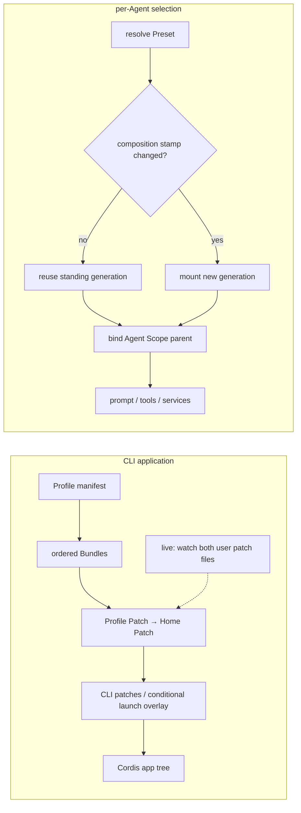

# 应用与 Session 的组合层

## 基线

DeepSeek Harness commit `0d1f50007f9bca3f52b06e1c3074fa14d5fb0720`。

## 一句话结论

Profile、Bundle、Patch 组合应用；Preset 与 Scope 组合 Agent。两条组合链的配置格式、重载时点和失败策略不同，Desktop 的保留 Profile 则由 Electron 单独管理。

 **Claim `DSH-ARCH-004`:** Application Profile 按顺序组合 Bundle 与 Patch；已发布 Profile 中只有 `web` 在运行时重载 Patch。

自定义 Profile 默认可实时重载，而 `headless`、`sdk`、`sdk-minimal` 与 `acp` 只在启动时应用组合。

 **Claim `DSH-ARCH-005`:** Agent Preset 为每个 Agent 组合能力，Scope 通过父子关系隔离并继承注册。

 **Claim `DSH-CAP-001`:** 固定基线发布 `web`、`headless`、`sdk`、`sdk-minimal` 与 `acp` 五个 Application Profile，并记录各自的 Bundle 与重载模式。

 **Claim `DSH-CAP-002`:** 固定基线发布 `standard`、`minimal`、`ptc` 与 `cordis` 四个 Agent Preset，并为它们配置不同的工具呈现。

 **Claim `DSH-DD-COMP-001`:** Profile 从空配置行开始，依次应用 Bundle、Profile Patch、Home Patch 与 CLI Patch。

 **Claim `DSH-DD-COMP-002`:** Application Profile 的 `live` 或 `startup` 模式决定 Patch 变更何时进入应用组合。

`live` 只覆盖 Patch 重载，不表示任意插件可以在活动请求中并发替换。

 **Claim `DSH-DD-COMP-003`:** Agent Preset 挂载完整的每 Agent 组合，复制出的用户 Preset 是独立快照。

部署升级不会更新已复制 Preset，因此副本会与其来源逐渐漂移。

## 机制

### 组合归属

| 概念 | 作用域与位置 | 应用方式 |
|---|---|---|
| Profile | CLI 应用；`$DSH_HOME/profiles/<name>/package.json` | 指定有序 Bundle 和 `patchReload`。 |
| Bundle | npm manifest 指向的 `cordis.patch.yml` | 向应用树提供可被上层 Patch 修改的配置行。 |
| Patch | Bundle → Profile → Home → CLI | 按 id 替换完整 config，或插入配置行。 |
| Preset | roots 下的 `<id>/agent.cordis.yml` | 挂载完整 Agent 组合，不是“标准配置加一项”的 Patch。 |
| Scope | 内存中的 key 与父子关系 | Agent 绑定到 Preset generation，继承 prompt、tools、services。 |

Desktop 保留 `profiles/desktop` 存放外部插件和 Host 所有包的链接，由 Electron 启动私有 Node.js Host；CLI 不能启动或修改它，因此不计入五个 CLI 模板。[Desktop 所有权](https://github.com/deepseek-ai/deepseek-harness/blob/0d1f50007f9bca3f52b06e1c3074fa14d5fb0720/apps/desktop/README.md#L22-L26)与[Desktop 装配与传输](https://github.com/deepseek-ai/deepseek-harness/blob/0d1f50007f9bca3f52b06e1c3074fa14d5fb0720/docs/architecture.md#L49-L53)定义这条例外。

### 两条组合链

启动器重写空根 `cordis.yml`，按 Bundle、Profile、Home、CLI 顺序叠加；条件性 telemetry overlay 可位于 CLI Patch 之上。`startup` 只在启动读取这些层；`live` 监听 Profile 与 Home 两个用户文件。

Preset 每次发现时扫描 roots，相同 Preset 的首次并发使用共享一次挂载。`agent.cordis.yml` stamp 改变时，后续加入者创建新 generation；已有 Session 保留旧代，旧代只在整棵应用树 teardown 时回收。相邻 skill 或 asset 文件的编辑不触发这个 stamp 检查。子 Agent 的 `composeFrom()` 绑定到父 Agent 已经使用的同一代，不重新按 id 解析。

默认 Preset 可由设置选择；关闭 `modeSelectionEnabled` 时，未显式指定 Preset 的新 Session 使用部署的 `config.default`。高层 `select()` 串行检查 Session：只运行独立命令而未开启 Turn 仍可切换，一旦有 open Turn 或 `lastTurn > 0` 就拒绝。底层 `recompose()` 由调用者保证空会话前提。

### 固定名录

下表列出源码中的五个 CLI 模板；`sdk-minimal` 是唯一不叠加 `dsh-base` 的模板。

| Profile | 有序 Bundle（省略 `@deepseek-ai/dsh-`） | Patch 模式 |
|---|---|---|
| `acp` | `base` → `acp-app` | `startup` |
| `headless` | `base` → `headless` | `startup` |
| `sdk` | `base` → `sdk-app` | `startup` |
| `sdk-minimal` | `sdk-minimal` | `startup` |
| `web` | `base` → `web-app` | `live` |

四个 Preset id 与产品显示名称见下表；工具差异由[能力章节](../03-capabilities.md)集中说明。`cordis` 是 Creator mode 的权威 id，显示名称不产生另一个 Preset。

| Preset id | 元数据 | 产品模式 |
|---|---|---|
| `cordis` | [preset.yml](https://github.com/deepseek-ai/deepseek-harness/blob/0d1f50007f9bca3f52b06e1c3074fa14d5fb0720/packages/preset/agent-presets/presets/cordis/preset.yml#L1-L3) | Creator mode |
| `minimal` | [preset.yml](https://github.com/deepseek-ai/deepseek-harness/blob/0d1f50007f9bca3f52b06e1c3074fa14d5fb0720/packages/preset/agent-presets/presets/minimal/preset.yml#L1-L3) | Minimal mode；持久 shell 单工具 |
| `ptc` | [preset.yml](https://github.com/deepseek-ai/deepseek-harness/blob/0d1f50007f9bca3f52b06e1c3074fa14d5fb0720/packages/preset/agent-presets/presets/ptc/preset.yml#L1-L3) | PTC mode |
| `standard` | [preset.yml](https://github.com/deepseek-ai/deepseek-harness/blob/0d1f50007f9bca3f52b06e1c3074fa14d5fb0720/packages/preset/agent-presets/presets/standard/preset.yml#L1-L3) | Standard mode |

## 源码导读

| 主题 | 固定来源 | 核对重点 |
|---|---|---|
| Profile 名录 | [模板与默认模式](https://github.com/deepseek-ai/deepseek-harness/blob/0d1f50007f9bca3f52b06e1c3074fa14d5fb0720/packages/boot/app-boot/src/profile.ts#L138-L171) | 五个模板、有序 Bundle、自定义默认 `live`。 |
| 空根与层顺序 | [空根配置](https://github.com/deepseek-ai/deepseek-harness/blob/0d1f50007f9bca3f52b06e1c3074fa14d5fb0720/apps/cli/src/profile-boot.ts#L87-L95)；[启动重写](https://github.com/deepseek-ai/deepseek-harness/blob/0d1f50007f9bca3f52b06e1c3074fa14d5fb0720/apps/cli/src/profile-boot.ts#L191-L195)；[Patch 组合](https://github.com/deepseek-ai/deepseek-harness/blob/0d1f50007f9bca3f52b06e1c3074fa14d5fb0720/apps/cli/src/profile-boot.ts#L211-L253) | 各层优先级与条件 overlay。 |
| Patch 与 reload | [完整 config 替换](https://github.com/deepseek-ai/deepseek-harness/blob/0d1f50007f9bca3f52b06e1c3074fa14d5fb0720/packages/boot/app-boot/README.md#L50-L57)；[live watcher](https://github.com/deepseek-ai/deepseek-harness/blob/0d1f50007f9bca3f52b06e1c3074fa14d5fb0720/apps/cli/src/profile-boot.ts#L375-L402)；[失败策略](https://github.com/deepseek-ai/deepseek-harness/blob/0d1f50007f9bca3f52b06e1c3074fa14d5fb0720/packages/boot/app-boot/README.md#L67-L86) | 用户层监听、启动必需项与局部失败。 |
| Preset 选择 | [默认选择与发现](https://github.com/deepseek-ai/deepseek-harness/blob/0d1f50007f9bca3f52b06e1c3074fa14d5fb0720/packages/preset/agent-presets/src/index.ts#L241-L274)；[Turn 门禁](https://github.com/deepseek-ai/deepseek-harness/blob/0d1f50007f9bca3f52b06e1c3074fa14d5fb0720/packages/preset/agent-presets/src/index.ts#L737-L752) | 隐藏模式选择后的默认值、开始 Turn 后锁定。 |
| 组合代与绑定 | [standing 与 Agent 绑定](https://github.com/deepseek-ai/deepseek-harness/blob/0d1f50007f9bca3f52b06e1c3074fa14d5fb0720/packages/preset/agent-presets/src/index.ts#L409-L455)；[子 Agent 同代继承](https://github.com/deepseek-ai/deepseek-harness/blob/0d1f50007f9bca3f52b06e1c3074fa14d5fb0720/packages/preset/agent-presets/src/index.ts#L458-L492)；[stamp 检查与挂载](https://github.com/deepseek-ai/deepseek-harness/blob/0d1f50007f9bca3f52b06e1c3074fa14d5fb0720/packages/preset/agent-presets/src/index.ts#L775-L823) | 共享、更新与旧代保留。 |
| 挂载与 Scope | [完整挂载验证](https://github.com/deepseek-ai/deepseek-harness/blob/0d1f50007f9bca3f52b06e1c3074fa14d5fb0720/packages/preset/agent-presets/src/mount.ts#L359-L405)；[父链与受检重绑](https://github.com/deepseek-ai/deepseek-harness/blob/0d1f50007f9bca3f52b06e1c3074fa14d5fb0720/packages/core/scope/src/index.ts#L32-L82) | Preset 要求每个启用行可用，服务不得泄漏到根 realm。 |
| 用户副本与限制 | [完整目录复制](https://github.com/deepseek-ai/deepseek-harness/blob/0d1f50007f9bca3f52b06e1c3074fa14d5fb0720/packages/preset/agent-presets/src/authoring.ts#L105-L125)；[快照漂移、文件 stamp 与 generation 限制](https://github.com/deepseek-ai/deepseek-harness/blob/0d1f50007f9bca3f52b06e1c3074fa14d5fb0720/packages/preset/agent-presets/README.md#L174-L181) | 副本独立、只检测组合文件、旧代不提前回收。 |
| 显示名称 | [id 到字典 key](https://github.com/deepseek-ai/deepseek-harness/blob/0d1f50007f9bca3f52b06e1c3074fa14d5fb0720/packages/preset/agent-presets/src/display.ts#L42-L64)；[locale 字典](https://github.com/deepseek-ai/deepseek-harness/blob/0d1f50007f9bca3f52b06e1c3074fa14d5fb0720/packages/client/ui-agent-preset/src/client/locales.ts#L36-L47) | 名称不等于 id。 |

## 限制与失败

| 情况 | 结果与责任 |
|---|---|
| id Patch 只写一个 config 字段 | 整个 config 被替换；修改者必须重述要保留的字段。 |
| Patch 语法或配置行结构无效 | live 更新被拒绝，运行配置保留。 |
| 有效更新中的插件导入或激活失败 | 报错并保留成功的其他条目；已有条目的 config schema 拒绝可保留原实例，但没有整个更新的事务回滚。 |
| CLI 启动的必需条目无法激活 | dispose 应用并非零退出；可选条目失败通常警告并保留其他插件。后续 HMR 不重复必需项启动审计。 |
| Preset 中有不可用行 | 整个 Preset 挂载失败并清理；不能将应用的部分成功策略套到 Preset。 |
| 用户副本或旧代滞留 | 副本不随部署升级，旧代不按 Session 引用数回收；需要主动比较配置并考虑重复建代的 watcher 成本。 |
| 已开启 Turn 后切换 Preset | 高层 `select()` 返回 `agent-preset/locked`，避免历史工具调用与当前能力失配。 |

名录仅描述固定提交发布的组合材料，不证明任意部署已经选用或成功激活它们。

## 继续阅读

- [所属核心章节：组合与生命周期架构](../02-architecture.md)
- [证据方法](../00-methodology.md) · [证据反向索引](../source-map.md)
- [Claim ledger](../../evidence/claims.json)
