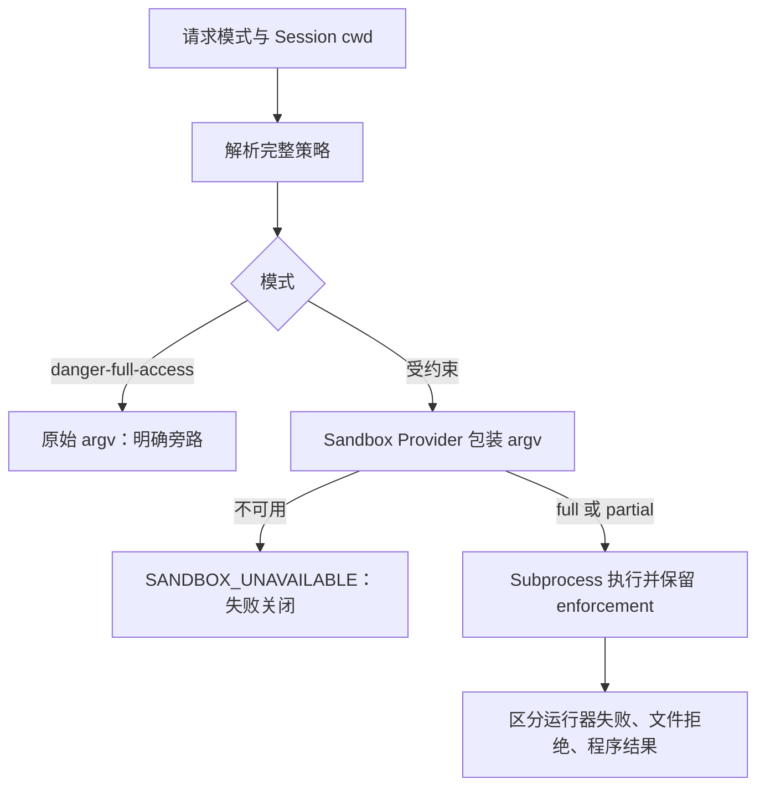

# 本地 Sandbox 执行边界

## 基线

本章描述提交 `46a7f68b0922371ce7144b668b90e377d8e799f4` 的文件系统效果约束。未运行跨平台探针，不从操作系统名称推导部署的实际 enforcement。

## 一句话结论

 **Claim `DSH-CAP-005`:** 本地 Sandbox 提供方约束文件系统副作用，并报告实际 enforcement 状态。

 **Claim `DSH-DD-SANDBOX-001`:** Sandbox 请求先解析文件系统副作用模式；受约束模式再选择平台 Provider，而 `danger-full-access` 直接绕过 confinement。

该模式约束文件系统副作用，不构成通用网络、进程或凭据隔离。

 **Claim `DSH-DD-SANDBOX-002`:** Linux、macOS 与 Windows 使用不同的本地 Sandbox Provider，并报告各自的 enforcement 状态。

Windows ACL 与部分受支持的 Landlock ABI 可能诚实返回 `partial`。

 **Claim `DSH-DD-SANDBOX-003`:** 必需的 confinement 不可用时执行会失败关闭，而 `danger-full-access` 会明确绕过 confinement。

`danger-full-access` 是调用方选择的无约束模式，不能被描述为 Sandbox 保护。

## 机制

### 每次调用解析策略

`ctx.sandboxPolicy.resolve()` 按“显式批准的模式 → Session 最近的 `sandbox/mode` → 部署默认值”解析；Session 不可变 cwd 是该会话的 workspace root，缺失时才用配置 fallback。Provider 在对应执行环境解析真实路径，不能假定本地路径就是 SSH 远端路径。[解析实现](https://github.com/deepseek-ai/deepseek-harness/blob/46a7f68b0922371ce7144b668b90e377d8e799f4/packages/sandbox/sandbox-policy/src/index.ts#L155-L179)；[执行环境与策略](https://github.com/deepseek-ai/deepseek-harness/blob/46a7f68b0922371ce7144b668b90e377d8e799f4/docs/subsystems/sandbox.md#L5-L79)

| 模式 | 行为 |
|---|---|
| `read-only` | 拒绝一般写入，POSIX 保留必要的 `/dev/null` 等 sink |
| `workspace-write` | 允许 workspace root 和 backend 承诺的临时区域 |
| `danger-full-access` | Consumer 使用原始 argv，不调用 confining Provider |

模式词汇只描述文件效果，不承诺统一的网络限制或进程可见性规则。个别 backend 可以有更强机制，但不能泛化为所有平台共同保证。[模式与 enforcement](https://github.com/deepseek-ai/deepseek-harness/blob/46a7f68b0922371ce7144b668b90e377d8e799f4/docs/subsystems/sandbox.md#L9-L35)

### 平台提供方

| 平台 | 选择与机制 | enforcement / 限制 |
|---|---|---|
| Linux | bwrap 优先，Landlock 备选；竞争候选用功能探针选择 | bwrap 用只读根、私有 PID namespace 与模式允许的写路径；旧 Landlock ABI 可为 `partial` |
| macOS | Seatbelt / `sandbox-exec` | 拒绝文件写入再放行允许 roots；依赖平台仍提供该执行器 |
| Windows | ACL restricted-token runner | workspace 写入 SID 与 Session 私有 temp SID 分离；NTFS hard link、读取未约束，以及 AppContainer ACL 目录对低完整性子进程不可读等限制使其为 `partial` |

Provider 缓存选择结果到生命周期结束；修复运行器后需重载。单候选可跳过探针，但运行器自身拒绝仍必须作为失败报告。自定义 `runnerCommand` 跳过探针并相信操作者声明，因此不能把其 `full` 字段误读为独立安全审计。[选择、平台机制](https://github.com/deepseek-ai/deepseek-harness/blob/46a7f68b0922371ce7144b668b90e377d8e799f4/packages/sandbox/sandbox-local/README.md#L69-L87)；[已知限制](https://github.com/deepseek-ai/deepseek-harness/blob/46a7f68b0922371ce7144b668b90e377d8e799f4/packages/sandbox/sandbox-local/README.md#L128-L134)

### 执行与失败分类

`await ctx.sandbox.confine(argv, policy, signal)` 在执行环境中解析路径并返回包装后的 argv；取消可以阻止尚未开始的启动。Consumer 负责执行和结果归因。`denial` 表示活动约束下的文件操作被拒；`runner failure` 表示运行器在内层命令执行前失败，必须优先识别。[分类规则](https://github.com/deepseek-ai/deepseek-harness/blob/46a7f68b0922371ce7144b668b90e377d8e799f4/docs/subsystems/sandbox.md#L98-L156)

### 与 PTC 和远程执行的关系

当前 Node PTC Provider 也使用 Sandbox 和 subprocess 服务：受约束模式不可用时不允许悄悄以原始 Node 执行。文件策略、输出限制和进程清理仍是三个独立承诺，不能合并为“绝对安全”。[PTC 文件策略](https://github.com/deepseek-ai/deepseek-harness/blob/46a7f68b0922371ce7144b668b90e377d8e799f4/packages/ptc-runtime/ptc-runtime-node/README.md#L12)；[PTC 限制](https://github.com/deepseek-ai/deepseek-harness/blob/46a7f68b0922371ce7144b668b90e377d8e799f4/packages/ptc-runtime/ptc-runtime-node/README.md#L137-L144)

`dsh-sandbox-ssh` 则与 SSH filesystem/subprocess 提供方配套在远端施加策略；这不是把本地 wrapper 路径传给远端。[SSH Sandbox](https://github.com/deepseek-ai/deepseek-harness/blob/46a7f68b0922371ce7144b668b90e377d8e799f4/docs/subsystems/sandbox.md#L5)

## 源码导读

| Claim / 主题 | 固定来源 |
|---|---|
| `DSH-DD-SANDBOX-001` | [模式词汇](https://github.com/deepseek-ai/deepseek-harness/blob/46a7f68b0922371ce7144b668b90e377d8e799f4/docs/subsystems/sandbox.md#L9-L35)；[每调用解析](https://github.com/deepseek-ai/deepseek-harness/blob/46a7f68b0922371ce7144b668b90e377d8e799f4/packages/sandbox/sandbox-policy/src/index.ts#L155-L179) |
| `DSH-DD-SANDBOX-002` | [本地选择与状态](https://github.com/deepseek-ai/deepseek-harness/blob/46a7f68b0922371ce7144b668b90e377d8e799f4/packages/sandbox/sandbox-local/README.md#L51-L81)；[平台限制](https://github.com/deepseek-ai/deepseek-harness/blob/46a7f68b0922371ce7144b668b90e377d8e799f4/packages/sandbox/sandbox-local/README.md#L128-L134) |
| `DSH-DD-SANDBOX-003` | [失败关闭](https://github.com/deepseek-ai/deepseek-harness/blob/46a7f68b0922371ce7144b668b90e377d8e799f4/docs/subsystems/sandbox.md#L154-L158)；[运行器错误](https://github.com/deepseek-ai/deepseek-harness/blob/46a7f68b0922371ce7144b668b90e377d8e799f4/packages/sandbox/sandbox-local/README.md#L55-L57) |

## 限制与失败

`partial` 表示已建立但不完整的文件约束，不是 `full`，也不是 Provider 不存在；需要绝对文件承诺的 Consumer 必须拒绝或明确呈现这个区别。受约束模式没有静默旁路，而 `danger-full-access` 本身就是显式旁路。

本地 Provider 共享宿主机内核与文件系统，不等同于容器或 microVM。Node PTC 的环境清理是该 Provider 自己的行为，不是所有 Sandbox Consumer 都具有的能力。安全决策应依据实际 backend、enforcement 和暴露的资源，而不是仅依据“沙箱”名称。

## 继续阅读

- [能力与组合归属](../03-capabilities.md)
- [工具与 PTC](tools-and-ptc.md)
- [证据方法](../00-methodology.md)
- [证据反向索引](../source-map.md)
