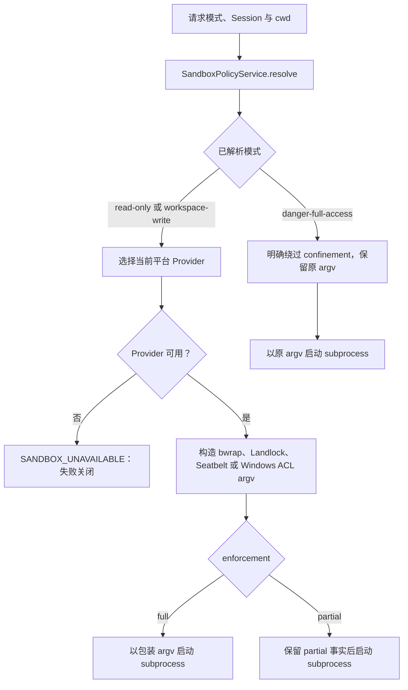

# 本地 Sandbox 执行边界

## 基线

本章只描述 DeepSeek Harness commit `76fda729799fe9b3848dbe2c211d4b231032b81e` 中的本地文件系统副作用约束：每次调用如何解析策略、如何选择平台 Provider、Shell 如何执行包装后的 argv，以及执行结果如何报告 enforcement。源码链接固定到该提交；本章没有运行跨平台探针，也不推断任何内核或 ABI 数字门槛。

## 一句话结论

本地 Sandbox 在每次执行前先得到文件系统策略；`read-only` 与 `workspace-write` 必须交给可用的平台 Provider，`danger-full-access` 则由调用方明确绕过 confinement。Provider 返回 `full` 或 `partial`，而无法建立所需 confinement 的路径必须失败关闭。

 **Claim `DSH-CAP-005`:** 本地 Sandbox 提供方约束文件系统副作用，并报告实际 enforcement 状态。

Windows ACL 与部分受支持的 Landlock ABI 可能返回 `partial`，而 `danger-full-access` 明确绕过约束；这些模式不承诺通用网络、进程或凭据隔离。

 **Claim `DSH-DD-SANDBOX-001`:** Sandbox 请求先解析文件系统副作用模式；受约束模式再选择平台 Provider，而 `danger-full-access` 直接绕过 confinement。

该模式约束文件系统副作用，不构成通用网络、进程或凭据隔离。

 **Claim `DSH-DD-SANDBOX-002`:** Linux、macOS 与 Windows 使用不同的本地 Sandbox Provider，并报告各自的 enforcement 状态。

Windows ACL 与部分受支持的 Landlock ABI 可能诚实返回 `partial`。

 **Claim `DSH-DD-SANDBOX-003`:** 必需的 confinement 不可用时执行会失败关闭，而 `danger-full-access` 会明确绕过 confinement。

`danger-full-access` 是调用方选择的无约束模式，不能被描述为 Sandbox 保护。

## 机制

### 请求与已解析规格

`ctx.sandboxPolicy.resolve()` 每次接收可选 Session 与显式批准的模式。解析优先级是显式模式、Session 日志中最后一次 `sandbox/mode`、部署默认值；workspace root 则优先使用 Session header 中不可变的 cwd，没有 Session cwd 时使用部署配置的绝对路径。已解析规格携带模式、root，并在有 Session 时携带其 id，使调用者不必分别推断这些值。[策略服务](https://github.com/deepseek-ai/deepseek-harness/blob/76fda729799fe9b3848dbe2c211d4b231032b81e/packages/sandbox/sandbox-policy/src/index.ts#L104-L178)固定了优先级和字段来源。

受约束调用把同一个已解析 workspace root 传入平台 Provider；Provider 不重新选择另一条 root。这个按调用传播的规格允许不同 Session 使用各自 cwd，也避免通过修改全局 Provider 状态来表达一次批准的模式覆盖。[每次调用策略](https://github.com/deepseek-ai/deepseek-harness/blob/76fda729799fe9b3848dbe2c211d4b231032b81e/docs/subsystems/sandbox.md#L41-L79)给出这一所有权划分。

### 策略模式

`read-only` 请求拒绝一般写入，只保留运行器所需的最小写入落点；`workspace-write` 另外允许 workspace root 与 Provider 承诺的临时区域；`danger-full-access` 不进入 Provider。三种值都只描述文件系统副作用，不增加网络访问、进程可见性或凭据保护的承诺。[模式定义](https://github.com/deepseek-ai/deepseek-harness/blob/76fda729799fe9b3848dbe2c211d4b231032b81e/packages/sandbox/sandbox/src/index.ts#L17-L59)与[子系统说明](https://github.com/deepseek-ai/deepseek-harness/blob/76fda729799fe9b3848dbe2c211d4b231032b81e/docs/subsystems/sandbox.md#L1-L30)共同限定这套词汇。

`sdk-minimal` Bundle 在 `sandbox-policy` 配置中显式选择 `danger-full-access`；这是一项应用组合选择，不是本地 Provider 已建立保护的证据。[固定 Patch](https://github.com/deepseek-ai/deepseek-harness/blob/76fda729799fe9b3848dbe2c211d4b231032b81e/packages/bundle/sdk-minimal/cordis.patch.yml#L41-L45)显示该模式值。

### 平台提供方

| 平台 | 本地 Provider 路径 | 文件系统规则摘要 | enforcement |
|---|---|---|---|
| Linux | 优先使用 bwrap，备选 Landlock | bwrap 以只读根挂载为基础；Landlock 以只读根和按模式增加的可写路径表达许可 | bwrap 报告 `full`；Landlock 可报告 `full`，部分受支持 ABI 诚实报告 `partial` |
| macOS | Seatbelt (`sandbox-exec`) | profile 默认允许操作，但拒绝文件写入，再放行 `/dev/null` 与按模式计算的可写 roots | 可用的该 Provider 报告 `full` |
| Windows | ACL restricted-token runner | restricted token 配合 workspace 与私有临时目录的 write SID；`read-only` 不接受 write SID | 报告 `partial`，不能提升为 `full` |

Linux 与 macOS 的 argv/profile 构造可在[平台 profile 构造器](https://github.com/deepseek-ai/deepseek-harness/blob/76fda729799fe9b3848dbe2c211d4b231032b81e/packages/sandbox/sandbox-local/src/profiles.ts#L12-L58)核对；[平台链与静态状态](https://github.com/deepseek-ai/deepseek-harness/blob/76fda729799fe9b3848dbe2c211d4b231032b81e/packages/sandbox/sandbox-local/src/index.ts#L151-L187)、[包装分派](https://github.com/deepseek-ai/deepseek-harness/blob/76fda729799fe9b3848dbe2c211d4b231032b81e/packages/sandbox/sandbox-local/src/index.ts#L307-L344)和[探针结果](https://github.com/deepseek-ai/deepseek-harness/blob/76fda729799fe9b3848dbe2c211d4b231032b81e/packages/sandbox/sandbox-local/src/index.ts#L486-L539)固定选择与 enforcement；Windows 的 token、write SID 与输入约束可在[ACL Sandbox](https://github.com/deepseek-ai/deepseek-harness/blob/76fda729799fe9b3848dbe2c211d4b231032b81e/packages/sandbox/sandbox-windows-acl/src/index.ts#L149-L209)核对。`partial` 表示已有活动 backend 只能兑现部分文件效果承诺，不等同于 Provider 不可用；选中 Provider 也不证明后续包装运行器一定成功，固定来源没有给出可安全转写为数字阈值的 Landlock ABI 或内核版本门槛。

### Shell 包装链

Sandbox-aware Bash 在 `resolve()` 阶段把完整策略写入 `ShellExecSpec`。运行时，`danger-full-access` 直接调用普通 Shell 实现；受约束模式把 `bash -c` 命令交给 `ctx.sandbox.confine()`，再把返回的 argv 原样交给 subprocess 路径。同步 `run()` 和持久 `start()` 都保留模式与 enforcement 事实，但后者在进程结束时才完成 runner-failure 与 denial 归因。[Bash 包装器](https://github.com/deepseek-ai/deepseek-harness/blob/76fda729799fe9b3848dbe2c211d4b231032b81e/packages/shell/bash-sandbox/src/index.ts#L80-L177)显示旁路、包装和结果归因的分支。

### enforcement 状态

`full` 表示选定 backend 覆盖该模式承诺的所有文件系统副作用；`partial` 表示活动 backend 只覆盖其中一部分。调用方如果要求绝对文件系统承诺，就不能把 `partial` 当作 `full`；调用方也不能把它误判成“命令未经任何 backend 直接运行”。[enforcement 类型](https://github.com/deepseek-ai/deepseek-harness/blob/76fda729799fe9b3848dbe2c211d4b231032b81e/packages/sandbox/sandbox/src/index.ts#L54-L59)与[Provider 返回值](https://github.com/deepseek-ai/deepseek-harness/blob/76fda729799fe9b3848dbe2c211d4b231032b81e/docs/subsystems/sandbox.md#L120-L149)保留了这项区分。

denial 与 runner failure 是不同结果。denial 表示命令已在活动 confinement 下运行，但文件操作被阻止；runner failure 表示包装运行器在内层命令执行前拒绝或失败，因此它优先于 denial 分类。消费者用当前 Provider 返回的 stderr 规则完成归因，不把所有平台的诊断词混成一个通用集合。[分类字段](https://github.com/deepseek-ai/deepseek-harness/blob/76fda729799fe9b3848dbe2c211d4b231032b81e/docs/subsystems/sandbox.md#L98-L149)说明两类信号。

## 源码导读

| 主题 | 固定来源 | 可核对行为 |
|---|---|---|
| 模式与 Provider 接口 | [`sandbox/src/index.ts` 第 17–59 行](https://github.com/deepseek-ai/deepseek-harness/blob/76fda729799fe9b3848dbe2c211d4b231032b81e/packages/sandbox/sandbox/src/index.ts#L17-L59)、[第 128–175 行](https://github.com/deepseek-ai/deepseek-harness/blob/76fda729799fe9b3848dbe2c211d4b231032b81e/packages/sandbox/sandbox/src/index.ts#L128-L175) | 三种请求模式、两种 enforcement 值，以及受约束请求必须返回包装 argv 或失败关闭 |
| 策略解析 | [`sandbox-policy/src/index.ts` 第 104–178 行](https://github.com/deepseek-ai/deepseek-harness/blob/76fda729799fe9b3848dbe2c211d4b231032b81e/packages/sandbox/sandbox-policy/src/index.ts#L104-L178) | 显式模式、Session override、部署默认值的优先级，以及 Session cwd 的 root 所有权 |
| POSIX profile | [`sandbox-local/src/profiles.ts` 第 12–58 行](https://github.com/deepseek-ai/deepseek-harness/blob/76fda729799fe9b3848dbe2c211d4b231032b81e/packages/sandbox/sandbox-local/src/profiles.ts#L12-L58) | bwrap、Landlock 与 Seatbelt 如何把同一策略转为平台参数 |
| 平台选择与状态 | [`sandbox-local/src/index.ts` 第 151–187 行](https://github.com/deepseek-ai/deepseek-harness/blob/76fda729799fe9b3848dbe2c211d4b231032b81e/packages/sandbox/sandbox-local/src/index.ts#L151-L187)、[第 307–344 行](https://github.com/deepseek-ai/deepseek-harness/blob/76fda729799fe9b3848dbe2c211d4b231032b81e/packages/sandbox/sandbox-local/src/index.ts#L307-L344)、[第 486–539 行](https://github.com/deepseek-ai/deepseek-harness/blob/76fda729799fe9b3848dbe2c211d4b231032b81e/packages/sandbox/sandbox-local/src/index.ts#L486-L539) | 平台链、runner argv、静态或探针得到的 enforcement，以及无可用 runner 时的失败关闭 |
| Windows runner | [`sandbox-windows-acl/src/index.ts` 第 149–209 行](https://github.com/deepseek-ai/deepseek-harness/blob/76fda729799fe9b3848dbe2c211d4b231032b81e/packages/sandbox/sandbox-windows-acl/src/index.ts#L149-L209) | restricted token、workspace/temp write SID 与模式前置条件 |
| Shell 消费者 | [`bash-sandbox/src/index.ts` 第 80–177 行](https://github.com/deepseek-ai/deepseek-harness/blob/76fda729799fe9b3848dbe2c211d4b231032b81e/packages/shell/bash-sandbox/src/index.ts#L80-L177) | 完整策略进入 spec、full-access 旁路、受约束 argv 启动和结果归因 |
| `sdk-minimal` 选择 | [`sdk-minimal/cordis.patch.yml` 第 41–45 行](https://github.com/deepseek-ai/deepseek-harness/blob/76fda729799fe9b3848dbe2c211d4b231032b81e/packages/bundle/sdk-minimal/cordis.patch.yml#L41-L45) | Bundle 把部署默认模式设为 `danger-full-access` |

## 限制与失败

### 失败关闭

受约束模式下，`ctx.sandbox.confine()` 找不到可用 backend 时抛出 `SANDBOX_UNAVAILABLE`，不得静默回退到原 argv。即使包装已经返回，消费者仍会把包装运行器的启动失败或匹配到的致命 stderr 归因为 Sandbox unavailable；这类失败说明内层命令没有在承诺的 confinement 下执行。[Provider 错误](https://github.com/deepseek-ai/deepseek-harness/blob/76fda729799fe9b3848dbe2c211d4b231032b81e/packages/sandbox/sandbox/src/index.ts#L128-L175)、[子系统失败规则](https://github.com/deepseek-ai/deepseek-harness/blob/76fda729799fe9b3848dbe2c211d4b231032b81e/docs/subsystems/sandbox.md#L154-L158)与[Bash 归因](https://github.com/deepseek-ai/deepseek-harness/blob/76fda729799fe9b3848dbe2c211d4b231032b81e/packages/shell/bash-sandbox/src/index.ts#L88-L177)覆盖 wrap-time 和 runner-execution 两个失败点。

`partial` 不是失败关闭分支：它是 Provider 已建立部分约束后返回的事实。是否接受这一结果由需要何种文件系统保证的消费者决定；本章不把它改写为 `full`，也不把它改写为 unavailable。

### 明确不覆盖的风险

这些 Sandbox 模式不构成通用系统隔离：它们不承诺限制网络连接、隐藏其他进程、清除环境变量或凭据，也不承诺替代容器、microVM 或远程执行环境。`workspace-write` 只表达允许写入的文件系统 roots；`read-only` 只表达写入限制；`danger-full-access` 明确没有 confinement。

平台机制也不能被折叠成一个相同强度的标签。Windows ACL 与部分受支持的 Landlock ABI 可以报告 `partial`；固定证据没有数字版本门槛，因此部署者必须读取实际 enforcement 状态，而不是从操作系统名称推导 `full`。

## 继续阅读

- [所属核心章节：能力与组合归属](../03-capabilities.md)
- [证据方法](../00-methodology.md)：了解固定提交、Claim ledger 与限定语的核对方法。
- [证据反向索引](../source-map.md)：按上游文件定位本章声明与源码跨度。
