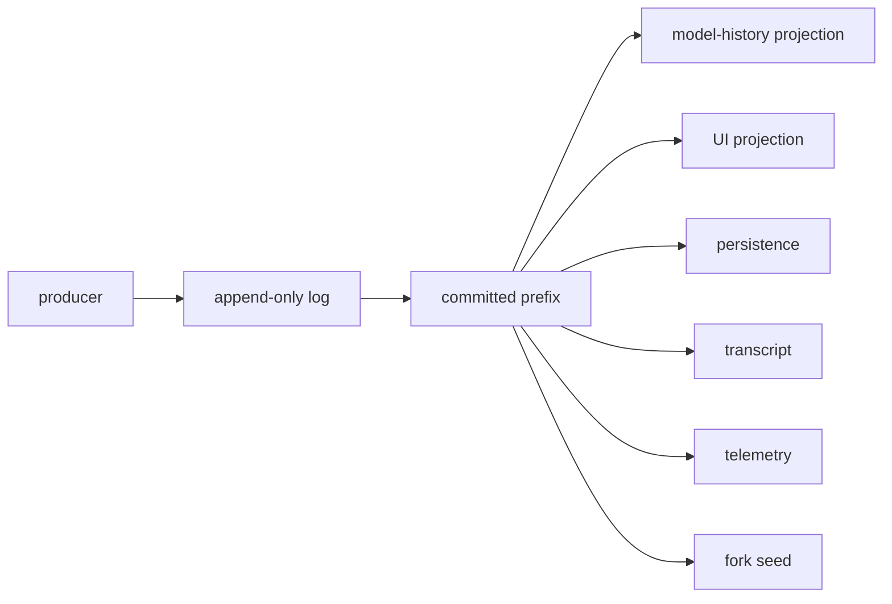

# Session Event Log：从追加到投影与 Fork

## 基线

本章只描述 DeepSeek Harness commit `76fda729799fe9b3848dbe2c211d4b231032b81e` 中的 Session 日志、Projection、持久化、Resume 与 Fork 行为。源码链接固定到该提交；运行中的 Session 内存提交、持久化 Provider 接受写入和 `flush` 耐久屏障是三个不同时间点。

## 一句话结论

Session Event Log 是按 `seq` 连续追加的事实记录；模型历史、Client 状态和 Transcript 分别从已提交前缀派生，而 Resume 与 Fork 通过显式种子和持久化元数据保留历史。

 **Claim `DSH-ARCH-007`:** 所有进入模型请求的输入都可由追加式 Session Event Log 重建。

 **Claim `DSH-CAP-006`:** Session 提供持久化、投影、恢复、Transcript 与已完成 Turn 的 Fork 原语。

 **Claim `DSH-DD-SESSION-001`:** 追加式 Session Event Log 默认要求读取方认识每种事件，只有标记 `ignorable: true` 的未知事件可以跳过。

 **Claim `DSH-DD-SESSION-002`:** 类型化 Projection 折叠已提交事件前缀，为 Host 与 Client 生成视图而不替代原始日志。

 **Claim `DSH-DD-SESSION-003`:** Resume 与已完成 Turn 的 Fork 在显式持久化所有权规则下保留已提交历史。

Fork 选定的前缀不能结束于未完成 Turn 内；持久化 Provider 仍负责日志的耐久性与格式拒绝。

 **Claim `DSH-CAP-009`:** Session 原语与确定性 replay fixture 不构成专用的终端用户调试器或通用 Benchmark 产品。

该判断限制产品定位，不否认这些原语可被更高层工具组合使用。

## 机制

### 事件封套与顺序

每个 `SessionEvent` 都携带 `type`、`seq`、`time` 与 `data`。`Session.append` 以当前日志长度分配连续 `seq`，所以日志位置而非时间戳定义单个 Session 内的单调顺序；`time` 来自 `Date.now()`，只记录 epoch 毫秒，不能替代 `seq` 作为顺序依据。[事件封套](https://github.com/deepseek-ai/deepseek-harness/blob/76fda729799fe9b3848dbe2c211d4b231032b81e/packages/core/session/src/types.ts#L436-L470)与[追加实现](https://github.com/deepseek-ai/deepseek-harness/blob/76fda729799fe9b3848dbe2c211d4b231032b81e/packages/core/session/src/index.ts#L668-L718)共同固定这项关系。

原始日志保留每个已接受事件及其序列位置，包括不进入模型历史的结构事件、chunk 和可忽略未知事件。

派生消息是 `deriveMessages()` 从日志 surface 计算的 `Message[]`，不是另一份权威存储。

Client Projection 是注册的类型化 fold 计算出的 Host 状态与可选 wire view，也不是原始日志或模型消息的别名。

### append/commit/broadcast

`Session.append` 先快照并验证数据、构造事件，再验证 surface 转换；这些步骤失败时日志不变。`log.push(event)` 是内存日志的提交点，随后才调用已收集的 `session/event` observer；observer 失败被隔离，因此不会撤销提交，也不会阻止后续 observer 看到同一事件。[提交与发布顺序](https://github.com/deepseek-ai/deepseek-harness/blob/76fda729799fe9b3848dbe2c211d4b231032b81e/packages/core/session/src/index.ts#L637-L718)只承诺内存接受与发布，不承诺某个下游分支已经执行成功。

这张图表示各表示形式对已提交前缀的依赖，不表示各分支同步执行，也不表示每次广播都已完成磁盘 `flush`。Transcript 从 append-origin 事件读取人类可见历史；surface replacement 可以遮蔽模型历史节点，却不会删除原始日志条目。

### deriveMessages

`deriveMessages()` 遍历当前 surface 节点并调用单事件投影；surface replacement 会使缓存重建。`user/message`、非空 `assistant/message` 与 `tool/result` 可形成模型消息，结构事件不形成消息；`assistant/chunk` 和空内容的 `assistant/message` 在语义投影中被跳过，但它们仍保留在日志及原来的 `seq` 位置。[派生规则](https://github.com/deepseek-ai/deepseek-harness/blob/76fda729799fe9b3848dbe2c211d4b231032b81e/docs/subsystems/session.md#L563-L572)与[缓存实现](https://github.com/deepseek-ai/deepseek-harness/blob/76fda729799fe9b3848dbe2c211d4b231032b81e/packages/core/session/src/index.ts#L790-L820)区分“没有消息语义”和“删除事件”。

模型请求还需要日志中的完整 `request/header` 快照；fold 选择最新快照，从而重建调用配置、adapter 默认标记、system prompt 和工具 schema。[请求封套规则](https://github.com/deepseek-ai/deepseek-harness/blob/76fda729799fe9b3848dbe2c211d4b231032b81e/docs/subsystems/session.md#L138-L160)说明了这些模型可见输入为何必须进入日志。

### typed projections

`SessionProjectionRegistry` 只订阅一次 `session/event`，并把每个已提交事件送入所有已注册 unit 的同步纯 `apply`。每个 unit 持有 Host fold state；带 `wire` 的 unit 再通过 `view` 生成经过 schema 验证的 Client 整体值，snapshot 用共同的 `asOfSeq` 表示一致读取位置。[Projection unit](https://github.com/deepseek-ai/deepseek-harness/blob/76fda729799fe9b3848dbe2c211d4b231032b81e/packages/session/session-projection/src/index.ts#L40-L117)与[registry 驱动](https://github.com/deepseek-ai/deepseek-harness/blob/76fda729799fe9b3848dbe2c211d4b231032b81e/packages/session/session-projection/src/index.ts#L181-L223)共同定义这一读取模型。

晚注册的 unit 或早于 registry 存在的 Session 会在首次事件或读取时从内存日志惰性折叠；注册卸载会移除该 key 与缓存，Client 把缺失 key 视为能力缺失。Projection 因此是可重建、可失效的派生状态，不能用来替换或裁剪日志。[快照和注册语义](https://github.com/deepseek-ai/deepseek-harness/blob/76fda729799fe9b3848dbe2c211d4b231032b81e/docs/subsystems/session-projection.md#L72-L106)固定了 watermark、schema 与生命周期规则。

### 持久化与所有权

持久化层以 per-session handle 区分 `read` 与 `write`；创建存储 Session 时调用方取得写所有权，read handle 不能 `append` 或 `flush`，失去写所有权的 handle 也不能继续写。写 handle 的 `append` 只保证连续批次已被 backend 接受、排序并对同一 backend 实例的后续读取可见；只有已解决的 `flush` 承诺此前确认的追加能在崩溃后保留。[handle 语义](https://github.com/deepseek-ai/deepseek-harness/blob/76fda729799fe9b3848dbe2c211d4b231032b81e/packages/session/session-persistence/src/handle.ts#L37-L94)与[Provider 语义](https://github.com/deepseek-ai/deepseek-harness/blob/76fda729799fe9b3848dbe2c211d4b231032b81e/packages/session/session-persistence/src/index.ts#L115-L146)明确分开接受、可见和耐久。

| 操作或状态 | 保留内容 | 不保证或拒绝 | 所有者 |
|---|---|---|---|
| 内存 `Session.append` | 验证后的事件进入当前日志，`seq` 连续 | 不等于 backend 接受或磁盘耐久 | `Session` |
| write-handle `append` | backend 接受连续批次，同实例后续读取至少看到该前缀 | 不保证崩溃后保留 | 持久化 Provider 与当前 write handle |
| `flush` | 此前已确认追加形成耐久屏障 | read handle、关闭 handle 或失去所有权的 handle 不能写 | 持久化 Provider |
| Resume | 经版本、封套、连续性与事件词汇检查的存储前缀 | 缺失、损坏或不支持的日志不进入活 Session | 持久化 Provider 读取，Session 构造器接收 seed |
| Fork | 选定前缀的深拷贝、`parentSession`、`isSeeded`、精确 `inheritedEventCount` 与继承的 `cwd` | 来源必须是 store 中的 live 实例；边界不能落在 open Turn 内 | `SessionStore.fork` |

### resume

Resume 从持久化 Provider 读取有效的连续前缀，并在重建 live Session 前执行 header 版本、事件词汇和封套验证；不支持的格式与损坏内容不会被当作可恢复历史。构造器以 restore seed 接收已转移所有权的记录，验证 `seq` 从 0 连续，并把构造历史与新生命周期写入区分开。[seed 验证](https://github.com/deepseek-ai/deepseek-harness/blob/76fda729799fe9b3848dbe2c211d4b231032b81e/packages/core/session/src/index.ts#L525-L580)与[格式错误类型](https://github.com/deepseek-ai/deepseek-harness/blob/76fda729799fe9b3848dbe2c211d4b231032b81e/packages/session/session-persistence/src/errors.ts#L92-L137)显示了恢复前的拒绝点。

`session/end-seed` 是构造器在 seed 之后写入日志的生命周期边界，`firstLiveSeq` 是当前对象中 live 写入的起点。它们说明哪些事件来自构造历史；`SessionHeader.isSeeded` 与存储层的 `inheritedEventCount` 才记录 Fork 谱系和精确继承长度，所以 seed marker 不能被解释为所有权标记。[seed 边界说明](https://github.com/deepseek-ai/deepseek-harness/blob/76fda729799fe9b3848dbe2c211d4b231032b81e/docs/subsystems/session.md#L627-L635)与[持久化元数据](https://github.com/deepseek-ai/deepseek-harness/blob/76fda729799fe9b3848dbe2c211d4b231032b81e/packages/session/session-persistence/src/handle.ts#L48-L60)分别拥有这两个概念。

### completed-turn fork

`SessionStore.fork` 接受 store 中的 live `Session` 或其 id，选择包含指定边界的前缀并深拷贝为子 Session seed。空来源可以生成空 seed；显式边界可以选择较早的 `turn/end` 或更晚的 between-turn log-only 位置，即使来源随后已有新 open Turn。[Fork 选择](https://github.com/deepseek-ai/deepseek-harness/blob/76fda729799fe9b3848dbe2c211d4b231032b81e/packages/core/session/src/index.ts#L1139-L1204)并不要求来源当前完全空闲。

策略检查只拒绝“所选前缀最后一个 Turn 边界仍是 `turn/start`”的情况；它不会静默截短边界。传入 Session 对象还必须与 store 按同一 id 保存的对象完全相同，因而 detached 副本不是合法 policy-fork 来源；需要较低层 seed 创建时应直接使用创建原语，不应把它描述成普通 Fork。[live 来源检查](https://github.com/deepseek-ai/deepseek-harness/blob/76fda729799fe9b3848dbe2c211d4b231032b81e/packages/core/session/src/index.ts#L1206-L1218)保留了两层 API 的差异。

## 源码导读

下表按“写入事实 → 派生表示 → 保存与再生”的顺序列出最小阅读路径；每个链接都固定到同一上游提交。

| 阅读主题 | 固定来源 | 核对重点 |
|---|---|---|
| Event 封套与格式号 | [`types.ts` 第 28–87 行](https://github.com/deepseek-ai/deepseek-harness/blob/76fda729799fe9b3848dbe2c211d4b231032b81e/packages/core/session/src/types.ts#L28-L87)、[第 436–470 行](https://github.com/deepseek-ai/deepseek-harness/blob/76fda729799fe9b3848dbe2c211d4b231032b81e/packages/core/session/src/types.ts#L436-L470) | `SESSION_FORMAT_VERSION = 0`；`seq`、`time`、`ignorable` 的职责。 |
| 内存追加 | [`index.ts` 第 637–718 行](https://github.com/deepseek-ai/deepseek-harness/blob/76fda729799fe9b3848dbe2c211d4b231032b81e/packages/core/session/src/index.ts#L637-L718) | 验证先于 `log.push`；observer 位于提交之后。 |
| 模型历史与 Transcript | [`session.md` 第 253–317 行](https://github.com/deepseek-ai/deepseek-harness/blob/76fda729799fe9b3848dbe2c211d4b231032b81e/docs/subsystems/session.md#L253-L317)、[第 563–572 行](https://github.com/deepseek-ai/deepseek-harness/blob/76fda729799fe9b3848dbe2c211d4b231032b81e/docs/subsystems/session.md#L563-L572) | surface、append-origin 与模型消息是不同选择规则。 |
| 类型化 Projection | [`session-projection.md` 第 38–70 行](https://github.com/deepseek-ai/deepseek-harness/blob/76fda729799fe9b3848dbe2c211d4b231032b81e/docs/subsystems/session-projection.md#L38-L70)、[第 72–106 行](https://github.com/deepseek-ai/deepseek-harness/blob/76fda729799fe9b3848dbe2c211d4b231032b81e/docs/subsystems/session-projection.md#L72-L106)、[`index.ts` 第 181–223 行](https://github.com/deepseek-ai/deepseek-harness/blob/76fda729799fe9b3848dbe2c211d4b231032b81e/packages/session/session-projection/src/index.ts#L181-L223) | 同步 fold、共同 watermark、schema 验证与注册生命周期。 |
| Resume 与 seed | [`index.ts` 第 525–580 行](https://github.com/deepseek-ai/deepseek-harness/blob/76fda729799fe9b3848dbe2c211d4b231032b81e/packages/core/session/src/index.ts#L525-L580)、[`session.md` 第 627–635 行](https://github.com/deepseek-ai/deepseek-harness/blob/76fda729799fe9b3848dbe2c211d4b231032b81e/docs/subsystems/session.md#L627-L635) | seed 连续性、`session/end-seed` 与 `firstLiveSeq`。 |
| Fork 策略 | [`index.ts` 第 1139–1204 行](https://github.com/deepseek-ai/deepseek-harness/blob/76fda729799fe9b3848dbe2c211d4b231032b81e/packages/core/session/src/index.ts#L1139-L1204)、[第 1206–1218 行](https://github.com/deepseek-ai/deepseek-harness/blob/76fda729799fe9b3848dbe2c211d4b231032b81e/packages/core/session/src/index.ts#L1206-L1218) | 空历史、显式边界、open Turn 拒绝与 live-source 身份检查。 |
| Backend 接受与耐久 | [`handle.ts` 第 37–94 行](https://github.com/deepseek-ai/deepseek-harness/blob/76fda729799fe9b3848dbe2c211d4b231032b81e/packages/session/session-persistence/src/handle.ts#L37-L94)、[`index.ts` 第 115–146 行](https://github.com/deepseek-ai/deepseek-harness/blob/76fda729799fe9b3848dbe2c211d4b231032b81e/packages/session/session-persistence/src/index.ts#L115-L146) | read/write 所有权、append 可见性与 `flush` 屏障。 |

## 限制与失败

### 格式拒绝策略

固定基线把 `SESSION_FORMAT_VERSION` 保持为 `0`，不承诺旧磁盘格式兼容，也不提供迁移。Provider 在 stored-log 读取与重建阶段拒绝不同版本；完整但本 runtime 无法解释的日志产生 `SessionFormatUnsupportedError`，验证失败的记录产生 `SessionPersistenceCorruptionError`，两者不会被混成一次成功 Resume。[版本定义](https://github.com/deepseek-ai/deepseek-harness/blob/76fda729799fe9b3848dbe2c211d4b231032b81e/packages/core/session/src/types.ts#L64-L87)与[拒绝分类](https://github.com/deepseek-ai/deepseek-harness/blob/76fda729799fe9b3848dbe2c211d4b231032b81e/packages/session/session-persistence/src/errors.ts#L92-L137)给出各自职责。

`SessionEventMap` 可以由插件扩展，因此类型化代码允许遇到未枚举分支；但 stored-log guard 默认拒绝当前 build 不认识且没有 `ignorable: true` 的事件类型。对可忽略未知事件的“跳过”仅表示读取方可以不解释其语义：Provider 仍保留记录、校验封套并维持连续 `seq`，不能删除该位置或绕过验证；这项词汇拒绝不应虚构成 `Session.append` 内的全类型目录检查。[stored-log guard](https://github.com/deepseek-ai/deepseek-harness/blob/76fda729799fe9b3848dbe2c211d4b231032b81e/packages/session/session-persistence/src/storage-contract.ts#L36-L91)承担该判断。

| 失败或边界 | 可见结果 | 恢复责任 |
|---|---|---|
| append 数据或 surface metadata 非法 | 内存日志不变 | producer 修正事件后重新追加 |
| observer 在内存提交后失败 | 已提交事件保留，其他 observer 继续 | observer 自己记录和修复失败；不能要求回滚日志 |
| backend `append` 已解决但尚未 `flush` | 同实例后续读取可见，崩溃保留未承诺 | 需要耐久点的调用方显式等待 `flush` |
| stored header 版本不同 | `SessionFormatUnsupportedError` | 使用可读取该格式的 Harness；不要把原始日志改写成“修复” |
| stored event 损坏 | `SessionPersistenceCorruptionError` | 保留底层原因并检查 backend artifact |
| 未知且 required 的 stored event | 拒绝重建整个 Session | 使用认识该事件的 build；不能静默删事件 |
| Fork 边界位于 open Turn 内 | `OPEN_TURN` | 选择已完成 Turn 后或其他稳定 between-turn 位置 |
| Fork 来源不是 store 中的 live 实例 | `SESSION_NOT_FOUND` 或 `SESSION_NOT_LIVE` | 传入 live id/对象，或明确使用低层 seed 创建 |

仓库中的 replay 与 snapshot fixture 用于确定性测试和模型可见输出回归；它们不提供通用交互式调试、性能测量或 Benchmark 结论。任何更高层产品都必须另行定义输入控制、可观察性、指标和有效性。

## 继续阅读

- [所属核心章节：组合与生命周期架构](../02-architecture.md)
- [证据方法](../00-methodology.md)
- [证据反向索引](../source-map.md)
- [`evidence/claims.json`](../../evidence/claims.json)
