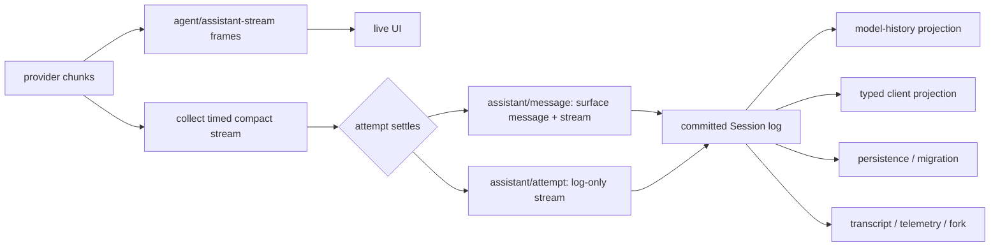
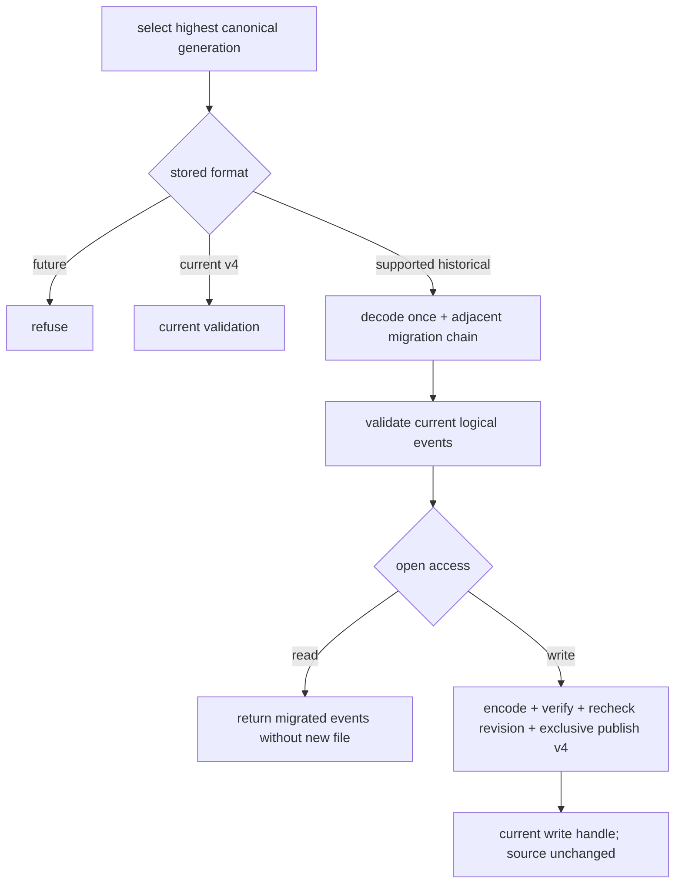

# Session Event Log：结算、投影、迁移与 Fork

## 基线

DeepSeek Harness commit `46a7f68b0922371ce7144b668b90e377d8e799f4`。本页区分 Session 内存提交、Provider 接受追加与 `flush` 耐久屏障；当前逻辑格式为 v4。

## 一句话结论

Session 按连续 `seq` 保存已提交事实。模型历史、Client 状态和 Transcript 从日志派生；实时 chunk 在请求结算后才成为 durable compact stream，持久化 Provider 负责历史格式迁移和耐久性。

 **Claim `DSH-ARCH-007`:** 所有进入模型请求的输入都可由追加式 Session Event Log 重建。

 **Claim `DSH-CAP-006`:** Session 提供持久化、投影、恢复、Transcript 与按事件前缀 Fork 的原语。

 **Claim `DSH-DD-SESSION-001`:** 追加式 Session Event Log 默认要求读取方认识每种事件，只有标记 `ignorable: true` 的未知事件可以跳过。

 **Claim `DSH-DD-SESSION-002`:** 类型化 Projection 折叠已提交事件前缀，为 Host 与 Client 生成视图而不替代原始日志。

 **Claim `DSH-DD-SESSION-003`:** Resume 与 Fork 在显式持久化所有权规则下保留已提交历史。

Fork 可选择未完成 Turn 内的前缀，并在子日志中补工具结果与 Step、Turn 结束记录；这些补充不属于继承前缀，持久化 Provider 仍负责耐久性与格式拒绝。

 **Claim `DSH-DD-SESSION-004`:** `agent/assistant-stream` 提供实时帧；`assistant/message` 与 `assistant/attempt` 在结算时持久记录完整 compact stream。

结算前的进程硬终止不会留下该 attempt 的 durable stream；`assistant/attempt` 不进入模型历史。

 **Claim `DSH-DD-SESSION-005`:** JSONL Provider 将受支持的历史日志迁移为当前 v4；读打开不发布新文件，写打开验证并独占发布新一代文件且保留原文件。

 **Claim `DSH-CAP-009`:** Session 原语与确定性 replay fixture 不构成专用的终端用户调试器或通用 Benchmark 产品。

该判断限制产品定位，不否认这些原语可被更高层工具组合使用。

## 机制

### 追加、提交与广播

事件封套包含 `type`、`seq`、`time`、`data`。`append()` 按当前日志长度分配 `seq`，用 `Date.now()` 记录时间；顺序由序列位置决定，不由时间戳决定。

追加先快照数据、验证事件与 surface 转换，再收集 observer。任何提交前失败都使日志不变；`log.push(event)` 是内存提交点，随后调用 `session/event` observer。每个 observer 的抛错或 rejection 被隔离，已提交事件不回滚，后续 observer 仍被调用。同步重入 append 会被拒绝。[追加顺序](https://github.com/deepseek-ai/deepseek-harness/blob/46a7f68b0922371ce7144b668b90e377d8e799f4/packages/core/session/src/index.ts#L720-L770)与[observer 隔离](https://github.com/deepseek-ai/deepseek-harness/blob/46a7f68b0922371ce7144b668b90e377d8e799f4/packages/core/session/src/index.ts#L395-L417)提供实现证据。

### 实时流与 durable 结算

`agent/assistant-stream` 发布进程内 start、chunk、end 帧。Chunk 含 attempt id、顺序 index、时间和 provider chunk；UI 可据此增量显示，但这些帧不是 Session Event Log 的逐条事件。

请求结算时，`assistant/message` 同时保存组装出的模型消息与 compact stream；未提交 surface message 的失败、重试、取消或 stream-error 尝试使用 `assistant/attempt`。取消时已产生可见文本或 reasoning 前缀的情况可以形成带 `interrupted: true` 的 message，未派发工具调用不进入该消息。Loop 先追加结算记录，再发 committed end 帧。

Compact stream 保留原 chunk 的时间和 delta 边界，用 text、reasoning、tool-call run 或原始 chunk 记录表示。它不是压成一段字符串，也不再以 `assistant/chunk` 占据多个顶层事件序号。硬终止发生在结算前时，内存中的这次流不会被恢复；写入内存日志后的磁盘耐久性仍取决于持久化。

图表示数据依赖，不表示每个分支同步完成或每次广播已经 `flush`。实时流与 durable 结算不能互换。

### 模型历史与 typed Projection

`deriveMessages()` 遍历当前 surface。`system/message`、`developer/message`、`user/message`、`assistant/message` 和 `tool/result` 可以形成模型消息；空内容 system/developer/assistant 消息不形成 wire message，`assistant/attempt` 和 Turn/Step 边界只留在日志。Surface replacement 改变当前模型历史而不删除原始事件；纯 message projection 也不改写原事件。[单事件投影](https://github.com/deepseek-ai/deepseek-harness/blob/46a7f68b0922371ce7144b668b90e377d8e799f4/packages/core/session/src/surface.ts#L120-L156)与[派生缓存](https://github.com/deepseek-ai/deepseek-harness/blob/46a7f68b0922371ce7144b668b90e377d8e799f4/packages/core/session/src/index.ts#L833-L870)区分原始事实与模型视图。

System prompt 来自 `system/message`。`request/header` 最新完整快照提供调用配置、adapter defaults 和工具 schema；它不再携带 system 字段。[请求 header](https://github.com/deepseek-ai/deepseek-harness/blob/46a7f68b0922371ce7144b668b90e377d8e799f4/packages/core/session/src/types.ts#L234-L250)与[旧 system 字段拒绝](https://github.com/deepseek-ai/deepseek-harness/blob/46a7f68b0922371ce7144b668b90e377d8e799f4/packages/core/session/src/surface.ts#L206-L216)明确这项分工。

v4 的消息角色包含 `system`、`developer`、`user`、`assistant`、`tool`；`tool/result` 使用独立 tool-role 消息、直接 content 数组与 `toolCallId`，不再把结果包在 user-role 的 `tool-result` block 中。消息的 `source.kind` 由各 producer 声明，角色与来源分别表达消息用途和产生者，不再依赖通用 `plugin` 来源包装。[消息定义](https://github.com/deepseek-ai/deepseek-harness/blob/46a7f68b0922371ce7144b668b90e377d8e799f4/packages/llm/llm/src/message.ts#L104-L190)与[V3→V4 转换](https://github.com/deepseek-ai/deepseek-harness/blob/46a7f68b0922371ce7144b668b90e377d8e799f4/packages/session/session-format-v3-to-v4/README.md#L85-L96)说明这两项变化。

`developer/message` 保存增量工具变化：`tool-addition` 按名字引用该事件 `headerSeq` 指向的历史 `request/header` schema，`tool-removal` 记录移除的名字。这只是当前格式能保存和恢复的表示；迁移不会凭空生成 developer 历史，也不启用自动产出、动态工具加载或 UI 渲染，不能表示这些历史的当前 Provider 与 UI 会明确拒绝。[Developer 存储支持与限制](https://github.com/deepseek-ai/deepseek-harness/blob/46a7f68b0922371ce7144b668b90e377d8e799f4/packages/session/session-format-v3-to-v4/README.md#L253-L262)给出完整限定。

`SessionProjectionRegistry` 只订阅一次 `session/event`，驱动注册 unit 的同步纯 `apply`；可选 `wire.view` 生成 schema 验证后的 Client 值，snapshot 的共同 `asOfSeq` 标记读取位置。晚注册 unit 可从内存日志惰性重建；同 key 注册被计数，最后一个注册卸载后该 key 才从 snapshot 消失。Projection 是可重建视图，不是日志的替代存储。

### 持久化与格式迁移

| 时点或操作 | 承诺 |
|---|---|
| Session `append` | 事件进入验证后的内存日志。 |
| write-handle `append` | backend 接受连续批次，之后同实例读取至少可见该前缀；通用接口不承诺崩溃保留。 |
| `flush` | 此前确认的追加耐久，未物化的空 Session 也变为可被其他进程列出。 |
| JSONL 的具体实现 | 每次实际 batch 写入会 fsync；这强于通用 append 的最低保证。 |
| read handle 或失去写所有权 | 不允许继续追加；read handle 不能执行写耐久屏障。 |

当前 `SESSION_FORMAT_VERSION = 4`，静态 catalog 包含 v0→v1→v2→v3→v4 相邻链。Session 消费者只读取当前逻辑事件，历史解码和转换发生在 Provider 暴露它们之前。未知 required 事件仍拒绝恢复；`ignorable: true` 只允许不解释语义，仍要保留记录、验证封套并维持连续 `seq`。

V3→V4 还转换已知消息来源，并把未知但可忽略的旧事件类型置于 `plugin:` 命名空间；其 payload 保持不变。历史父日志缺少 subagent catalog 时，可根据直接子日志的可用事实补充记录；当前 v4 读取不重新进行这项历史发现。迁移只转换明确列举的消息位置，不递归猜测任意 JSON 的含义。

JSONL 每次选择数字最大的规范 generation。`stat/list` 只读取并转换 header，不读事件或发布 successor；`open(read)` 在内存中迁移并验证；`open(write)` 复用或重新准备迁移结果，编码临时文件、验证、复查源 revision，最后独占发布当前 generation，原文件保持字节不变。未来版本拒绝打开。

v0 文件名是 `session.jsonl[.zstd]`，v1 起是 `session.vN.jsonl[.zstd]`。迁移不是任意损坏修复：常规中断尾部由读取/恢复消费者处理；迁移只为受支持历史中已被后续 `turn/start` 封闭的有限中断情形补缺失的结束标记。

### Resume 与事件前缀 Fork

Resume 从 Provider 取得经迁移和验证的当前事件。构造器校验 seed 从 0 连续，并区分构造历史与本实例 live 写入；`firstLiveSeq` 标识当前实例起点。

新 Fork child 写入带 `inherited: true` 的 `session/end-seed`，最后一个带该标记的事件记录当前 Session 的继承切点；普通 restore/replay 的非 tagged marker 仅标识生命周期。持久化 handle 仍暴露精确 `inheritedEventCount`，不能把任意 seed marker 当成并发写所有权信号。

`SessionStore.fork` 接受 store 中的 live Session 或其 id，按包含端点的事件序号截取前缀，并记录 `parentSession`、`isSeeded`、继承长度和 cwd。当前前缀可以结束于未完成 Turn；子日志在继承标记后补未结工具调用的合成结果与 Step、Turn 结束记录，原因是 `forked`。这些补充不计入 `inheritedEventCount`，也不修改来源日志；已经关闭的 Step 与 Turn 保持原样。传入对象必须是 store 保存的同一实例，detached 副本不能走这条策略 API。

## 源码导读

| 主题 | 固定来源 | 核对重点 |
|---|---|---|
| 格式与封套 | [v4 格式号](https://github.com/deepseek-ai/deepseek-harness/blob/46a7f68b0922371ce7144b668b90e377d8e799f4/packages/core/session/src/types.ts#L67-L89)；[seq、time 与 ignorable](https://github.com/deepseek-ai/deepseek-harness/blob/46a7f68b0922371ce7144b668b90e377d8e799f4/packages/core/session/src/types.ts#L493-L511) | 单调版本和未知 required 事件策略。 |
| 流式帧与结算 | [live chunk](https://github.com/deepseek-ai/deepseek-harness/blob/46a7f68b0922371ce7144b668b90e377d8e799f4/packages/core/agent/src/runtime-types.ts#L128-L145)；[settlement-before-end](https://github.com/deepseek-ai/deepseek-harness/blob/46a7f68b0922371ce7144b668b90e377d8e799f4/packages/core/agent/src/runtime-types.ts#L354-L363)；[message 与 attempt](https://github.com/deepseek-ai/deepseek-harness/blob/46a7f68b0922371ce7144b668b90e377d8e799f4/packages/core/session/src/types.ts#L331-L355)；[compact records](https://github.com/deepseek-ai/deepseek-harness/blob/46a7f68b0922371ce7144b668b90e377d8e799f4/packages/llm/llm/src/assistant-stream.ts#L13-L44)；[硬终止限制](https://github.com/deepseek-ai/deepseek-harness/blob/46a7f68b0922371ce7144b668b90e377d8e799f4/docs/architecture.md#L119-L121) | 瞬时帧、完整流与模型历史。 |
| Typed Projection | [纯 fold 与 wire view](https://github.com/deepseek-ai/deepseek-harness/blob/46a7f68b0922371ce7144b668b90e377d8e799f4/packages/session/session-projection/src/index.ts#L40-L92)；[共同 watermark](https://github.com/deepseek-ai/deepseek-harness/blob/46a7f68b0922371ce7144b668b90e377d8e799f4/packages/session/session-projection/src/index.ts#L107-L115)；[驱动与注册计数](https://github.com/deepseek-ai/deepseek-harness/blob/46a7f68b0922371ce7144b668b90e377d8e799f4/packages/session/session-projection/src/index.ts#L181-L197) | 派生值和注册生命周期。 |
| Handle 与耐久性 | [所有权、接受与 flush](https://github.com/deepseek-ai/deepseek-harness/blob/46a7f68b0922371ce7144b668b90e377d8e799f4/packages/session/session-persistence/src/handle.ts#L45-L109)；[JSONL 写入](https://github.com/deepseek-ai/deepseek-harness/blob/46a7f68b0922371ce7144b668b90e377d8e799f4/packages/session/session-persistence-jsonl/README.md#L74-L78) | 通用接口承诺与具体 backend 行为。 |
| 历史迁移 | [静态相邻链](https://github.com/deepseek-ai/deepseek-harness/blob/46a7f68b0922371ce7144b668b90e377d8e799f4/packages/session/session-format-catalog/src/generated.ts#L10-L31)；[read/write 与子日志事实](https://github.com/deepseek-ai/deepseek-harness/blob/46a7f68b0922371ce7144b668b90e377d8e799f4/packages/session/session-persistence-jsonl/README.md#L80-L84)；[来源转换](https://github.com/deepseek-ai/deepseek-harness/blob/46a7f68b0922371ce7144b668b90e377d8e799f4/packages/session/session-format-v3-to-v4/README.md#L107-L136)；[未知事件与拒绝](https://github.com/deepseek-ai/deepseek-harness/blob/46a7f68b0922371ce7144b668b90e377d8e799f4/packages/session/session-format-v3-to-v4/README.md#L182-L202) | 只读转换、验证发布、原文件不可变。 |
| 格式拒绝 | [当前格式和事件验证](https://github.com/deepseek-ai/deepseek-harness/blob/46a7f68b0922371ce7144b668b90e377d8e799f4/packages/session/session-persistence/src/storage-contract.ts#L41-L103)；[v4 表示与关系](https://github.com/deepseek-ai/deepseek-harness/blob/46a7f68b0922371ce7144b668b90e377d8e799f4/packages/session/session-format-v3-to-v4/README.md#L214-L240) | 未知 required、结构损坏与生命周期关系分别检查。 |
| Resume 与 Fork | [seed 校验和继承标记](https://github.com/deepseek-ai/deepseek-harness/blob/46a7f68b0922371ce7144b668b90e377d8e799f4/packages/core/session/src/index.ts#L555-L620)；[Fork 前缀与元数据](https://github.com/deepseek-ai/deepseek-harness/blob/46a7f68b0922371ce7144b668b90e377d8e799f4/packages/core/session/src/index.ts#L1221-L1254)；[合成尾部](https://github.com/deepseek-ai/deepseek-harness/blob/46a7f68b0922371ce7144b668b90e377d8e799f4/packages/core/session/src/fork.ts#L10-L29)；[live 身份](https://github.com/deepseek-ai/deepseek-harness/blob/46a7f68b0922371ce7144b668b90e377d8e799f4/packages/core/session/src/index.ts#L1292-L1304) | 继承切点、合成记录与写所有权。 |

## 限制与失败

| 情况 | 结果与恢复责任 |
|---|---|
| append 数据、surface 或同步 dispatch 验证失败 | 内存日志不变，producer 修正数据。 |
| observer 失败 | 已提交事件保留；observer 负责报告和恢复。 |
| 流尚未结算即进程硬终止 | 没有该 attempt 的 durable stream；实时 UI 帧不能补作日志。 |
| 未来格式或未知 required 事件 | 拒绝重建；使用支持该格式和词汇的 build，不静默删事件。 |
| 完整记录损坏 | 报 corruption；迁移不等于任意内容修复。 |
| 准备迁移后源 revision 改变 | 拒绝该次写打开；后续打开重新准备，旧读者已取得的逻辑历史不被替换。 |
| Fork 前缀结束于 open Turn | 子日志补 `forked` 结果与结束记录；这不表示原工具执行完成或外部副作用被撤销。 |
| Fork 来源不是 store 中的 live 实例 | `SESSION_NOT_FOUND` 或 `SESSION_NOT_LIVE`；低层 seed 创建是另一种操作。 |

日志与 replay fixture 只证明明确场景中的重建和回归行为；调试器或 Benchmark 还需定义控制方式、观测与指标。

## 继续阅读

- [所属核心章节：组合与生命周期架构](../02-architecture.md)
- [证据方法](../00-methodology.md) · [证据反向索引](../source-map.md)
- [Claim ledger](../../evidence/claims.json)
