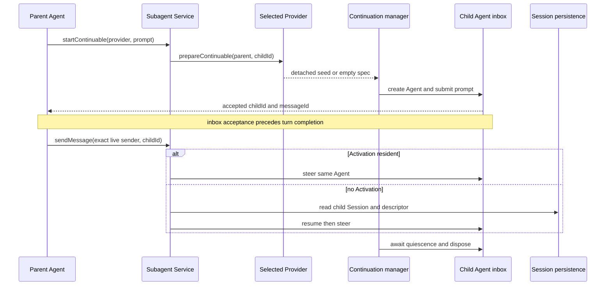
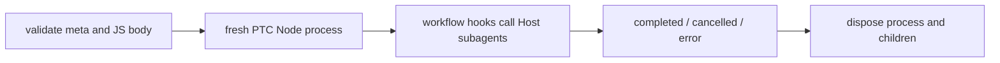

# Subagent、Goal、Plan mode 与 Workflow 的责任边界

## 基线

本章描述 DeepSeek Harness commit `46a7f68b0922371ce7144b668b90e377d8e799f4` 中的委托、目标状态、规划和程序化编排，并区分可选的 Agent Teams 与 Schedule。源码链接固定到该提交；进程位置、发布族与默认启用状态分别核对。

## 一句话结论

| 原语 | 负责什么 | 主要限制 |
|---|---|---|
| Subagent | 委托一个 child Agent，Provider 决定初次 transport 与 conversation seed | Provider 可用和模型工具启用是两步 |
| Goal | 在一个 Session 中保存当前目标、phase、revision 与 admitted rounds | activation 为进程内状态，续轮策略由 Consumer 决定 |
| Plan mode | 保存协作状态，并在活动时向模型请求加入 guidance | approval 与 Sandbox 独立执行 |
| Workflow | 运行模型编写的 JS 程序，通过 hooks 批量编排 Subagent，可前台等待或后台运行 | 每次新建 Node 进程使用 Session 文件策略；VM 本身不提供安全隔离 |
| Agent Teams | 可选的持久成员 roster、peer mailbox 与 shared task board | 实验性、共享 checkout、单进程协调 |
| Schedule | 在原会话发送持久化的一次性或固定间隔提醒 | 需要 live root Agent，不唤醒 cold Session 或通知会话外渠道 |

 **Claim `DSH-CAP-007`:** `standard` Preset 启用进程内 Subagent；Codex 与 Claude Code 工具默认禁用，其他外部 Provider 也需要显式组合。

Provider 在 Host 中可用不等于模型已经获得对应工具。

 **Claim `DSH-CAP-008`:** durable current Goal 与通过 PTC Node 进程执行的 Workflow 是两种不同的编排原语。

Goal 状态不负责调度；Workflow 的 VM 不是安全隔离层，文件约束由所选 Sandbox 提供方执行，网络不在该策略内。

 **Claim `DSH-DD-ORCH-001`:** 同一个 Subagent Service 接纳进程内与外部产品 Provider，并暴露不同的 continuation 语义。

Provider 可注册不等于对应模型工具已在当前 Preset 中启用。

 **Claim `DSH-DD-ORCH-002`:** Goal 保存一个 durable current objective，并在进程内维护 activation。

Resume 或 Fork 后需要重新激活 Goal；Goal 本身不是调度器。

 **Claim `DSH-DD-ORCH-003`:** Workflow 程序复用 Node PTC runtime，每次在新建的 Node 进程中运行；Consumer 在完成或失败后仍须调用 Dispose。

文件约束和进程清理由所选 Provider 决定；Workflow 无整体 elapsed deadline，VM 与协作式 fan-out limits 不构成安全隔离或强制配额。

 **Claim `DSH-DD-ORCH-004`:** Agent Teams 已纳入公开发布族，保留 experimental 名称与实验成熟度，并由可选 Profile layer 显式启用。

## 机制

### Subagent Service 与 Provider

`ctx.subagents` 可登记多个具名 Provider。`start()` 表示一次 one-shot run；可选方法 `prepareContinuable()` 的存在表示该 Provider 能提供 continuable child 的初始 detached seed。continuation manager 随后负责 Agent 创建、消息接纳、cold resume、ownership 与 dispose。[Provider contract](https://github.com/deepseek-ai/deepseek-harness/blob/46a7f68b0922371ce7144b668b90e377d8e799f4/docs/subsystems/subagent.md#L395-L457)。

| Provider | Transport 与 conversation seed | one-shot | continuable | Standard 模型工具 |
|---|---|---|---|---|
| `spawn` | 进程内新 Agent，无 parent conversation | 支持 | 支持，初始 spec 无 seed | `subagent`，启用 |
| `fork` | 进程内新 Agent，复制 parent 最后一个已完成 Turn 及以前的前缀 | 支持 | 支持，创建时固化前缀 | `subagent_fork`，启用 |
| `acp` | 新 ACP subprocess/session，不复制对话 | 支持 | 不支持 | 无预置行，需组合 Consumer |
| `codex` | app-server process 与独立 thread/Turn | 支持 | 不支持 | `subagent_codex`，disabled |
| `claude-code` | CLI process 与独立 Agent SDK query | 支持 | 不支持 | `subagent_claude_code`，disabled |
| `dsh-sdk` | 新 Harness subprocess，经 stdio JSON-RPC 驱动 | 支持 | 不支持 | 无预置行，需组合 Consumer |

[spawn 实现](https://github.com/deepseek-ai/deepseek-harness/blob/46a7f68b0922371ce7144b668b90e377d8e799f4/packages/subagent/subagent-spawn-in-process/src/index.ts#L41-L65)与[fork 实现](https://github.com/deepseek-ai/deepseek-harness/blob/46a7f68b0922371ce7144b668b90e377d8e799f4/packages/subagent/subagent-fork-in-process/src/index.ts#L40-L91)给出 seed 差异；[Standard 工具行](https://github.com/deepseek-ai/deepseek-harness/blob/46a7f68b0922371ce7144b668b90e377d8e799f4/packages/bundle/web-app/presets/standard.patch.yml#L86-L118)决定启用状态。Base 的 fork 行是 one-shot，Web Standard 的 fork 行是 continuable，选择入口时需区分两者。

每个进程内 child 建立自己的 flat scope；conversation seeding 不等于直接继承 parent 工具注册。授权也不是完全空白：进程内 Provider 按既定规则捕获 delegated permission，Auto/Full access 与 Read Only/Workspace Write 分别沿各自策略传播。具体字段与 cold resume 规则由[in-process 权限和深度约定](https://github.com/deepseek-ai/deepseek-harness/blob/46a7f68b0922371ce7144b668b90e377d8e799f4/docs/subsystems/subagent.md#L459-L469)拥有。

### 委托与 continuation 时序

continuable child 是 durable Session；Activation 是该 Session 当前由一个 Agent 驻留的进程内时段。`startContinuable()` 在 initial prompt 被 inbox 接受后返回 ids，不等待消息落入 Session log 或 Turn 完成。`sendMessage()` 接受 exact live sender，仅授权直接 parent/child；resident child 进入原 inbox，已释放 Activation 的 direct child 从自己的持久 Session/descriptor cold-resume。消息一旦被接纳，后续 caller cancellation 不撤回它。[Activation 与消息接纳](https://github.com/deepseek-ai/deepseek-harness/blob/46a7f68b0922371ce7144b668b90e377d8e799f4/docs/subsystems/subagent.md#L124-L156)。

直接 child 列表现在读取 parent Session 的 `subagentCatalog`，无需逐一打开 child logs；完整 descendant 列表仍遍历 Session corpus。`list_agents` 的 `running` / `inactive` 只描述当前活动，不证明任务完成或后续消息一定可送达。[子任务发现与活动语义](https://github.com/deepseek-ai/deepseek-harness/blob/46a7f68b0922371ce7144b668b90e377d8e799f4/docs/subsystems/subagent.md#L267-L277)。

### Goal 与 Plan mode

Goal 的 durable 事实来自 `goal/change`：目标文本、phase、revision 与轮数可重放。activation 为 process-local；任何 Session start 都把它 disarm，即使 durable phase 仍为 `active`，仍需显式 resume 才重新允许 continuation。上限是 admitted rounds，不是 token、费用或时间预算。[Goal 生命周期与恢复](https://github.com/deepseek-ai/deepseek-harness/blob/46a7f68b0922371ce7144b668b90e377d8e799f4/packages/goal/goal/README.md#L54-L82)；[Goal 限制](https://github.com/deepseek-ai/deepseek-harness/blob/46a7f68b0922371ce7144b668b90e377d8e799f4/packages/goal/goal/README.md#L158-L162)。

Plan mode 将 `plan/mode` 记录为 log-only 状态；模型请求读取由部署提供的 guidance。用户切换先成为 pending，下一次获准的 in-turn pre-step 才记录，因此 pending 选择可能在重启前尚未持久化。`exit_plan_mode` 提交完整 Markdown 计划给 user-question review，获准后记录待退出状态；同一批工具调用仍处于原 guidance。[Plan 日志与退出行为](https://github.com/deepseek-ai/deepseek-harness/blob/46a7f68b0922371ce7144b668b90e377d8e799f4/docs/subsystems/plan.md#L5-L35)。

### Workflow 运行生命周期

`workflow-ptc` 先验证 metadata、JS body、Provider 与 run limits，再调用 shared Node PTC runtime。它拒绝非 TypeScript runtime；Python PTC 组合必须禁用 `workflow-ptc`、`tool-workflow` 与任何启用的 Ralph。脚本保留 `agent()`、`parallel()`、`pipeline()`、`phase()`、`log()` 和 `args`；host binding 把 child 请求交给固定的 Subagent Provider。[Engine validation](https://github.com/deepseek-ai/deepseek-harness/blob/46a7f68b0922371ce7144b668b90e377d8e799f4/packages/workflow/workflow-ptc/src/index.ts#L96-L165)。

执行进程继承调用 Session 的 standing file policy 与 cwd，program-visible environment 为空；网络不受文件策略约束。VM 的 withheld globals 约束脚本接口，不提供安全隔离；如果代码到达 Node，它仍由所选 OS 文件策略限制。初始同步片段有 `syncTimeoutMs`，整个 run 没有 elapsed deadline；前台执行仍受 caller signal 和 enclosing tool deadline 约束，取消立即终止 managed process 并取消 child。[执行、取消与 Provider 限制](https://github.com/deepseek-ai/deepseek-harness/blob/46a7f68b0922371ce7144b668b90e377d8e799f4/packages/workflow/workflow-ptc/README.md#L47-L61)。

`WorkflowRun.result` 以 `completed`、`cancelled` 或 `error` 收敛。Consumer 每条路径都必须调用 idempotent `dispose()` 并等待进程与 child cleanup；Workflow 没有独立的 cleanup timer。[Live run 约定](https://github.com/deepseek-ai/deepseek-harness/blob/46a7f68b0922371ce7144b668b90e377d8e799f4/docs/subsystems/workflow.md#L93-L110)。顶层 workflow Consumer 将 run/member 生命周期写入 parent Session，Web 以独立 Chat node 呈现；缺少末尾终止记录可表示中断。[Durable Chat records](https://github.com/deepseek-ai/deepseek-harness/blob/46a7f68b0922371ce7144b668b90e377d8e799f4/docs/subsystems/workflow.md#L122-L128)。

通用 `workflow` 工具默认支持 `run_in_background: true`，先返回 `jobId` 与 `runId`，由 owned Job 管理运行。后台不会继承该工具步骤的 signal；`job_kill`、界面停止操作或 owner teardown 负责取消。模型在完成时获得整体结果；结算前的 `job_output` 只报告状态，界面可展示 Job ring 中的 `phase()`、`log()` 与成员变化。[后台接纳与取消](https://github.com/deepseek-ai/deepseek-harness/blob/46a7f68b0922371ce7144b668b90e377d8e799f4/packages/workflow/tool-workflow/README.md#L32-L50)。

持久记录只包含顶层 run/member 生命周期；`workflow/phase` 与 `workflow/log` 的逐行进度通过临时 Job observation 提供，不写成可恢复的 Workflow 进度日志。嵌套 PTC transport 不写这四类记录，记录失败可留下不完整前缀。[Job 与持久记录的分工](https://github.com/deepseek-ai/deepseek-harness/blob/46a7f68b0922371ce7144b668b90e377d8e799f4/packages/workflow/tool-workflow/README.md#L68-L80)。

Standard 启用 engine 与通用 Workflow 工具，Ralph 默认 disabled。PTC Preset 的 engine、通用工具和 Ralph 三行均 disabled，模型使用 `run_code`；启用 Ralph 时须在自定义 Preset 中同时恢复 engine。[Standard 行](https://github.com/deepseek-ai/deepseek-harness/blob/46a7f68b0922371ce7144b668b90e377d8e799f4/packages/bundle/web-app/presets/standard.patch.yml#L119-L130)；[PTC 行](https://github.com/deepseek-ai/deepseek-harness/blob/46a7f68b0922371ce7144b668b90e377d8e799f4/packages/bundle/web-app/presets/ptc.patch.yml#L119-L152)。

### Agent Teams 的发布状态

Agent Teams 包保留 `@deepseek-ai/dsh-experimental-*` 名称，但 metadata 声明 `publishConfig.access: public`；experimental 发布策略默认纳入 release family，固定基线的 private denylist 为空。它仍无稳定性承诺，默认 Profile 不启用。[Package metadata](https://github.com/deepseek-ai/deepseek-harness/blob/46a7f68b0922371ce7144b668b90e377d8e799f4/packages/experimental/agent-team/package.json#L1-L11)；[发布策略](https://github.com/deepseek-ai/deepseek-harness/blob/46a7f68b0922371ce7144b668b90e377d8e799f4/packages/experimental/AGENTS.md#L5-L9)；[private denylist](https://github.com/deepseek-ai/deepseek-harness/blob/46a7f68b0922371ce7144b668b90e377d8e799f4/scripts/experimental-package-policy.ts#L1-L15)。

Host Team Bundle 在 `dsh-base` 上装载 domain/tools，以 `spawn_teammate` 选择 fresh 或 fork，并禁用普通直接委托与重叠的全局 controls；Workflow 仍可创建 fresh one-shot children。domain 以 Lead Session log 持久化 roster、mailbox 与 task DAG，提供 peer messaging 和 compare-and-set task mutation。成员共享工作目录，文件提示只产生冲突警告，不提供 worktree isolation 或文件锁。[Team Profile layer](https://github.com/deepseek-ai/deepseek-harness/blob/46a7f68b0922371ce7144b668b90e377d8e799f4/packages/experimental/agent-team-profile/README.md#L12-L51)；[Team 行为](https://github.com/deepseek-ai/deepseek-harness/blob/46a7f68b0922371ce7144b668b90e377d8e799f4/packages/experimental/agent-team/README.md#L59-L108)。

固定基线已把工具与 Web UI 合并为同一个 Team Bundle；旧的 `agent-team-web-profile` 独立条目需要移除。安装本身提供该可选 Bundle，但默认不选中，Web/Desktop Plugins 页面可显式启用。它只覆盖 Host rows，Preset 里的 scoped continuable controls 仍可能同时出现。[合并后的启用方式](https://github.com/deepseek-ai/deepseek-harness/blob/46a7f68b0922371ce7144b668b90e377d8e799f4/packages/experimental/agent-team-profile/README.md#L39-L51)；[组合限制](https://github.com/deepseek-ai/deepseek-harness/blob/46a7f68b0922371ce7144b668b90e377d8e799f4/packages/experimental/agent-team-profile/README.md#L102-L109)。

### Schedule 与 Goal 的区别

Schedule 是独立的可选插件，记录提醒并等待 due time；Goal 记录同一 Session 的当前工作目标。Schedule 仅装配到插件加载之后创建的 root Agent，到期投递等待该 Agent idle；closed/cold Session 的提醒保持 overdue，重开后才处理。重复提醒使用固定间隔并只补最新一次；不会发送邮件、SMS、push 或浏览器通知。[Schedule 的使用与时序](https://github.com/deepseek-ai/deepseek-harness/blob/46a7f68b0922371ce7144b668b90e377d8e799f4/packages/schedule/schedule/README.md#L12-L83)。

## 源码导读

| 主题 | 固定来源 | 可核对行为 |
|---|---|---|
| Subagent | [Service 和 Provider contract](https://github.com/deepseek-ai/deepseek-harness/blob/46a7f68b0922371ce7144b668b90e377d8e799f4/docs/subsystems/subagent.md#L395-L469) | capability discovery、seed、permission 与 continuation |
| Goal | [Goal README](https://github.com/deepseek-ai/deepseek-harness/blob/46a7f68b0922371ce7144b668b90e377d8e799f4/packages/goal/goal/README.md#L54-L82) | durable phase 与 process-local activation |
| Plan mode | [Plan subsystem](https://github.com/deepseek-ai/deepseek-harness/blob/46a7f68b0922371ce7144b668b90e377d8e799f4/docs/subsystems/plan.md#L5-L35) | pending state、pre-step append 与 review |
| Workflow | [Engine source](https://github.com/deepseek-ai/deepseek-harness/blob/46a7f68b0922371ce7144b668b90e377d8e799f4/packages/workflow/workflow-ptc/src/index.ts#L96-L165)；[生命周期记录](https://github.com/deepseek-ai/deepseek-harness/blob/46a7f68b0922371ce7144b668b90e377d8e799f4/docs/subsystems/workflow.md#L93-L128) | Node PTC runtime、cancel/dispose 与 Chat projection |
| Agent Teams | [Profile patch](https://github.com/deepseek-ai/deepseek-harness/blob/46a7f68b0922371ce7144b668b90e377d8e799f4/packages/experimental/agent-team-profile/cordis.patch.yml#L1-L30)；[发布规则](https://github.com/deepseek-ai/deepseek-harness/blob/46a7f68b0922371ce7144b668b90e377d8e799f4/packages/experimental/AGENTS.md#L5-L9) | opt-in 组合与实验成熟度 |
| Schedule | [Scope 与 live owner](https://github.com/deepseek-ai/deepseek-harness/blob/46a7f68b0922371ce7144b668b90e377d8e799f4/packages/schedule/schedule/README.md#L68-L83) | root-Agent 安装与 Session 内投递 |

## 限制与失败

| 条件 | 可见结果 | 恢复责任 |
|---|---|---|
| Provider 无 `prepareContinuable()` | continuable start 被拒绝 | 选择支持的 Provider 或 one-shot Consumer |
| `startContinuable()` 返回 | initial inbox acceptance | 用后续 Session/Turn 事件观察完成 |
| sender 不是授权的 direct parent/child | `UNAUTHORIZED` | 保留 exact live Agent 与合法邻接关系 |
| Goal Resume/Fork 后 phase 为 active | activation 仍 disarmed | 显式 resume Goal |
| Workflow 接入 Python PTC | engine 在 load 时失败 | 禁用 Workflow/Ralph 对应行或使用 Node runtime |
| Workflow 失败/取消 | 前台 `error`/`cancelled`；后台 Job `failed`/`killed` | holder 或 Job owner 仍等待 dispose；清理服从 Provider 约定 |
| Team 多成员修改同一 checkout | task hints 可提示冲突 | 调用方协调文件写入；没有文件锁 |
| Schedule 到期但 Session cold | 保持 overdue | 恢复 live root Agent 后处理 |

## 继续阅读

- [所属核心章节：能力与组合归属](../03-capabilities.md)
- [注册工具与 PTC](tools-and-ptc.md)
- [本地 Sandbox 执行边界](sandbox-execution.md)
- [证据方法](../00-methodology.md)
- [证据反向索引](../source-map.md)
