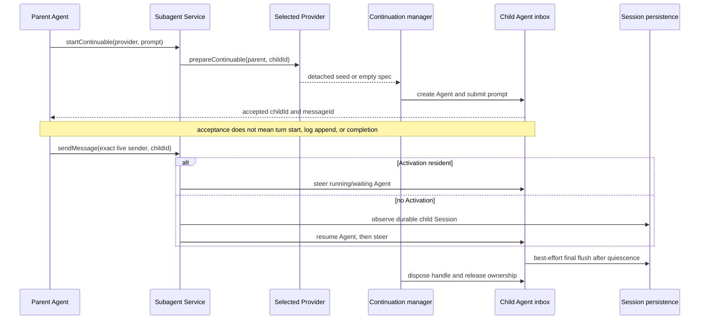
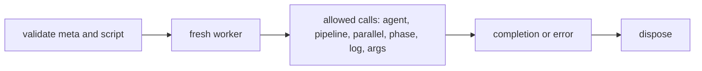

# Subagent、Goal、Plan mode 与 Workflow 的责任边界

## 基线

本章只描述 DeepSeek Harness commit `76fda729799fe9b3848dbe2c211d4b231032b81e` 中四种容易混淆的协作原语。源码链接固定到该提交；“进程内”“Worker”或“独立进程”只说明 transport 与生命周期位置，不自动表示安全隔离、工具继承或父 Agent 权限继承。

## 一句话结论

| 原语 | 负责什么 | 不负责什么 |
|---|---|---|
| Subagent | 把工作委托给一个 child agent；Provider 决定初次运行的 transport 与会话种子 | 不替代 Goal 状态、Plan guidance 或 Workflow 程序 |
| Goal | 在一个 Session 中记录唯一的 durable current objective、阶段、revision 与轮次 | 不决定何时继续、重试或调度 |
| Plan mode | 记录每 Agent 的协作状态，并在活动时向模型请求加入部署方 guidance | 不执行 approval、Sandbox 或自动 continuation |
| Workflow | 让模型编写的 JavaScript 程序通过允许的 API 批量编排 subagents | 不向程序提供普通 Host API，也不建立安全 Sandbox |

 **Claim `DSH-CAP-007`:** `standard` Preset 启用进程内 Subagent，而外部产品 Provider 需要可选组合且对应工具行默认禁用。

Provider 在 Host 中可用不等于模型已经获得对应工具。

 **Claim `DSH-CAP-008`:** durable current Goal 与 worker-thread Workflow 是两种不同的编排原语。

Goal 不是调度器，Workflow Worker 的受限 API 也不是安全 Sandbox。

 **Claim `DSH-DD-ORCH-001`:** 同一个 Subagent Service 接纳进程内与外部产品 Provider，并暴露不同的 continuation 语义。

Provider 可注册不等于对应模型工具已在当前 Preset 中启用。

 **Claim `DSH-DD-ORCH-002`:** Goal 保存一个 durable current objective，并在进程内维护 activation。

Resume 或 Fork 后需要重新激活 Goal；Goal 本身不是调度器。

 **Claim `DSH-DD-ORCH-003`:** Workflow 程序在受限 Worker API 中运行，并在完成或失败后执行 Dispose。

Worker 的 API 限制用于缩小执行能力，但不构成安全 Sandbox。

 **Claim `DSH-DD-ORCH-004`:** Agent Teams 位于私有 experimental package 中，并被官方发布排除。

## 机制

### Subagent Service 与 Provider

`ctx.subagents` 是可同时登记多个具名 Provider 的 Service；普通 `start()` 始终表示一次 one-shot run，而 optional `prepareContinuable()` 的存在才表示 Provider 能准备 continuable child。该准备方法只贡献初次创建所需的 detached seed：child id、Agent 创建、prompt delivery、cold resume、ownership 与 dispose 都由 continuation manager 负责，不由 Provider 持有。[Provider contract](https://github.com/deepseek-ai/deepseek-harness/blob/76fda729799fe9b3848dbe2c211d4b231032b81e/docs/subsystems/subagent.md#L389-L447)明确区分这两条能力发现路径。

| Provider | Transport 与 conversation seed | one-shot | continuable | 固定 `standard` Preset 中的模型工具 |
|---|---|---|---|---|
| `spawn` | 进程内新 Agent；不带 parent conversation | 支持 | 支持，准备结果无 seed | `subagent`，启用 |
| `fork` | 进程内新 Agent；只复制 parent 最后一个已完成 Turn 及以前的平衡前缀 | 支持 | 支持，创建时一次性固化该前缀 | `subagent_fork`，启用 |
| `acp` | 新 ACP subprocess 与 session；只解析 parent workspace cwd，不复制对话 | 支持 | 不支持 | 没有预置工具行，需要显式组合 Consumer |
| `codex` | 新 app-server process、ephemeral Codex thread 与单个 Turn；不复制对话 | 支持 | 不支持 | `subagent_codex` 行存在但 `disabled: true` |
| `claude-code` | 新 CLI process 与独立 Agent SDK query；不复制对话 | 支持 | 不支持 | `subagent_claude_code` 行存在但 `disabled: true` |
| `dsh-sdk` | 新完整 Harness subprocess，经 stdio JSON-RPC 驱动；不复制对话 | 支持 | 不支持 | 没有预置工具行，需要显式组合 Consumer |

`spawn` 与 `fork` 的实现都提供 `start()` 和 `prepareContinuable()`；前者返回空创建规格，后者只截取到最后一个 `turn/end` 的前缀。[spawn provider](https://github.com/deepseek-ai/deepseek-harness/blob/76fda729799fe9b3848dbe2c211d4b231032b81e/packages/subagent/subagent-spawn-in-process/src/index.ts#L34-L69)与[fork provider](https://github.com/deepseek-ai/deepseek-harness/blob/76fda729799fe9b3848dbe2c211d4b231032b81e/packages/subagent/subagent-fork-in-process/src/index.ts#L40-L94)直接给出差异。四个外部 Provider 的 class 都只有 `start()`：Codex 使用 app-server，[Claude Code](https://github.com/deepseek-ai/deepseek-harness/blob/76fda729799fe9b3848dbe2c211d4b231032b81e/packages/subagent/subagent-claude-code/src/index.ts#L73-L126)使用 Agent SDK/CLI，[ACP](https://github.com/deepseek-ai/deepseek-harness/blob/76fda729799fe9b3848dbe2c211d4b231032b81e/packages/subagent/subagent-acp/src/index.ts#L141-L188)与[dsh-sdk](https://github.com/deepseek-ai/deepseek-harness/blob/76fda729799fe9b3848dbe2c211d4b231032b81e/packages/subagent/subagent-dsh-sdk/src/index.ts#L129-L199)分别驱动自己的 wire；没有 `prepareContinuable()` 就会在 continuable start 前失败。

Provider 是否已注册、Consumer 工具是否已挂载以及工具行是否 `disabled` 是三件事。固定 `standard` Preset 启用 `spawn`/`fork` 的 continuable 工具，只为 Codex 与 Claude Code 保留禁用的 one-shot 行；ACP 与 DSH SDK 要由部署另行挂载 Provider 和 Consumer。共享 cwd 或另一个进程都不授予 parent 的工具、Service 或 authority。[Preset 行](https://github.com/deepseek-ai/deepseek-harness/blob/76fda729799fe9b3848dbe2c211d4b231032b81e/packages/preset/agent-presets/presets/standard/agent.cordis.yml#L157-L227)与[`inheritsParentContext` 定义](https://github.com/deepseek-ai/deepseek-harness/blob/76fda729799fe9b3848dbe2c211d4b231032b81e/docs/subsystems/subagent.md#L389-L412)防止把可用性、工具暴露和权限继承混成同一结论。

### 委托与 continuation 时序

一个 continuable child 是 durable Session；Activation 只是该 Session 当前由一个重建 Agent 驻留的 process-local 时段。`startContinuable()` 在 inbox 接受 initial prompt 后返回 `{ childId, messageId }`，并不等待 Turn 开始、消息写入 Session log 或 Turn 完成。[start path](https://github.com/deepseek-ai/deepseek-harness/blob/76fda729799fe9b3848dbe2c211d4b231032b81e/packages/subagent/subagent/src/continuation.ts#L422-L518)固定了这个完成点。

后续 `sendMessage()` 只接受 exact live sender，并只允许直接 parent/child 邻接关系；resident child 进入同一 Agent inbox，缺失 Activation 的 direct child 则从 persisted header 与自己的 descriptor suffix cold-resume。cold resume 直接调用 `ctx.agents.resume()`，不会再次调用原 Provider。[delivery route](https://github.com/deepseek-ai/deepseek-harness/blob/76fda729799fe9b3848dbe2c211d4b231032b81e/packages/subagent/subagent/src/continuation.ts#L563-L706)、[cold resume](https://github.com/deepseek-ai/deepseek-harness/blob/76fda729799fe9b3848dbe2c211d4b231032b81e/packages/subagent/subagent/src/continuation.ts#L1053-L1115)与[materialization](https://github.com/deepseek-ai/deepseek-harness/blob/76fda729799fe9b3848dbe2c211d4b231032b81e/packages/subagent/subagent/src/continuation.ts#L1181-L1297)共同说明 authority、恢复和 Provider 所有权。

### Goal 与 Plan mode

Goal 的 durable 事实来自 `goal/change` Session Event：目标文本、阶段、revision、round cap 与已开始轮次可在 Resume、Fork 和进程重启后重放。activation 则保存在 per-session process-local cache；任何 `agent/session-start` 都把它置为 disarmed，即使 durable phase 仍是 `active`，调用者仍须显式 resume 才能重新允许自动 continuation。[Goal durable changes](https://github.com/deepseek-ai/deepseek-harness/blob/76fda729799fe9b3848dbe2c211d4b231032b81e/docs/subsystems/goal.md#L72-L100)与[process-local activation](https://github.com/deepseek-ai/deepseek-harness/blob/76fda729799fe9b3848dbe2c211d4b231032b81e/packages/goal/goal/README.md#L54-L72)划分了耐久状态和运行许可。

Goal 不是调度器。

它不决定何时开始下一轮、不重试异常失败，也不取消活动 Turn；这些策略属于 `dsh-goal-round-driver` 等 Consumer。Goal 只保存一个 current objective，不能表达并行目标数据库。[Goal limitations](https://github.com/deepseek-ai/deepseek-harness/blob/76fda729799fe9b3848dbe2c211d4b231032b81e/packages/goal/goal/README.md#L151-L162)列出这些非目标。

Plan mode 是另一个 per-agent、durable 且可重放的协作状态：`plan/mode` 决定 model request 是否加入部署方拥有的 guidance。它是 soft guidance；状态选择本身不会迫使 Agent 继续，Sandbox mode 与 approval policy 也不读取 plan state。[Plan mode](https://github.com/deepseek-ai/deepseek-harness/blob/76fda729799fe9b3848dbe2c211d4b231032b81e/docs/subsystems/plan.md#L1-L17)说明日志时点与独立 enforcement。

Plan mode 不是安全策略。

### Workflow 运行生命周期

模型面对的 `workflow` tool 把 `meta` 作为 JSON data、把 script 作为 JavaScript body 交给 engine。worker-thread engine 先验证 meta，并用与 Worker 相同的 wrapper 做 Host-side parse；成功后为每次 run 创建 fresh Worker，并通过 Host bridge 把 `agent()` 转为具名 Subagent Provider 的 one-shot `start()`。并发数、总 child 数与单次组合项数都由 engine limits 约束。[engine start](https://github.com/deepseek-ai/deepseek-harness/blob/76fda729799fe9b3848dbe2c211d4b231032b81e/packages/workflow/workflow-worker-thread/src/index.ts#L106-L201)显示 validate、Provider resolve、limits 与事件边缘。

Workflow Worker 不是安全 Sandbox。

脚本环境只提供 `agent`、`pipeline`、`parallel`、`phase`、`log` 与 `args`；它不提供普通 filesystem、network、timer 或 Node.js API。Worker 使同步脚本不阻塞 Host，并允许超时后强制终止，但其 vm context 可逃逸，因此这里的 API 缩减与生命周期 containment 不能作为 hostile-code security boundary。[model-facing contract](https://github.com/deepseek-ai/deepseek-harness/blob/76fda729799fe9b3848dbe2c211d4b231032b81e/packages/workflow/tool-workflow/src/index.ts#L133-L149)与[Worker module contract](https://github.com/deepseek-ai/deepseek-harness/blob/76fda729799fe9b3848dbe2c211d4b231032b81e/packages/workflow/workflow-worker-thread/src/index.ts#L2-L5)给出两项限制。

`WorkflowRun.result` 不 reject：脚本完成返回 `completed`，取消或失败分别以 `cancelled`、`error` 结果收敛。Consumer 必须在每条路径调用 idempotent `dispose()`；model-facing tool 在 `finally` 中等待它，使脚本和 child runs 清理后才结束调用。[run handle](https://github.com/deepseek-ai/deepseek-harness/blob/76fda729799fe9b3848dbe2c211d4b231032b81e/packages/workflow/workflow/src/runtime-types.ts#L36-L49)与[tool lifecycle](https://github.com/deepseek-ai/deepseek-harness/blob/76fda729799fe9b3848dbe2c211d4b231032b81e/packages/workflow/tool-workflow/src/index.ts#L281-L324)固定了 completion/error → dispose 的所有权。

### Agent Teams 的发布状态

Agent Teams 不是上述四种 released 原语的总称。它位于 `packages/experimental/agent-team`，package 声明 `private: true`；experimental 目录规则要求这类 package 使用专用前缀、不得设置 `publishConfig`，并由 release family 排除。[package metadata](https://github.com/deepseek-ai/deepseek-harness/blob/76fda729799fe9b3848dbe2c211d4b231032b81e/packages/experimental/agent-team/package.json#L1-L10)与[experimental rules](https://github.com/deepseek-ai/deepseek-harness/blob/76fda729799fe9b3848dbe2c211d4b231032b81e/packages/experimental/AGENTS.md#L1-L8)只支持这个成熟度与发布结论，不把它描述为默认能力。

## 源码导读

| 主题 | 固定来源 | 可核对行为 |
|---|---|---|
| Service 与 continuation contract | [`subagent.md` 第 122–167、219–261、389–458 行](https://github.com/deepseek-ai/deepseek-harness/blob/76fda729799fe9b3848dbe2c211d4b231032b81e/docs/subsystems/subagent.md#L122-L458)、[`index.ts` 第 220–254、574–587 行](https://github.com/deepseek-ai/deepseek-harness/blob/76fda729799fe9b3848dbe2c211d4b231032b81e/packages/subagent/subagent/src/index.ts#L220-L587) | one-shot/continuable 能力发现、inbox acceptance、direct adjacency 与 Provider 只参与初次准备 |
| Continuation manager | [`continuation.ts` 第 422–518 行](https://github.com/deepseek-ai/deepseek-harness/blob/76fda729799fe9b3848dbe2c211d4b231032b81e/packages/subagent/subagent/src/continuation.ts#L422-L518)、[第 563–706 行](https://github.com/deepseek-ai/deepseek-harness/blob/76fda729799fe9b3848dbe2c211d4b231032b81e/packages/subagent/subagent/src/continuation.ts#L563-L706)、[第 1053–1115 行](https://github.com/deepseek-ai/deepseek-harness/blob/76fda729799fe9b3848dbe2c211d4b231032b81e/packages/subagent/subagent/src/continuation.ts#L1053-L1115) | initial acceptance、resident delivery、cold resume 和 persisted descriptor authority |
| Provider implementations | [`spawn`](https://github.com/deepseek-ai/deepseek-harness/blob/76fda729799fe9b3848dbe2c211d4b231032b81e/packages/subagent/subagent-spawn-in-process/src/index.ts#L34-L69)、[`fork`](https://github.com/deepseek-ai/deepseek-harness/blob/76fda729799fe9b3848dbe2c211d4b231032b81e/packages/subagent/subagent-fork-in-process/src/index.ts#L40-L94)、[`codex`](https://github.com/deepseek-ai/deepseek-harness/blob/76fda729799fe9b3848dbe2c211d4b231032b81e/packages/subagent/subagent-codex/src/index.ts#L63-L110)、[`claude-code`](https://github.com/deepseek-ai/deepseek-harness/blob/76fda729799fe9b3848dbe2c211d4b231032b81e/packages/subagent/subagent-claude-code/src/index.ts#L73-L126)、[`acp`](https://github.com/deepseek-ai/deepseek-harness/blob/76fda729799fe9b3848dbe2c211d4b231032b81e/packages/subagent/subagent-acp/src/index.ts#L141-L188)、[`dsh-sdk`](https://github.com/deepseek-ai/deepseek-harness/blob/76fda729799fe9b3848dbe2c211d4b231032b81e/packages/subagent/subagent-dsh-sdk/src/index.ts#L129-L199) | transport、parent conversation seed 与 `prepareContinuable` 是否存在 |
| Goal | [`goal.md` 第 1–30、72–100 行](https://github.com/deepseek-ai/deepseek-harness/blob/76fda729799fe9b3848dbe2c211d4b231032b81e/docs/subsystems/goal.md#L1-L100)、[`goal` README 第 54–72、151–162 行](https://github.com/deepseek-ai/deepseek-harness/blob/76fda729799fe9b3848dbe2c211d4b231032b81e/packages/goal/goal/README.md#L54-L162) | durable phase 与 mutation、process-local activation、scheduler 非目标 |
| Plan mode | [`plan.md` 第 1–17、31–39 行](https://github.com/deepseek-ai/deepseek-harness/blob/76fda729799fe9b3848dbe2c211d4b231032b81e/docs/subsystems/plan.md#L1-L39) | logged guidance、pending selection、exit tool，以及与 approval/Sandbox 的分离 |
| Workflow | [`workflow.md` 第 1–13、39–65、93–128 行](https://github.com/deepseek-ai/deepseek-harness/blob/76fda729799fe9b3848dbe2c211d4b231032b81e/docs/subsystems/workflow.md#L1-L128)、[`worker-thread/index.ts` 第 106–201 行](https://github.com/deepseek-ai/deepseek-harness/blob/76fda729799fe9b3848dbe2c211d4b231032b81e/packages/workflow/workflow-worker-thread/src/index.ts#L106-L201)、[`tool-workflow/index.ts` 第 281–324 行](https://github.com/deepseek-ai/deepseek-harness/blob/76fda729799fe9b3848dbe2c211d4b231032b81e/packages/workflow/tool-workflow/src/index.ts#L281-L324) | model-authored script、allowed API、result settlement 与 holder-owned dispose |
| Agent Teams | [`agent-team/package.json`](https://github.com/deepseek-ai/deepseek-harness/blob/76fda729799fe9b3848dbe2c211d4b231032b81e/packages/experimental/agent-team/package.json#L1-L10)、[`agent-team-profile` README](https://github.com/deepseek-ai/deepseek-harness/blob/76fda729799fe9b3848dbe2c211d4b231032b81e/packages/experimental/agent-team-profile/README.md#L1-L12)、[`experimental/AGENTS.md`](https://github.com/deepseek-ai/deepseek-harness/blob/76fda729799fe9b3848dbe2c211d4b231032b81e/packages/experimental/AGENTS.md#L1-L8) | private package 与 release exclusion |

## 限制与失败

| 条件 | 可见结果 | 边界或恢复责任 |
|---|---|---|
| 请求 continuable，但 Provider 没有 `prepareContinuable()` | `UNSUPPORTED_CAPABILITY`，child 不创建 | 选择 `spawn`/`fork`，或把 Consumer 配成 one-shot |
| `startContinuable()` 返回 | 只保证 initial message 已被 inbox 接受并取得 ids | 用 durable inbox/Turn 事件观察开始、claim、discard 与完成，不能把接受当完成 |
| exact live sender 不是 direct parent/child | `UNAUTHORIZED` | 调用方必须保留真实 live Agent；descriptor provenance 不授予 authority |
| child Session 存在但 Activation 已释放 | direct parent 的下一条消息尝试 cold resume | persistence/descriptor/lineage 无法恢复时返回 `NOT_RESUMABLE` |
| final Session flush listener 失败 | 记录 warning，handle 仍 dispose，ownership 仍释放 | persisted child state 可能缺失或陈旧；best-effort flush 不是耐久保证 |
| Goal 在 Resume/Fork 后 durable phase 仍为 `active` | activation 为 disarmed，不自动继续 | Consumer 或用户显式 resume；不要把 durable phase 当 scheduler admission |
| Plan mode 活动 | 请求加入 soft guidance | approval 与 Sandbox 仍由各自策略执行 |
| Workflow meta/script 在 start 前无效 | start 同步失败，不创建 run | 模型修正 data 或 script；不要执行源码文本来发现 meta |
| Workflow 运行中失败或取消 | `result` 以 `error`/`cancelled` 收敛 | holder 仍须调用并等待 `dispose()` |

外部 Provider 的独立进程、进程内 Provider 的独立 Agent scope，以及 Workflow 的 Worker thread 都是具体 transport 或生命周期事实。它们不证明通用 filesystem/network/credential isolation，也不表示 child 自动继承 parent tools、Services 或 authority。

## 继续阅读

- [所属核心章节：能力与组合归属](../03-capabilities.md)
- [证据方法](../00-methodology.md)：了解固定提交、Claim ledger 与限定语如何配对。
- [证据反向索引](../source-map.md)：按 Provider、Goal、Plan 与 Workflow 的上游文件回到本章声明。
